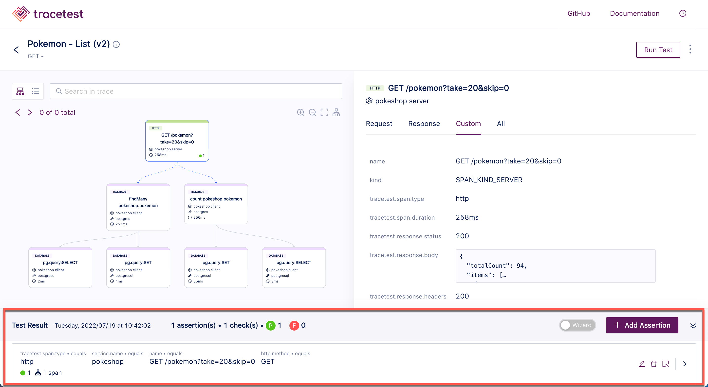
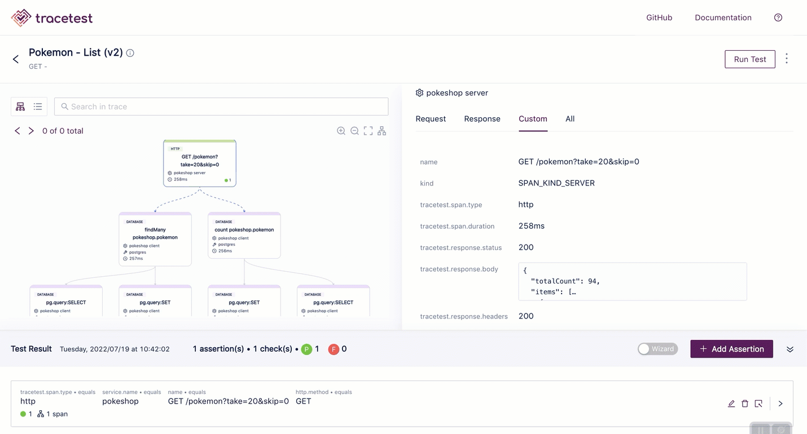
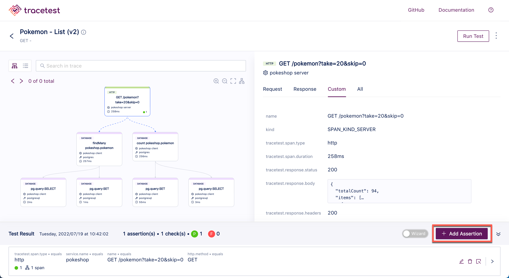
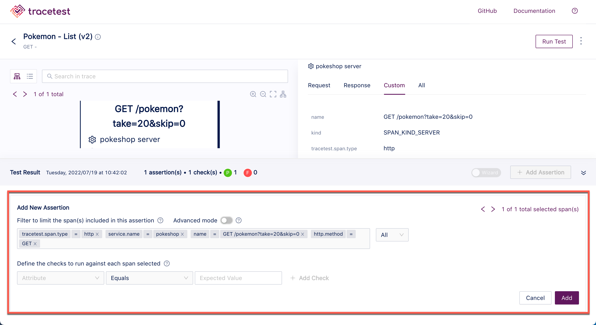
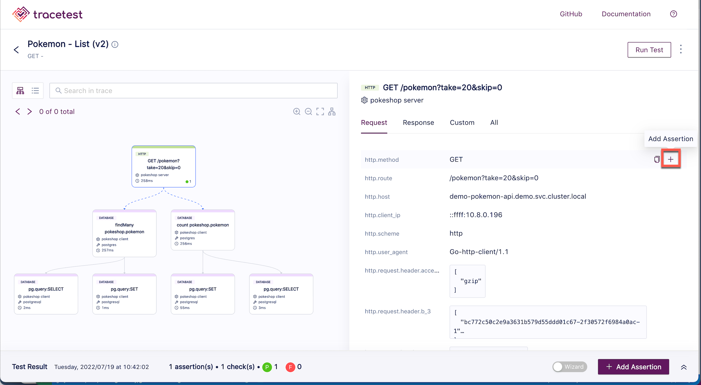
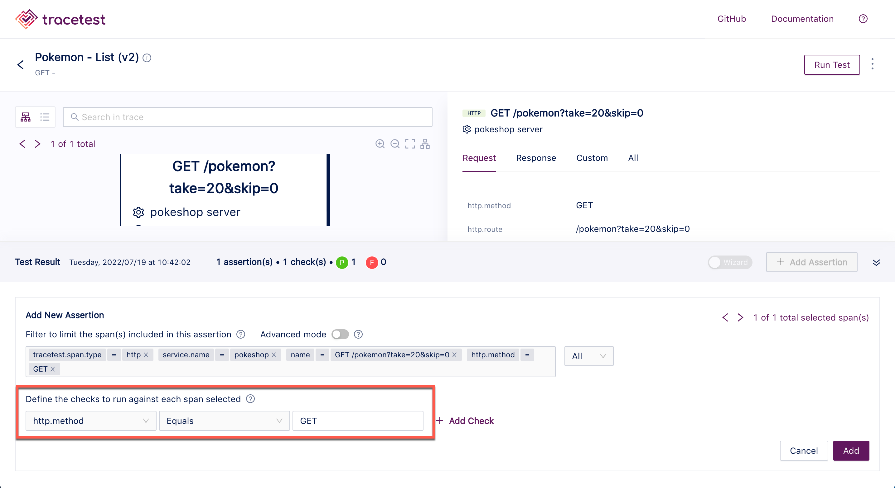
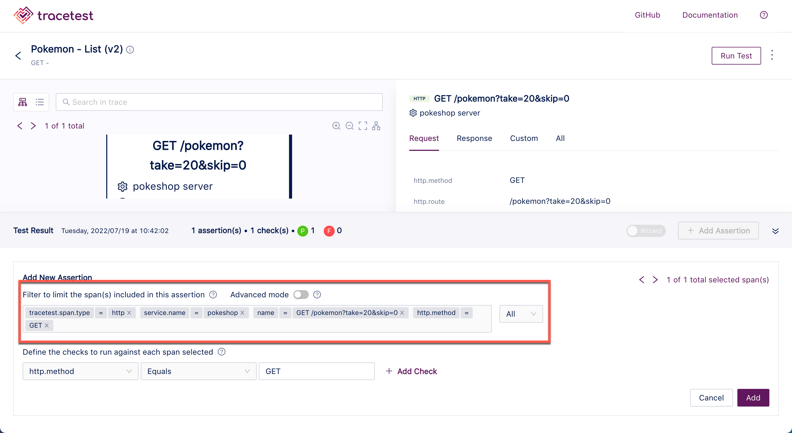
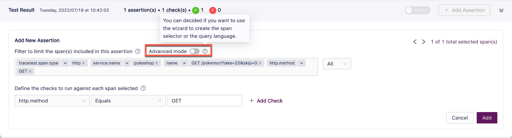
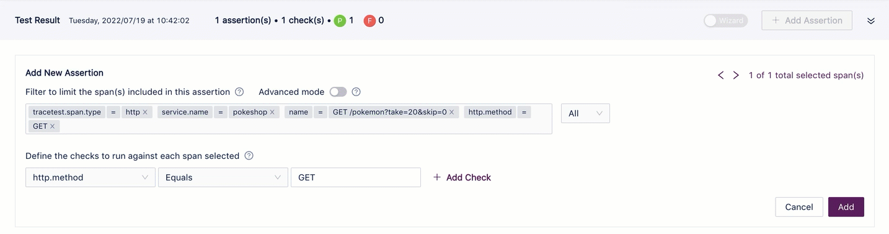

# Adding Assertions

Assertions may be added to a trace to set a value for a step in the trace to determine success or failure. If assertions have already been added to a test, they will be listed at the bottom of the screen:

The assertion results can be viewed using the key-value (wizard) mode or the query language (advanced):

After you have created a test and your test run is complete, click the **Add Assertion** button at the bottom right of the trace screen.

The **Add Assertion** dialog opens.

You can also create assertions by hovering over the **+** sign to the right of an attribute in the trace. 

This will populate the assertion with the correct information for that attribute.

The **Filter** field allows for limiting the spans affected by the assertion.

Use the **Advanced mode** toggle switch to use the wizard or the query language to create the span selector:

<!--- To see adding assertions in action, please watch <Add link to video> --->
