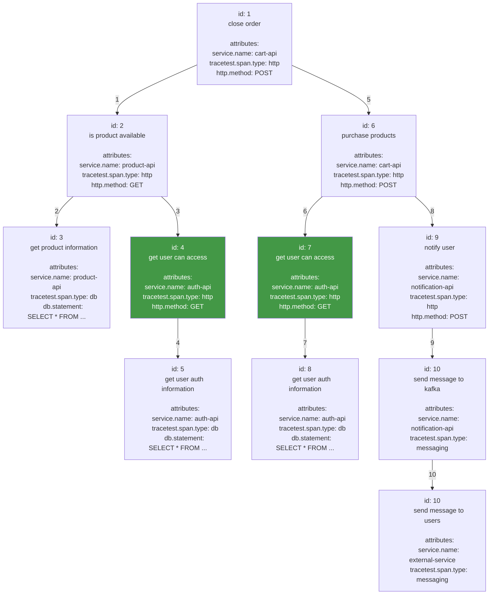

# Advanced Selectors

If you find yourself in a position where you cannot select complex spans, you can use our advanced selectors to help in that task. It enables you selecting spans that are impossible to select using just basic selectors.

In order to present each selector feature as easily as possible, we will use a theoretical scenario of an e-commerce application.

The system we will inspect has this flow:


And it generates the following trace:


# Features

## Empty selector
By providing an empty selector, all spans from the trace are selected. Note that an empty selector is an empty string. Providing `span` or `span[]` as a selector will result as a syntax error.

## Filter by attributes
The most basic way of filtering the spans you want to apply an assertion on is by using its attributes. A good starting example would be filtering all spans of type `http`:

```css
span[tracetest.span.type="http"]
```

This would select the following spans:


### AND condition
If you need to narrow down your results, you can provide multiple properties in the selector by separating them usign a space. So, let's say we want all `http` spans **AND** were created by the service `cart-api`:

```css
span[tracetest.span.type="http" service.name="cart-api"]
```

This would select the following spans:


### OR condition
Sometimes we want to have a broader result by selecting spans that match different selectors. Let's say we have to get all spans from our services, but not from any other external service.

```css
span[service.name="api-product"], span[service.name="api-auth"], span[service.name="api-notification"], span[service.name="api-cart"]
```

This would select the following spans:


Each span selector will be executed individually and the results will be merged together, creating a list of all spans that match any of the provided span selectors.

### Contains operator
Although it is possible to filter several span selectors at once to get a broader result, it might become verbose very quickly. The previous example can be written in another way to reduce its complexity:

```css
span[service.name contains "api"]
```

This would select the same spans as the previous example:


## pseudo-classes support

Sometimes filtering by attributes is not enough because we might have two or three identical spans in the tree, but we only want to assert one of them. For example, imagine a system that has a `retry` policy for all the HTTP requests it sends. How would we allow a user to validate if the `third` execution was successful without asserting the other two spans?

This is where pseudo-classes enter the scene. Those are ways of filtering spans by data that is not present in the span itself. For example, the order which the span appears.

> :warning: Today we support only `first`, `last`, and `nth_child`. If you think we should implement another one, please open an issue and explain why it is important and how it should behave.

For the examples of the three pseudo-classes, let's consider we want to select a specific `http` span based on when it happens.

```css
span[tracetest.span.type="http"]
```

This will select the following spans:


### :first
This would return the first appearing span from the list

```css
span[tracetest.span.type="http"]:first
```


### :last
This would return the last appearing span from the list

```css
span[tracetest.span.type="http"]:last
```


### :nth_child
This enables you to fetch any item from the list based on its index. `n` starts at 1 (first element) and ends at `length` (last element). Any invalid `n` value will return in an empty list of spans being returned

```css
span[tracetest.span.type="http"]:nth_child(3)
```


## Parent-child relation filtering
Even with all those capabilities, we might have problems with ambiguous selectors returning several spans when just a few were intended.

In our example, you can notice that `auth-api` is called twice from different parts of the trace. At first by `product-api` and later by `cart-api`.

What if I want to test if a product only available in US can be bought in UK? The product can be seen by the user, but it cannot be bought if the user is outside US. Certainly I cannot apply the same assertions on all `auth-api` spans, otherwise the test will not pass.

> :information_source: When you filter by parent-child relation, it matches spans recursively in all levels bellow the parent. This doesn't match only direct children of the parent, but all other spans in the sub-tree.

For example:

```css
span[service.name="auth-api" tracetest.span.type="http"]
```

Will return:


This is a problem, because if we apply the same assertion to both spans, one of them will fail. We could try to use `nth_child` but that could break if a http request failed and the retry policy kicked in. Thus, the only way of filtering that is based on the context when it was generated. For example: using its parent span to do so.

We could use the `purchase products` parent to ensure just `http` class to the `auth-api` triggered by the `purchase-api` would be selected:

```css
span[service.name="cart-api", name="purchase products"] span[service.name="auth-api" tracetest.span.type="http"]
```

This would find the parent span and only select the spans that are descedents of that parent and match the provided filter:

