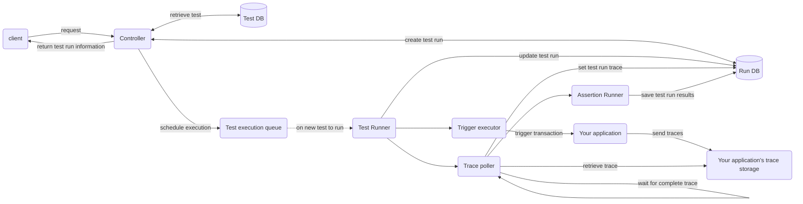

## Running a test

```mermaid
flowchart LR
    client(client)
    controller(Controller)
    testDB[(Test DB)]
    runDB[(Run DB)]

    testRunner(Test Runner)
    runTestQueue(Test execution queue)

    executor(Trigger executor)
    externalService(Your application)
    externalTraceStorage(Your application's trace storage)
    tracePoller(Trace poller)
    assertionRunner(Assertion Runner)

    client --> | request | controller
    controller <--> |retrieve test| testDB
    controller <--> |create test run| runDB
    controller --> |schedule execution| runTestQueue
    controller --> |return test run information| client

    runTestQueue -.-> |on new test to run| testRunner
    testRunner --> executor
    executor --> |trigger transaction| externalService

    externalService --> |send traces| externalTraceStorage

    testRunner --> |update test run| runDB
    testRunner --> tracePoller
    tracePoller --> |wait for complete trace| tracePoller
    tracePoller --> |retrieve trace| externalTraceStorage
    tracePoller --> |set test run trace| runDB

    tracePoller --> assertionRunner
    assertionRunner --> |save test run results| runDB
```