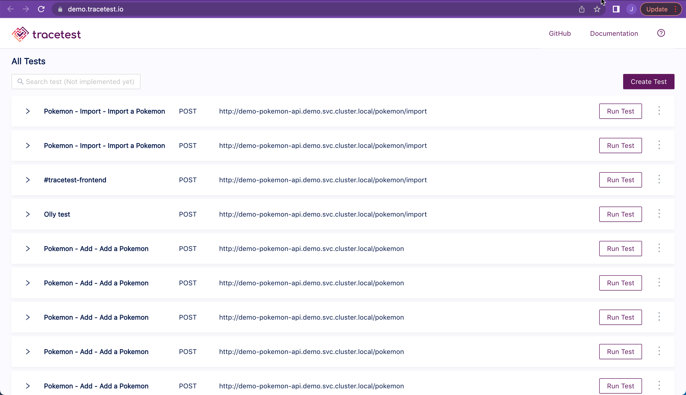
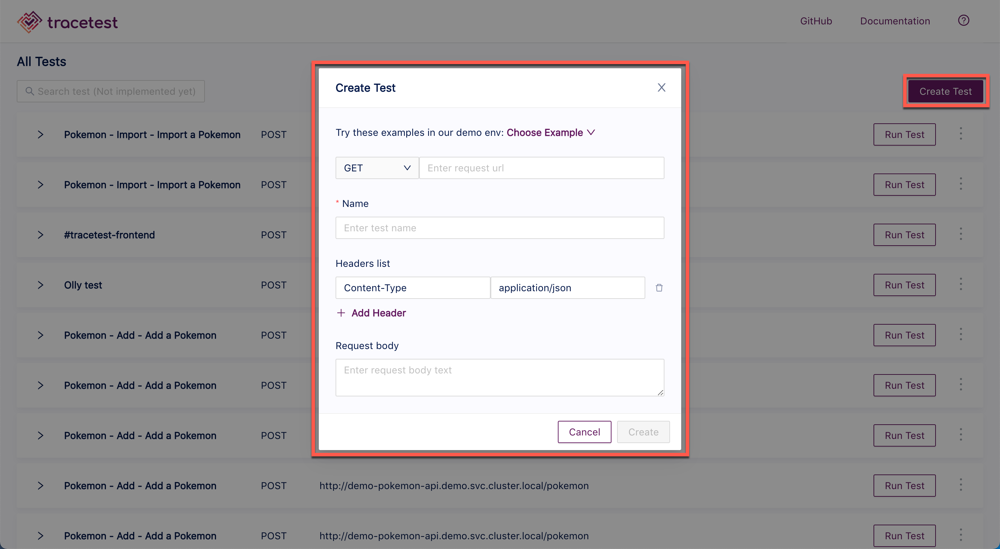
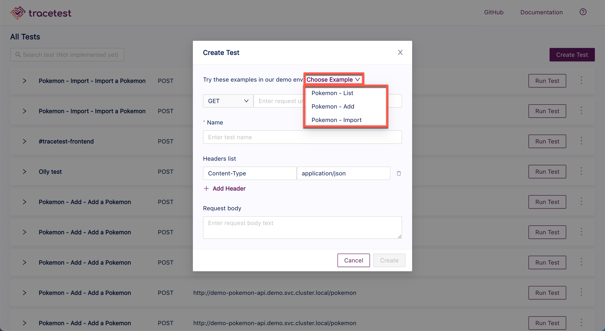
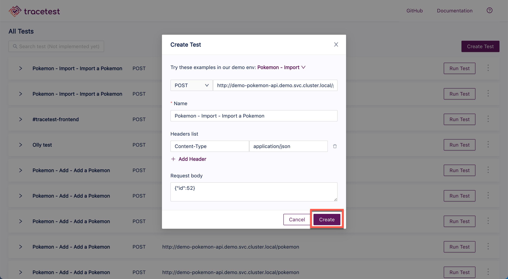
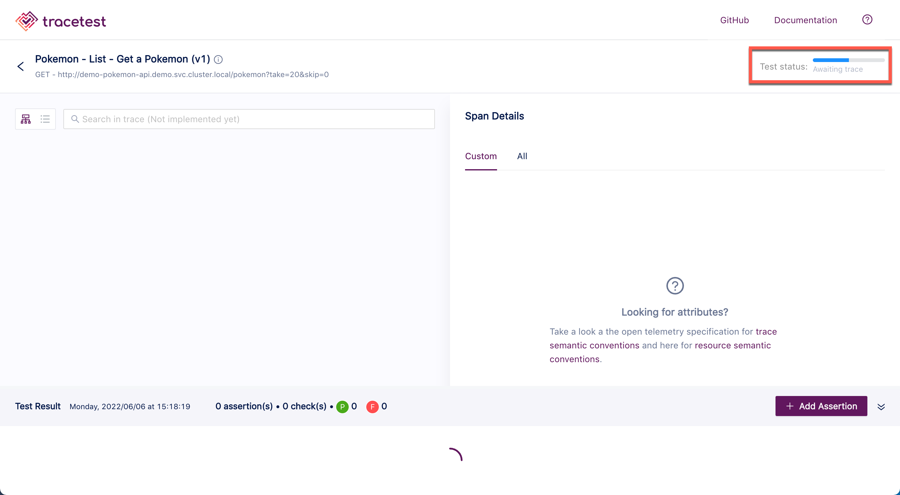
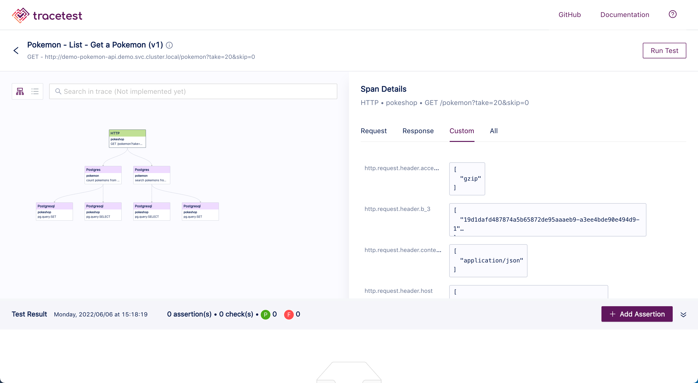
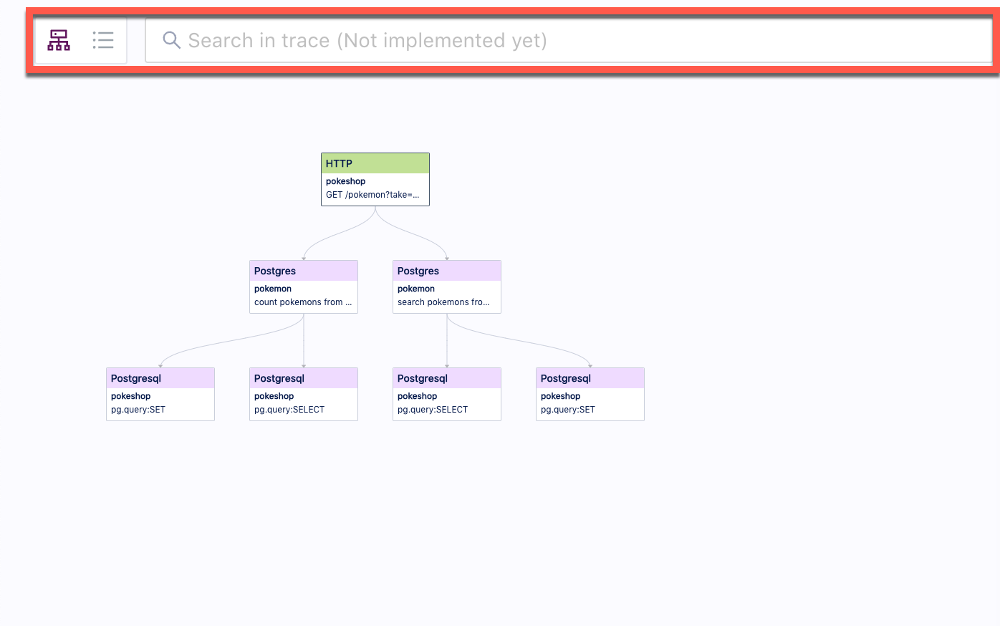
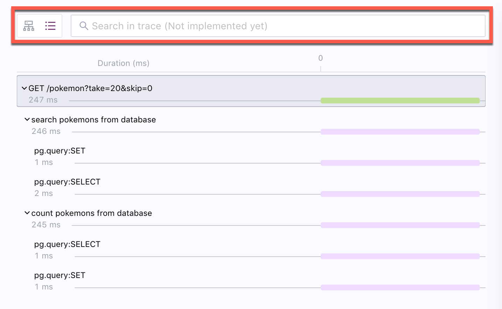
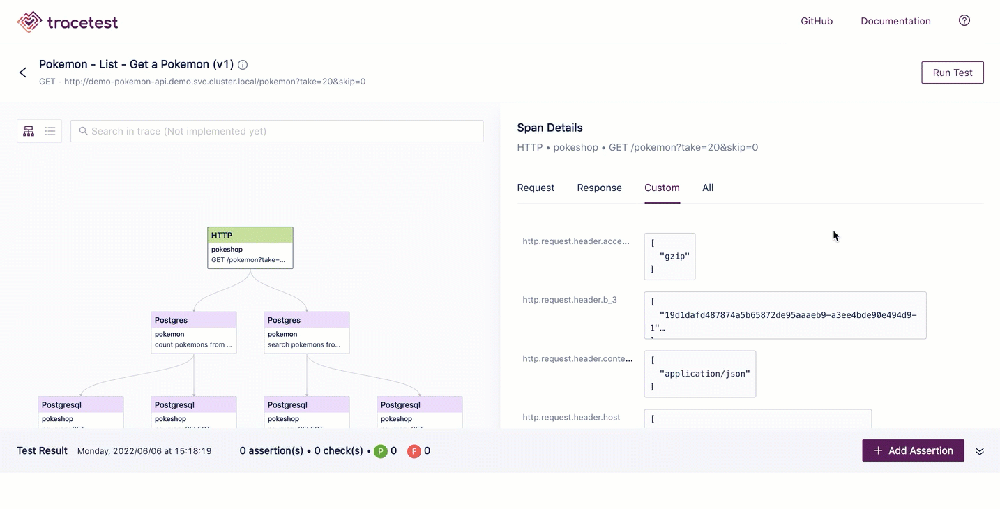

# Create a Test

<em>**Note:** Please follow the [Installation Guide](installing.md) guide to set up all prerequisites and install Tracetest.</em>

Open the [Tracetest application](https://demo.tracetest.io).

Click the **Create Test** button and the **Create New Test** dialog appears:

Use the **Choose Example** drop down list to populate the dialog screen and create a test for the following:

- List (Get) - List the current Pokemon.
- Add (Post) - Create any Pokemon - name it, give it a type and set an image for it.
- Import (Post) - Set a pokemon ID and retrieve all the information from that Pokemon using pokeapi.co. Only Pokemons that exist in the games can be imported.

Or input your own test details. The screenshot below shows one of the examples from the Tracetest GitHub [Readme](https://github.com/kubeshop/tracetest#readmed) document. Then click **Create**.

The trace will start:

When the trace is finished, you will get the following results:

The trace results include:

- A diagram of the trace steps that can be viewed in diagram or timeline form by toggling the icons at the top left of the image below. This panel also contains a **search** field which can be useful when working with large diagrams and timelines.

- The span details of the trace:

