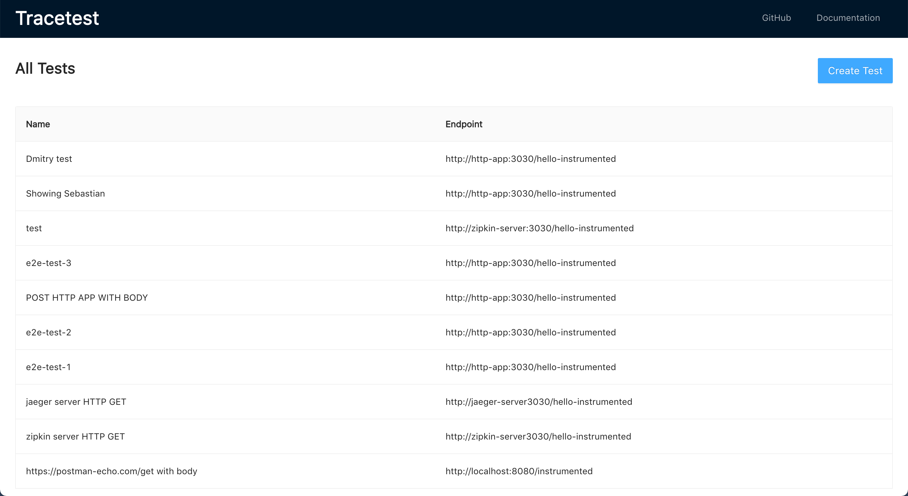
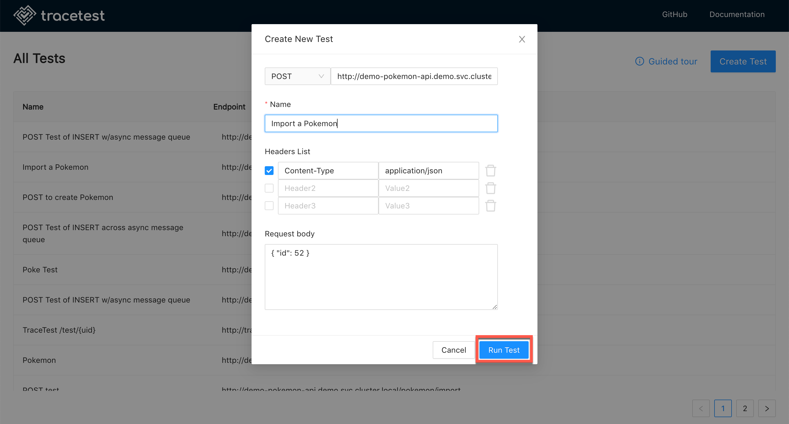

# Create a Test

Open the [Tracetest application](https://demo.tracetest.io).

Click the **Create Test** button and the **Create New Test** dialog appears:

Input the test details. The screenshot below shows one of the examples from the Tracetest GitHub [Readme](https://github.com/kubeshop/tracetest#readmed) document. Then click **Run Test**.

The trace will start:

When the trace is finished, you will get the following results:

The trace results include:

- A diagram of the trace steps:

- The span details of the trace:

- The trace component timeline:

