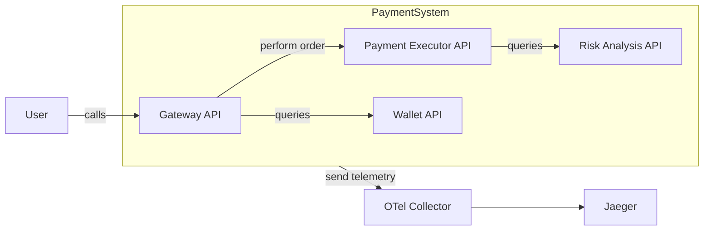

:::note
[Check out the source code on GitHub here.](https://github.com/kubeshop/tracetest/tree/main/examples/tracetest-with-github-action-and-secrets)
:::

[Tracetest](https://tracetest.io/) is a testing tool based on [OpenTelemetry](https://opentelemetry.io/) that allows you to test your distributed application. It allows you to use data from distributed traces generated by OpenTelemetry to validate and assert if your application has the desired behavior defined by your test definitions.


[Github Actions](https://github.com/features/actions) is a continuous integration/continuous deployment (CI/CD) automation service provided by GitHub. It allows developers to automate their software workflows directly in their GitHub repositories. These workflows can include building, testing, and deploying applications, as well as many other tasks. Workflows are defined using YAML files and can be triggered by various GitHub events such as push, pull requests, or issue comments.

## Running trace-based test in Github Actions with Secrets

When creating testing CI scripts in Github, sometimes you need to use sensitive information, like passwords and API Keys. To keep this information safe, Github provides a feature called [Secrets](https://docs.github.com/en/actions/reference/encrypted-secrets). Secrets are encrypted environment variables that you create in a repository and are available to use in your workflows.

On this example, you will see how to configure one repository to use Tracetest and Github Action with Secrets to run trace-based tests, keeping your sensitive information safe.

Let's start by using a mini Payment ecosystem with 4 APIs that work together to emulate a Payment system. These APIs are:
- a **Gateway API** that is user-facing API that receives payment orders, protected with Basic Auth
- a **Payment Executor API** that executes a payment order after analyzing the customer profile
- a **Risk Analysis API** that analyze user profile to understand its score
- a **Wallet API** that retains data about the Wallet balance of each user

These APIs are instrumented with [OpenTelemetry SDKs](https://opentelemetry.io/docs/languages/) and send data to [Jaeger](https://www.jaegertracing.io/) via the [OTel Collector](https://opentelemetry.io/docs/collector/).



Each one of these APIs has their code specified inside our source code on GitHub ([here](https://github.com/kubeshop/tracetest/tree/main/examples/tracetest-with-github-action-and-secrets)) inside the `services` folder.

To see more details about the code of each API, you can check the following link: https://github.com/kubeshop/tracetest/tree/main/examples/tracetest-with-github-action-and-secrets

You can run them together using Docker Compose along with a Tracetest Agent, that we will use soon to test these services, with the following command:

```sh
git clone git@github.com:kubeshop/tracetest.git
cd ./tracetest/examples/tracetest-with-github-action-and-secrets
TRACETEST_API_KEY=<your-agent-key> docker compose up
```

To run a test, you need execute an API call to the Gateway API, that is protected with Basic Auth. On this tutorial, you will use a Github Secret to store the Basic Auth credentials and use it in our Github Action workflow by adding it to a [VariableSet](/concepts/variable-sets.mdx) as a secret.

### Creating a Github Actions Workflow

To test this recipe, let's create repository in your machine, add it to Github and run the workflow. First of all, you need to create a new folder on your machine to store the service code and the repository code. You can do this by running the following commands:

```sh
# sandbox folder to store our files
mkdir github-actions-test
cd ./github-actions-test

mkdir my-repository
cd ./my-repository
```

Now, we will copy the code of the Payment Ecosystem to this repository. You can do this by running the following commands:

```sh
cd ..

git clone git@github.com:kubeshop/tracetest.git
cp -r ./tracetest/examples/tracetest-with-github-action-and-secrets/services ./my-repository

cd ./my-repository

# remove the .git folder to start a new repository
rm -rf .git
git init

git add .
git commit -m "Initial commit"
```

Then, [create a new repository](https://docs.github.com/en/repositories/creating-and-managing-repositories/quickstart-for-repositories#create-a-repository) on Github and perform the commands below:

:::note
Remember to replace `<your-github-user>` and `<your-github-name>` with your Github user and the name of the repository you created.
:::

```sh
git remote add origin https://github.com/<your-github-user>/<your-github-name>.git
git push origin main
```

After that, you need to configure a new environment on [Tracetest](http://app.tracetest.io) with [these instructions](/concepts/environments.mdx) and generate an environment token for it ([here](/concepts/environment-tokens.mdx)). Remember to store the API Key generated to the agent and the environment token, they will be used on next step.

One you have these data, you need to register three secrets on your Github repository using [these instructions](https://docs.github.com/en/actions/security-guides/using-secrets-in-github-actions#creating-secrets-for-a-repository):
- `TRACETEST_API_KEY`: that is the API key used by your [agent](/concepts/agent.mdx) to connect to Tracetest
- `TRACETEST_CLI_TOKEN`: an environment token used by the CI to run a test
- `API_SECRET_PASSWORD`: the password used to authenticate on the Gateway API. For demo purposes, its value is `supersecret`.

Now that you have the repository set, let's create a new Github Actions workflow file on your repository. First, create a new file on the `.github/workflows` folder with the following content:

```yaml
name: Run trace-based tests

on:
  # runs on every push to main
  push:
    branches: [main]

  # allows run manually via Actions tab on Github
  workflow_dispatch:

env:
  TRACETEST_API_KEY: ${{secrets.TRACETEST_API_KEY}}

jobs:
  run-trace-based-tests:
    name: Run trace based tests for Payment Ecosystem
    runs-on: ubuntu-latest

    steps:
      - name: Checkout
        uses: actions/checkout@v3

      # more steps to add
```

This file defines a workflow that runs on every push to the `main` branch and can be manually triggered via the Actions tab on Github. It also defines an environment variable `TRACETEST_API_KEY` that is set to the value of the secret `TRACETEST_API_KEY`, that will be used by the Tracetest Agent defined inside our `docker-compose.yml` file and also adds the first step, that checks out the repository code into the CI container.

The next step that you will add is to install the Tracetest CLI on the CI container with the [Tracetest Github Action](https://github.com/kubeshop/tracetest-github-action) and configure the CLI. You can do this by adding the following step:

```yaml
# ...
    steps:
      # previous steps ...

      - name: Configure Tracetest CLI
        uses: kubeshop/tracetest-github-action@v1
        with:
          token: ${{secrets.TRACETEST_CLI_TOKEN}}

      # more steps to add
```

Then, the next following two steps will start the APIs locally using Docker Compose and will configure Tracetest Agent to read traces from the Jaeger instance running inside of the docker compose network:

```yaml
# ...
    steps:
      # previous steps ...

      - name: Run APIs locally with docker compose
        run: |
          docker-compose up -d
          docker compose logs -f > /tmp/docker-log &

      - name: Configure Tracing Backend
        run: |
          tracetest datastore apply --file ./tracing-backend.yaml

      # more steps to add

```

Now, you will setup a [VariableSet](/concepts/variable-sets.mdx) with the id `tracetesting-vars` that will have all variables used in your test context, including the `API_SECRET_PASSWORD` secret. This will make Tracetest understand that this variable is a secret and should not be presented on the UI and CLI outputs. You can do this by adding the following step to the workflow file:

```yaml
# ...
    steps:
      # previous steps ...

      - name: Inject secrets as a variable set on Tracetest
        run: |
          cat << EOF > vars.yaml
          type: VariableSet
          spec:
            id: tracetesting-vars
            name: AuthKeys for test
            description: Variables used in basic auth for my API
            values:
            - key: USER
              value: admin
            - key: PASSWORD
              value: ${{secrets.API_SECRET_PASSWORD}}
              type: secret
          EOF

          tracetest apply variableset --file ./vars.yaml

      # more steps to add
```

Finally, you will run the test using the Tracetest CLI, passing the `tracetesting-vars` VariableSet on `--vars` argumen and the test file `trace-based-test.yaml` that contains the test definition. You can do this by adding the following step to the workflow file:

```yaml
# ...
    steps:
      # previous steps ...

      - name: Run trace-based tests
        run: |
          tracetest run test --vars tracetesting-vars --file ./trace-based-test.yaml

      # more steps to add
```

And now its done. You can run the test by pushing a new commit to the `main` branch with:

```sh
# assuming that you are on "my-repository" folder

git add .
git commit -m "Add Tracetest Github Action workflow"
git push origin main
```

After a while, you can go to the "Actions" on Github and see the workflow running, as shown below:


Then, you can see the execution of this workflow:


Once it is finished, you can also see the results of the test on the Tracetest UI, as shown logs or by going to your environment on [app.tracetest.io](https://app.tracetest.io) and clicking on "Runs".

## Learn More

Please visit our [examples in GitHub](https://github.com/kubeshop/tracetest/tree/main/examples) and join our [Slack Community](https://dub.sh/tracetest-community) for more info!
