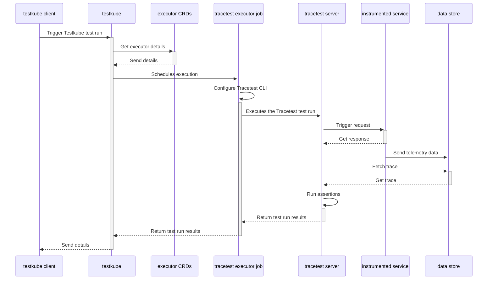

# Testkube Kubernetes-native Test Runner Pipeline

:::note
[Check out how the integration works, here.](../tools-and-integrations/testkube.md)
:::

## Running Scheduled Trace-based Tests

[Testkube Tracetest Executor](https://github.com/kubeshop/testkube-executor-tracetest) is a test executor to run Tracetest tests with Testkube.

## Why do we want to run Tracetest with Testkube?

Tracetest leverages existing OpenTelemetry instrumentation to run assertions against every part of an HTTP transaction.

By integrating with Testkube you can now add Tracetest to the native CI/CD pipeline in your Kubernetes cluster. It allows you to run scheduled test runs and synthetic tests. All while following the trace-based testing principle and enabling full in-depth assertions against trace data, not just the response.

## Infrastructure Overview

The following is high level sequence diagram on how Testkube and Tracetest interact with the different pieces of the system:



## Prerequisites

Make sure you have these three things installed before starting.

1. A running Kubernetes cluster (either locally or in the cloud).
2. [Kubectl](https://kubernetes.io/docs/tasks/tools/)
3. [Helm](https://helm.sh/docs/intro/install/)

## Quickstart

Follow these steps to get started.

## 1. Install Testkube CLI

Install Testkube CLI by following [these instructions](https://docs.testkube.io/getting-started/step1-installing-cli) for your OS.

```bash
# MacOS example
brew install testkube
```

## 2. Install Testkube in Your Kubernetes Cluster

```bash
testkube init
```

Confirm that Testkube is running:

```bash
kubectl get all -n testkube
```

```text title="Expected output"
NAME                                                        READY   STATUS    RESTARTS      AGE
pod/testkube-api-server-8f5cf8b8f-vrpk6                     1/1     Running   3 (14m ago)   18m
pod/testkube-dashboard-584846b754-4sxq8                     1/1     Running   0             18m
pod/testkube-minio-testkube-bd549c85d-lpwbm                 1/1     Running   0             18m
pod/testkube-mongodb-d78699775-cjcd7                        1/1     Running   0             18m
pod/testkube-nats-0                                         3/3     Running   0             18m
pod/testkube-nats-box-5b555bc9c4-5mpz5                      1/1     Running   0             18m
pod/testkube-operator-controller-manager-5f84bb4fd4-mjr2l   2/2     Running   0             18m

NAME                                                           TYPE        CLUSTER-IP      EXTERNAL-IP   PORT(S)                                                 AGE
service/testkube-api-server                                    ClusterIP   10.96.78.171    <none>        8088/TCP                                                18m
service/testkube-dashboard                                     ClusterIP   10.96.204.214   <none>        8080/TCP                                                18m
service/testkube-minio-service-testkube                        ClusterIP   10.96.85.219    <none>        9000/TCP,9090/TCP,9443/TCP                              18m
service/testkube-mongodb                                       ClusterIP   10.96.213.36    <none>        27017/TCP                                               18m
service/testkube-nats                                          ClusterIP   None            <none>        4222/TCP,6222/TCP,8222/TCP,7777/TCP,7422/TCP,7522/TCP   18m
service/testkube-operator-controller-manager-metrics-service   ClusterIP   10.96.243.219   <none>        8443/TCP                                                18m
service/testkube-operator-webhook-service                      ClusterIP   10.96.106.138   <none>        443/TCP                                                 18m

NAME                                                   READY   UP-TO-DATE   AVAILABLE   AGE
deployment.apps/testkube-api-server                    1/1     1            1           18m
deployment.apps/testkube-dashboard                     1/1     1            1           18m
deployment.apps/testkube-minio-testkube                1/1     1            1           18m
deployment.apps/testkube-mongodb                       1/1     1            1           18m
deployment.apps/testkube-nats-box                      1/1     1            1           18m
deployment.apps/testkube-operator-controller-manager   1/1     1            1           18m

NAME                                                              DESIRED   CURRENT   READY   AGE
replicaset.apps/testkube-api-server-8f5cf8b8f                     1         1         1       18m
replicaset.apps/testkube-dashboard-584846b754                     1         1         1       18m
replicaset.apps/testkube-minio-testkube-bd549c85d                 1         1         1       18m
replicaset.apps/testkube-mongodb-d78699775                        1         1         1       18m
replicaset.apps/testkube-nats-box-5b555bc9c4                      1         1         1       18m
replicaset.apps/testkube-operator-controller-manager-5f84bb4fd4   1         1         1       18m

NAME                             READY   AGE
statefulset.apps/testkube-nats   1/1     18m
```

By default, Testkube is installed in the `testkube` namespace.

To explore the Testkube dashboard, run the command:

```bash
testkube dashboard
```


## 3. Install Tracetest CLI

Install Tracetest CLI by following [these instructions](https://docs.tracetest.io/getting-started/installation) for your OS.

```bash
# MacOS example
brew install kubeshop/tracetest/tracetest
```

## 4. Install Tracetest in Your Kubernetes Cluster

```bash
tracetest server install
```

```text title="Expected output"
How do you want to run TraceTest? [type to search]:
  Using Docker Compose
> Using Kubernetes
```

Select `Using Kubernetes`.

```text title="Expected output"
Do you have OpenTelemetry based tracing already set up, or would you like us to install a demo tracing environment and app? [type to search]:
  I have a tracing environment already. Just install Tracetest
> Just learning tracing! Install Tracetest, OpenTelemetry Collector and the sample app.
```

Select `Just learning tracing! Install Tracetest, OpenTelemetry Collector and the sample app.`.

Confirm that Tracetest is running:

```bash
kubectl get all -n tracetest
```

```text title="Expected output"
NAME                                  READY   STATUS    RESTARTS        AGE
pod/otel-collector-7f4d87489f-vp6zn   1/1     Running   0               5m41s
pod/tracetest-78b9c84c57-t4prx        1/1     Running   3 (4m15s ago)   5m29s
pod/tracetest-postgresql-0            1/1     Running   0               5m42s

NAME                              TYPE        CLUSTER-IP      EXTERNAL-IP   PORT(S)               AGE
service/otel-collector            ClusterIP   10.96.173.226   <none>        4317/TCP              5m46s
service/tracetest                 ClusterIP   10.96.248.146   <none>        11633/TCP,4317/TCP   5m42s
service/tracetest-postgresql      ClusterIP   10.96.155.147   <none>        5432/TCP              5m42s
service/tracetest-postgresql-hl   ClusterIP   None            <none>        5432/TCP              5m42s

NAME                             READY   UP-TO-DATE   AVAILABLE   AGE
deployment.apps/otel-collector   1/1     1            1           5m46s
deployment.apps/tracetest        1/1     1            1           5m42s

NAME                                        DESIRED   CURRENT   READY   AGE
replicaset.apps/otel-collector-7f4d87489f   1         1         1       5m46s
replicaset.apps/tracetest-78b9c84c57        1         1         1       5m42s

NAME                                    READY   AGE
statefulset.apps/tracetest-postgresql   1/1     5m42s
```

By default, Tracetest is installed in the `tracetest` namespace.

To explore the Tracetest Web UI, run the command:

```bash
kubectl --kubeconfig ${HOME}/.kube/config --context kind-kind --namespace tracetest port-forward svc/tracetest 11633
```


## 5. Create a Test in Tracetest

Start by clicking `Create` > `Create New Test` > `HTTP Request` > `Next` > `Choose Example` (dropdown) > `Pokeshop - List` (generates a sample test from the Tracetest demo) > `Next` > `URL` is prefilled with `http://demo-pokemon-api.demo/pokemon?take=20&skip=0` > `Create & Run`.

This will trigger the test and display a distributed trace in the `Trace` tab to run assertions against.


Proceed to add a test spec to assert all database queries return within 500 ms. Click the `Test` tab and proceed to click the `Add Test Spec` button.

In the span selector make sure to add this selector:

```css
span[tracetest.span.type="database"]
```

In the assertion field add:

```css
attr:tracetest.span.duration < 500ms
```

Save the test spec and publish the test.


The database spans that are returning in more than 500ms are labeled in red.


This is an example of a trace-based test that asserts against every single part of an HTTP transaction, including all interactions with the database.

However, Tracetest cannot run this test as part of your CI/CD without integrating with another tool.

Let's introduce how Testkube makes it possible.

## 6. Deploy the Tracetest Executor

Testkube works with the concept of Executors. An Executor is a wrapper around a testing framework, Tracetest in this case, in the form of a Docker container and runs as a Kubernetes job. To start you need to register and deploy the Tracetest executor in your cluster using the Testkube CLI.

```bash
kubectl testkube create executor --image kubeshop/testkube-executor-tracetest:latest --types "tracetest/test" --name tracetest-executor --icon-uri icon --content-type string --content-type file-uri
```

```text title="Expected output"
Executor created tracetest-executor 🥇
```

## 7. Create a Trace-based Test with Tracetest in Testkube

Click the ⚙️ button in the top right. Then click `Test Definition`.


This will open a YAML definition for the test run.


Save this into a file called `test.yaml`:

```yaml
type: Test
spec:
  id: RUkKQ_aVR
  name: Pokeshop - List
  description: Get a Pokemon
  trigger:
    type: http
    httpRequest:
      url: http://demo-pokemon-api.demo/pokemon?take=20&skip=0
      method: GET
      headers:
      - key: Content-Type
        value: application/json
  specs:
  - name: Database queries less than 500 ms
    selector: span[tracetest.span.type="database"]
    assertions:
    - attr:tracetest.span.duration  <  500ms
```

Execute the following command to create the test executor object in Testkube. Do not forget to provide the path to your Tracetest definition file using the `--file` argument and also the Tracetest Server endpoint using the `TRACETEST_ENDPOINT` `--variable`.

Remember that your `TRACETEST_ENDPOINT` should be reachable from Testkube in your cluster. Use your Tracetest service's `CLUSTER-IP:PORT`. E.g: `10.96.93.106:11633`.

```bash
kubectl testkube create test --file ./test.yaml --type "tracetest/test" --name pokeshop-tracetest-test --variable TRACETEST_ENDPOINT=http://CLUSTER-IP:PORT
```

```text title="Expected output"
Test created testkube / pokeshop-tracetest-test 🥇
```

Opening the Testkube Dashboard will show the test is created successfully.


## 8. Run the Tracetest Trace-based Test in Testkube

Finally, to run the test, execute the following command, or run the test from the Testkube Dashboard.

```bash
kubectl testkube run test --watch pokeshop-tracetest-test
```

Here's what the Testkube CLI will look like if the test fails.

```text title="Expected output"
Type:              tracetest/test
Name:              pokeshop-tracetest-test
Execution ID:      641885f39922b3e1003dd5b6
Execution name:    pokeshop-tracetest-test-3
Execution number:  3
Status:            running
Start time:        2023-03-20 16:12:35.268197087 +0000 UTC
End time:          0001-01-01 00:00:00 +0000 UTC
Duration:

  Variables:    1
  - TRACETEST_ENDPOINT = http://10.96.93.106:11633

Getting logs from test job 641885f39922b3e1003dd5b6
Execution completed
🔬 Executing in directory :
 $ tracetest run test --server-url http://10.96.93.106:11633 --file /tmp/test-content737616681 --output pretty
✘ Pokeshop - List (http://10.96.93.106:11633/test/RUkKQ_aVR/run/2/test)
	✘ Database queries less than 500 ms
		✘ #2b213392d0e3ff21
			✘ attr:tracetest.span.duration  <  500ms (502ms) (http://10.96.93.106:11633/test/RUkKQ_aVR/run/2/test?selectedAssertion=0&selectedSpan=2b213392d0e3ff21)
		✔ #7e6657f6a43fceeb
			✔ attr:tracetest.span.duration  <  500ms (72ms)
		✔ #6ee2fb69690eed47
			✔ attr:tracetest.span.duration  <  500ms (13ms)
		✘ #a82c304a3558763b
			✘ attr:tracetest.span.duration  <  500ms (679ms) (http://10.96.93.106:11633/test/RUkKQ_aVR/run/2/test?selectedAssertion=0&selectedSpan=a82c304a3558763b)
		✔ #6ae21f2251101fd6
			✔ attr:tracetest.span.duration  <  500ms (393ms)
		✔ #2a9b9422af8ba1a8
			✔ attr:tracetest.span.duration  <  500ms (61ms)
		✔ #010a8a0d53687276
			✔ attr:tracetest.span.duration  <  500ms (36ms)
		✘ #895d66286b6325ae
			✘ attr:tracetest.span.duration  <  500ms (686ms) (http://10.96.93.106:11633/test/RUkKQ_aVR/run/2/test?selectedAssertion=0&selectedSpan=895d66286b6325ae)

```

And, here's the Testkube Dashboard.


If the test passes, it'll look like this.

```text title="Expected output"
Type:              tracetest/test
Name:              pokeshop-tracetest-test
Execution ID:      6418873d9922b3e1003dd5b8
Execution name:    pokeshop-tracetest-test-4
Execution number:  4
Status:            running
Start time:        2023-03-20 16:18:05.60245717 +0000 UTC
End time:          0001-01-01 00:00:00 +0000 UTC
Duration:

  Variables:    1
  - TRACETEST_ENDPOINT = http://10.96.93.106:11633


Getting logs from test job 6418873d9922b3e1003dd5b8
Execution completed
🔬 Executing in directory :
 $ tracetest run test --server-url http://10.96.93.106:11633 --file /tmp/test-content1901459587 --output pretty
✔ Pokeshop - List (http://10.96.93.106:11633/test/RUkKQ_aVR/run/3/test)
	✔ Database queries less than 500 ms

✅ Execution succeeded
Execution completed ✔ Pokeshop - List (http://10.96.93.106:11633/test/RUkKQ_aVR/run/3/test)
	✔ Database queries less than 500 ms
```


## 9. Create a Trace-based Test That Runs Every Minute

By using Testkube's [scheduling](https://docs.testkube.io/concepts/scheduling), you can trigger this test every minute.

```bash
kubectl testkube create test --file ./test.yaml --type "tracetest/test" --name pokeshop-tracetest-scheduled-test --schedule="*/1 * * * *" --variable TRACETEST_ENDPOINT=http://CLUSTER-IP:PORT
```

```text title="Expected output"
Test created testkube / pokeshop-tracetest-scheduled-test 🥇
```

In your Testkube Dashboard you'll see this test run continuously and get triggered every minute.


## Next Steps

To explore more options that Testkube gives you, check out [test triggers](https://docs.testkube.io/concepts/triggers). They enable you to trigger tests based on Kubernetes events.
