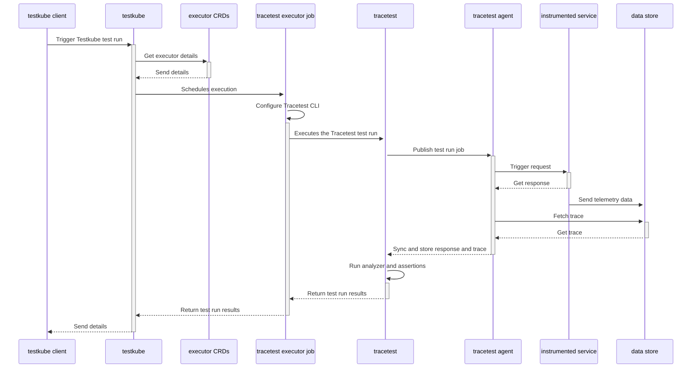
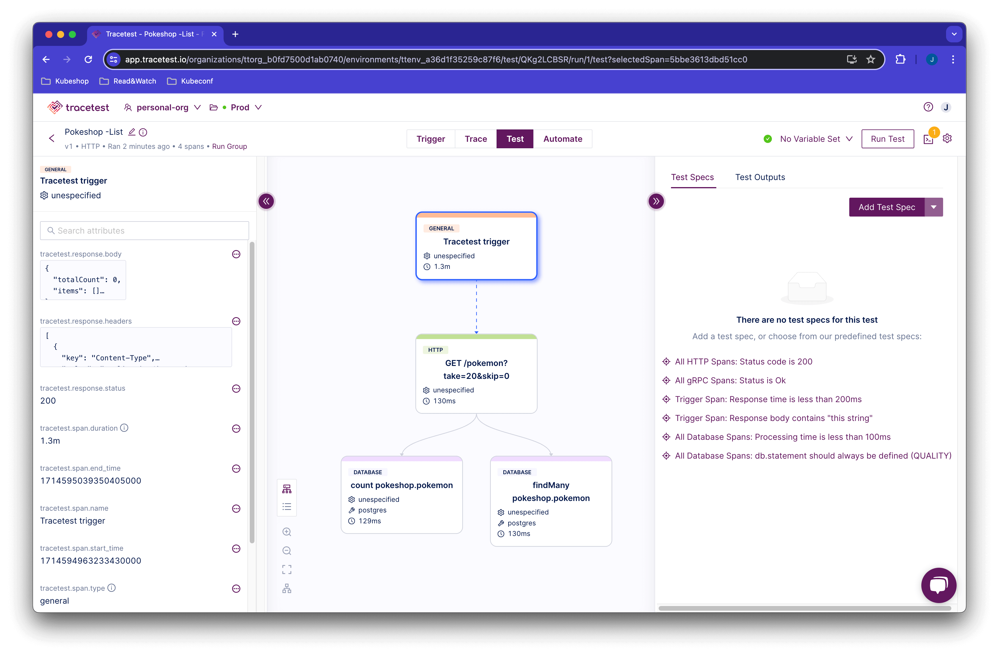
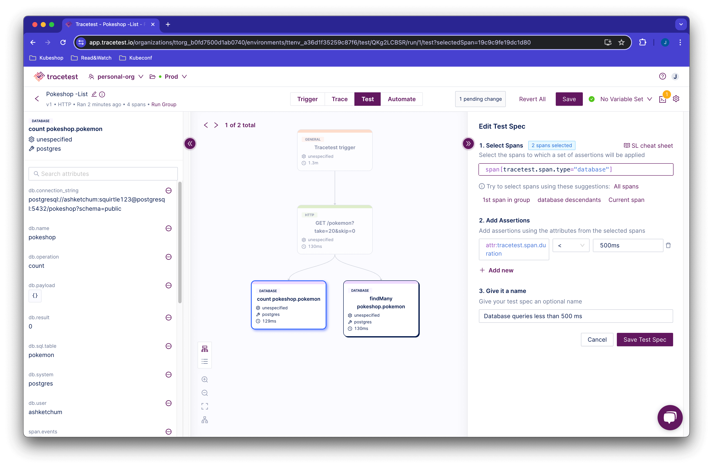
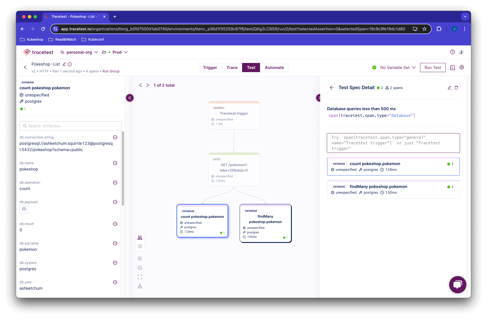
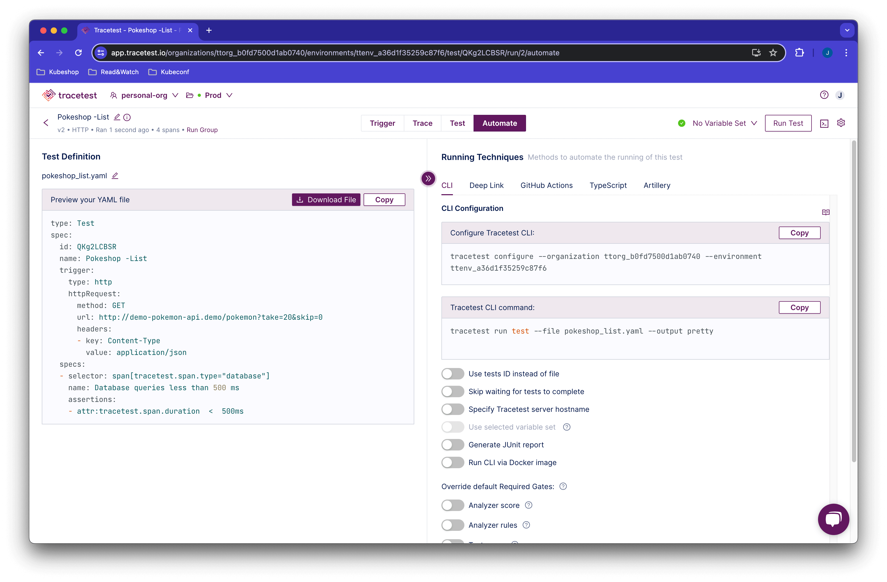
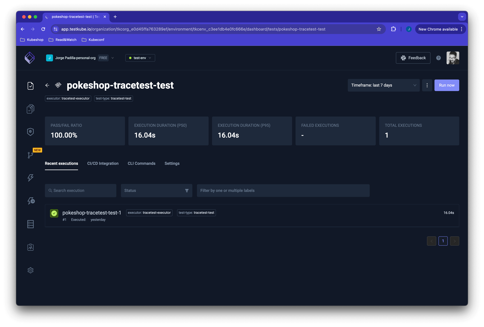

:::note
[Check out how the integration works, here.](/tools-and-integrations/testkube)
:::

## Running Scheduled Trace-based Tests

[Tracetest](https://app.tracetest.io/) is a testing tool based on [OpenTelemetry](https://opentelemetry.io/) that allows you to test your distributed application. It uses data from distributed traces generated by OpenTelemetry to validate and assert if your application has the desired behavior described by your test definitions.

[Testkube](https://testkube.io/) is a Kubernetes-native testing framework for Testers and Developers that allows you to automate the executions of your existing testing tools inside your Kubernetes cluster, removing all the complexity from your CI/CD/GitOps pipelines.

By using the [Testkube Tracetest Executor](https://docs.testkube.io/test-types/executor-tracetest) you can unlock Testkube's capacity in conjunction with Tracetest, and leverage the work you have already done to instrument your services.

<div style={{ position: "relative", paddingBottom: "62.5%", height: "0" }}>
  <iframe
    src="https://www.youtube.com/embed/nAp3zYgykok"
    title="Trace-based testing in Kubernetes with Testkube and Tracetest"
    frameborder="0"
    webkitallowfullscreen
    mozallowfullscreen
    allowfullscreen
    width="100%"
    style={{ position: "absolute", top: "0", left: "0", width: "100%", height: "100%" }}
  ></iframe>
</div>

## Why do we want to run Tracetest with Testkube?

Tracetest leverages existing OpenTelemetry instrumentation to run assertions against every part of a distributed transaction.

By integrating with Testkube you can now add Tracetest to the native CI/CD pipeline in your Kubernetes cluster. It allows you to run scheduled tests and synthetic tests. All while following the trace-based testing principle and enabling full in-depth assertions against trace data, not just the response.

## Infrastructure Overview

The following is high level sequence diagram on how Testkube and Tracetest interact with the different pieces of the system:



## Quickstart

This guide will show how to use Testkube alongside Tracetest to run scheduled Trace-based tests in a Kubernetes cluster.

### Prerequisites

**Tracetest account**:

- Sign up to [`app.tracetest.io`](https://app.tracetest.io) or follow the [get started](/getting-started/installation) docs.
- Create an [organization](/concepts/organizations) and [environment](/concepts/environments).
- Deploy the [Tracetest Agent](/configuration/agent) in your cluster.
- Create an [environment token](/concepts/environment-tokens).

**Testkube account**:

- Sign up to [`app.testkube.io`](https://app.testkube.io) or follow the [get started](https://docs.testkube.io/articles/getting-started) docs.
- Create a Testkube environment.
- Deploy the [Testkube Agent](https://docs.testkube.io/testkube-pro/articles/installing-agent) in your cluster.

Remember, in your Kubernetes cluster you should have:

1. `Tracetest Agent`.
2. `Testkube Agent`.
3. `OpenTelemetry Instrumented Service`: In order to generate traces and spans, the service under test must support the basics for [propagation](https://opentelemetry.io/docs/reference/specification/context/api-propagators/) through HTTP requests, and also store traces and spans into a Tracing Backend (Jaeger, Grafana Tempo, OpenSearch, etc) or use the [OpenTelemetry Collector](https://docs.tracetest.io/configuration/overview#using-tracetest-without-a-trace-data-store). If you are using a Tracing Backend, the Tracetest Agent requires network access to it. In case of using the OpenTelemetry Collector, you need to setup your collector to send trace data to the Tracetest Agent.

On your machine you should have:

1. `Kubectl` [installed](https://kubernetes.io/docs/tasks/tools/).
2. `Testkube CLI` [installed](https://docs.testkube.io/articles/install/cli).
3. `Helm` [installed](https://helm.sh/docs/intro/install/)

With everything set up, we will start configuring Testkube and Tracetest to run scheduled Trace-based tests.

### 1. Connect your Testkube CLI to your Testkube Environment

To use the Testkube CLI with your Testkube account you need to set the CLI Context. For that you need a Testkube Pro token. When the token is created, you are ready to change the Testkube CLI context:

```bash
testkube set context -c cloud -e testkube-environment-id -o testkube-organization-id -k testkube-token
```

For more information see the Testkube [Connecting from the CLI](https://docs.testkube.io/testkube-pro/articles/managing-cli-context) docs.

### 2. Create a Test in Tracetest

In the environment in your [Tracetest](https://app.tracetest.io) account, start by clicking `Tests` > `Create` > `HTTP`, then `Enter the URL of your OpenTelemetry Instrumented Service` and click `Run`. Remember that you need the Tracetest Agent deployed and configured in your environment so it can trigger the request and fetch the trace data.

This will trigger the test and display the distributed trace in the `Test` tab to run assertions against.



Proceed to add a test spec to assert all database queries return within 500 ms. Click the `Test` tab and proceed to click the `Add Test Spec` button.

In the span selector make sure to add this selector:

```css
span[tracetest.span.type="database"]
```

In the assertion field add:

```css
attr: tracetest.span.duration < 500ms;
```

Save the test spec and publish the test.



The database spans that are returning in less than 500ms are labeled in green.



This is an example of a trace-based test that asserts against every single part of an HTTP transaction, including all interactions with the database.

However, Tracetest cannot run this test as part of your CI/CD without integrating with another tool.

Let's introduce how Testkube makes it possible.

### 3. Create a Trace-based Test with Tracetest in Testkube

Click the `Automate` tab in the top of your screen. This will show the YAML definition for the test run.



Click the `Download File` button and this will save your definition in a yaml format.

```yaml
type: Test
spec:
  id: RUkKQ_aVR
  name: Pokeshop - List
  description: Get a Pokemon
  trigger:
    type: http
    httpRequest:
      url: http://demo-pokemon-api.demo/pokemon?take=20&skip=0
      method: GET
      headers:
        - key: Content-Type
          value: application/json
  specs:
    - name: Database queries less than 500 ms
      selector: span[tracetest.span.type="database"]
      assertions:
        - attr:tracetest.span.duration  <  500ms
```

Execute the following command to create the test executor object in Testkube. Do not forget to provide the path to your Tracetest definition file using the `--file` argument, and also the following variables:

- `TRACETEST_TOKEN`: your [environment token](../concepts/environment-token.mdx).
- `TRACETEST_ENVIRONMENT`: your [environment id](../concepts/environments.mdx).
- `TRACETEST_ORGANIZATION`: your [organization id](../concepts/organizations.mdx).

```bash
kubectl testkube create test --file my/file/location.yaml --type "tracetest/test" --name pokeshop-tracetest-test --variable TRACETEST_TOKEN=tracetest-token --variable TRACETEST_ENVIRONMENT=tracetest-environment-id --variable TRACETEST_ORGANIZATION=tracetest-organization-id
```

```text title="Expected output"
Test created testkube / pokeshop-tracetest-test 🥇
```

Opening the Testkube Dashboard will show the test is created successfully.


### 4. Run the Tracetest Trace-based Test in Testkube

Finally, to run the test, execute the following command, or run the test from the Testkube Dashboard.

```bash
kubectl testkube run test --watch pokeshop-tracetest-test
```

Here's what the Testkube CLI will look like if the test passes.

```bash
🚚 [TracetestRunner]: Preparing test run
🌍 Configuring Tracetest CLI with Token
🌍 Using arguments to configure CLI: [configure --token tracetest-token --organization tracetest-organization-id --environment tracetest-environment-id]
🚀 Configure command tracetest configure --token tracetest-token --organization tracetest-organization-id --environment tracetest-environment-id
🔬 Executing in directory :
 $ tracetest configure --token tracetest-token --organization tracetest-organization-id --environment tracetest-environment-id
 SUCCESS  Successfully configured Tracetest CLI

✅ Execution succeeded
🌍 Using arguments to run test: [run test --file /data/test-content --output pretty]
🚀 Test run command tracetest run test --file /data/test-content --output pretty
🔬 Executing in directory :
 $ tracetest run test --file /data/test-content --output pretty

✔ RunGroup: #58WmDuBSR (https://app.tracetest.io/organizations/tracetest-organization-id/environments/tracetest-environment-id/run/58WmDuBSR)
 Summary: 1 passed, 0 failed, 0 pending
  ✔ Pokeshop - List (https://app.tracetest.io/organizations/tracetest-organization-id/environments/tracetest-environment-id/test/R5NITR14g/run/1/test) - trace id: 3cdcb56d6c226f7083f45d6b3d278051
	✔ span[tracetest.span.type="http"]
	✔ span[tracetest.span.type="database"]
```

And, here's the Testkube Dashboard.



### 5. Create a Trace-based Test That Runs Every Minute

By using Testkube's [scheduling](https://docs.testkube.io/concepts/scheduling), you can trigger this test every minute.

```bash
kubectl testkube create test --file my/file/location.yaml --type "tracetest/test" --name pokeshop-tracetest-scheduled-test --schedule="*/1 * * * *" --variable TRACETEST_TOKEN=tracetest-token --variable TRACETEST_ENVIRONMENT=tracetest-environment-id --variable TRACETEST_ORGANIZATION=tracetest-organization-id
```

```text title="Expected output"
Test created testkube / pokeshop-tracetest-scheduled-test 🥇
```

In your Testkube Dashboard you'll see this test run continuously and get triggered every minute.


## What's Next?

To explore more options that Testkube gives you, check out [test triggers](https://docs.testkube.io/concepts/triggers). They enable you to trigger tests based on Kubernetes events.

## Learn More

Please visit our [documentation](https://docs.tracetest.io/) and join our [Slack Community](https://dub.sh/tracetest-community) for more info!
