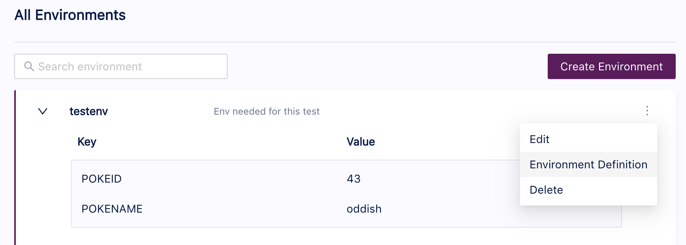

Once you have created a Test Suite, whether from the Tracetest UI or via a text editor, you will need the capability to run it via the Command Line Interface (CLI) to integrate it into your CI/CD process or your local development workflow.

The command to run a Test Suite is the same as running a test from the CLI.

The documentation for running a test via the CLI can be found here:

- [tracetest run](/cli/reference/tracetest_run): This page provides examples of using this command.

## Running Your First Test Suite

To run a Test Suite, give the path to the Test Suite definition file with the `'-f'` option. This will launch a Test Suite, providing us with a link to the created Test Suite run.

```sh
tracetest run testsuite -f path/to/testsuite.yaml
```
```text title="Output:"
✔ Pokemon Test Suite (http://localhost:11633/testsuite/xcGqfHl4g/run/3)
	✔ Pokeshop - Import (http://localhost:11633/test/XRHjfH_4R/run/4/test)
	✔ Pokeshop - List (http://localhost:11633/test/QvPjBH_4g/run/4/test)
```

## Running a Test Suite That Uses Variable Sets

There are two ways of referencing a variable set when running a Test Suite.

You can reference an existing variable set using its id. For example, given this defined variable set with an id of `'testenv'`:



We can run a Test Suite and specify that variable set with this command:

```sh
tracetest run testsuite -f path/to/testsuite.yaml --vars testenv
```

You can also reference a variable set resource file which will be used to create a new variable set or update an existing one. For example, if you have a file named `local.env` with this content:

```yaml
type: VariableSet
spec:
  id: local.env
  name: local.env
  values:
  - key: POKEID
    value: 45
  - key: POKENAME
    value: vileplume
```

```sh
tracetest run test -f path/to/testsuite.yaml --vars path/to/local.env
```

If you use the variable set resource approach, a new variable set will be created in Tracetest.

The second approach is very useful if you are running tests from a CI pipeline.
