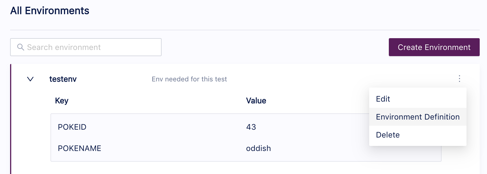

# Running Tests From the Command Line Interface (CLI)
Once you have created a test, whether from the Tracetest UI of via a text editor, you will need the capabity to run it via the Command Line Interface (CLI) to integrate it into your CI/CD process or your local development workflow. The documentation for running a test via the CLI can be found here: [tracetest test run](./reference/tracetest_test_run.md). This page will provide some examples of using this command.

## Running Your First Test
To run a test, give the path to the test definition file with the '-d' option. This will launch a test, providing us with a link to the created test run.

```
tracetest test run -d path/to/test.yaml -w
```
output:
```
✔ Pokeshop - Import (http://localhost:11633/test/4oI08rA4g/run/3/test)
```

Now, let's run the same test but tell the CLI to wait for the test to complete running before returning. This will provide results from the test.
```
tracetest test run -d path/to/test.yaml -w
```
output:
```
✘ Pokeshop - Import (http://localhost:11633/test/4oI08rA4g/run/12/test)
	✔ Response should be ok
		✔ #59ce1f4250482ba5
			✔ attr:tracetest.response.status = 200 (200)
	✔ JSON from external request should have name of 'meowth'
		✔ #efa1be47f04a0d43
			✔ attr:http.response.body| json_path '$.name' = "diglett" (diglett)
	✘ Postgres DB queries are fast
		✘ #f062f4d34031279e
			✘ attr:tracetest.span.duration < 20ms (23ms) (http://localhost:11633/test/4oI08rA4g/run/12/test?selectedAssertion=2&selectedSpan=f062f4d34031279e)
		✔ #0afed975903f2db5
			✔ attr:tracetest.span.duration < 20ms (636us)
		✔ #13ce59129b4e7e31
			✔ attr:tracetest.span.duration < 20ms (2ms)
```

Running the same command with the '-o json' option would change the output from the default of human readable 'pretty' to 'json'. This can be useful when you wish to extract particular data from the response. This would look like:
```
tracetest test run -d path/to/test.yaml -w - o json
```
output:
```
{
  "testRunWebUrl": "http://localhost:11633/test/4oI08rA4g/run/13/test",
  "results": {
    "results": [
      {
        "results": [
          {
            "allPassed": true,
            "assertion": "attr:tracetest.response.status = 200",
            "spanResults": [
              {
                "observedValue": "200",
                "passed": true,
                "spanId": "92e4781f4961bbe9"
              }
            ]
          }
        ],
        "selector": {
          "query": "span[tracetest.span.type=\"general\" name=\"Tracetest trigger\"]",
          "structure": [
            {
              "filters": [
                {
                  "operator": "=",
                  "property": "tracetest.span.type",
                  "value": "general"
                },
                {
                  "operator": "=",
                  "property": "name",
                  "value": "Tracetest trigger"
                }
              ]
            }
          ]
        }
      },
      {
        "results": [
          {
            "assertion": "attr:http.response.body| json_path '$.name' = \"diglett\"",
            "spanResults": [
              {
                "error": "no match"
              }
            ]
          }
        ],
        "selector": {
          "query": "span[tracetest.span.type=\"http\" name=\"HTTP GET pokeapi.pokemon\" http.method=\"GET\"]",
          "structure": [
            {
              "filters": [
                {
                  "operator": "=",
                  "property": "tracetest.span.type",
                  "value": "http"
                },
                {
                  "operator": "=",
                  "property": "name",
                  "value": "HTTP GET pokeapi.pokemon"
                },
                {
                  "operator": "=",
                  "property": "http.method",
                  "value": "GET"
                }
              ]
            }
          ]
        }
      },
      {
        "results": [
          {
            "assertion": "attr:tracetest.span.duration \u003c 20ms",
            "spanResults": [
              {
                "error": "no match",
                "observedValue": "22ms",
                "spanId": "1755c8fc14905bd1"
              },
              {
                "observedValue": "574us",
                "passed": true,
                "spanId": "c41f9b8f49f6eb32"
              },
              {
                "observedValue": "1ms",
                "passed": true,
                "spanId": "48bef78ad4b3c3ab"
              }
            ]
          }
        ],
        "selector": {
          "query": "span[tracetest.span.type=\"database\" db.system=\"postgresql\"]",
          "structure": [
            {
              "filters": [
                {
                  "operator": "=",
                  "property": "tracetest.span.type",
                  "value": "database"
                },
                {
                  "operator": "=",
                  "property": "db.system",
                  "value": "postgresql"
                }
              ]
            }
          ]
        }
      }
    ]
  }
}
```

You can also opt to output the result as JUnit to a file. You would run the command with a -j option and a file name, ie:
```
tracetest test run -d path/to/test.yaml -w -j junit.out
```
The junit output file would then contain the junit result, for example:
```
<testsuites name="Pokeshop - Import" tests="5" failures="1" errors="0" skipped="0" time="10">
        <testsuite name="span[tracetest.span.type=&#34;general&#34; name=&#34;Tracetest trigger&#34;]" tests="1" failures="0" errors="0" skipped="0">
                <testcase name="attr:tracetest.response.status = 200"></testcase>
        </testsuite>
        <testsuite name="span[tracetest.span.type=&#34;http&#34; name=&#34;HTTP GET pokeapi.pokemon&#34; http.method=&#34;GET&#34;]" tests="1" failures="0" errors="0" skipped="0">
                <testcase name="attr:http.response.body| json_path &#39;$.name&#39; = &#34;diglett&#34;"></testcase>
        </testsuite>
        <testsuite name="span[tracetest.span.type=&#34;database&#34; db.system=&#34;postgresql&#34;]" tests="3" failures="1" errors="0" skipped="0">
                <testcase name="attr:tracetest.span.duration &lt; 20ms">
                        <failure type="attr:tracetest.span.duration &lt; 20ms" message="21ms"></failure>
                </testcase>
                <testcase name="attr:tracetest.span.duration &lt; 20ms"></testcase>
                <testcase name="attr:tracetest.span.duration &lt; 20ms"></testcase>
        </testsuite>
</testsuites>
```

## Running a Test That Uses Environment Variables

There are two ways of referencing an environment when running a test. 

You can reference an existing environment using it's id by running. For example, given this defined environment with an id of 'testenv':



We can run a test and specify that environment with this command:
```
tracetest test run -d path/to/test.yaml -e testenv -w
```

You can also reference an .env file which will be used to create a new environment or updating an existing one. For example, if you have a .env file named local.env with this content:
```
POKEID=45
POKENAME=vileplume
```

tracetest test run -d path/to/test.yaml -e path/to/local.env -w

If you use the .env approach, a new environment will be created in Tracetest if it does not exist where the environment name and id will be the file name without the suffix .env. So, local.env becomes local.

The second approach is very useful if you are running tests from a CI pipeline