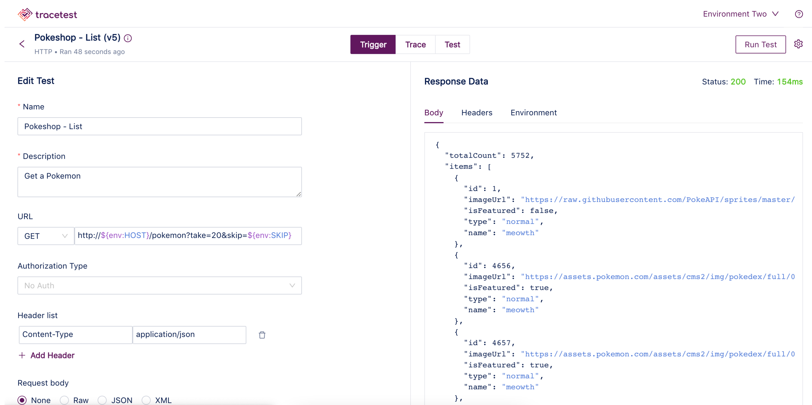
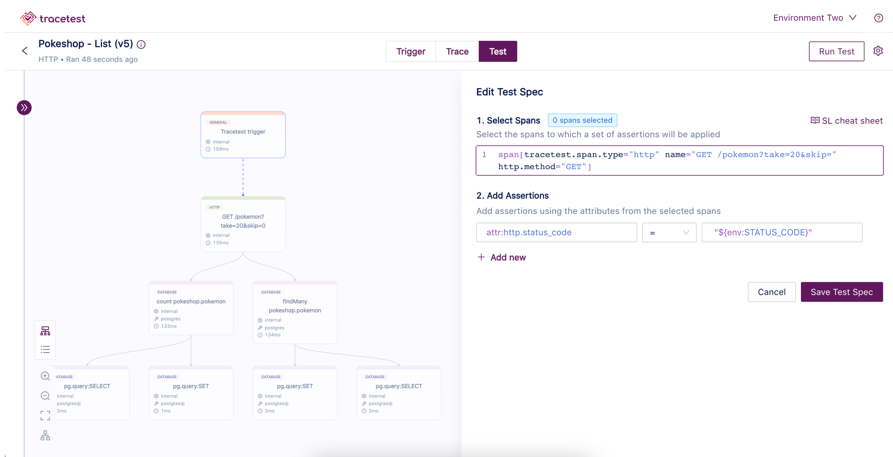
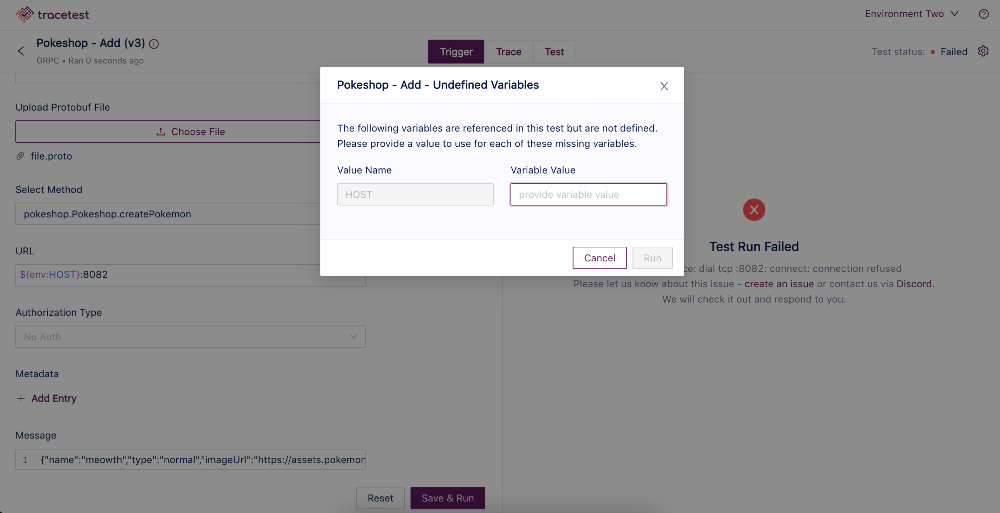
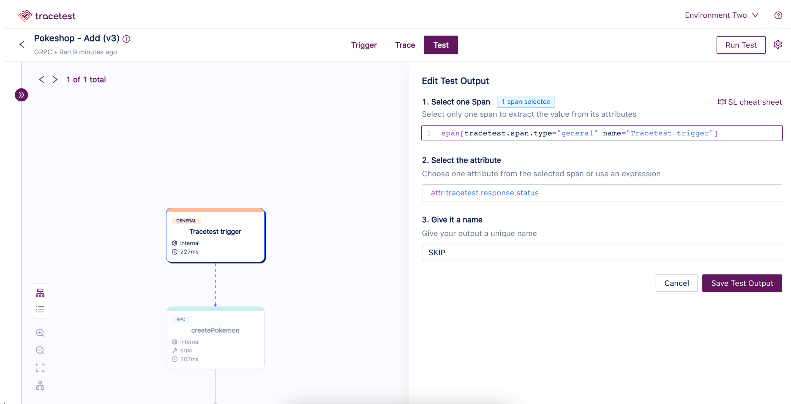
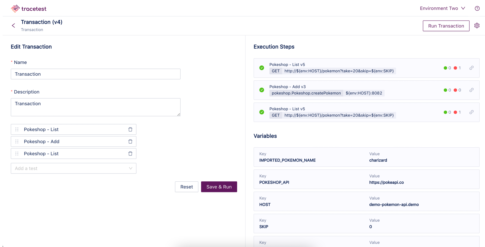
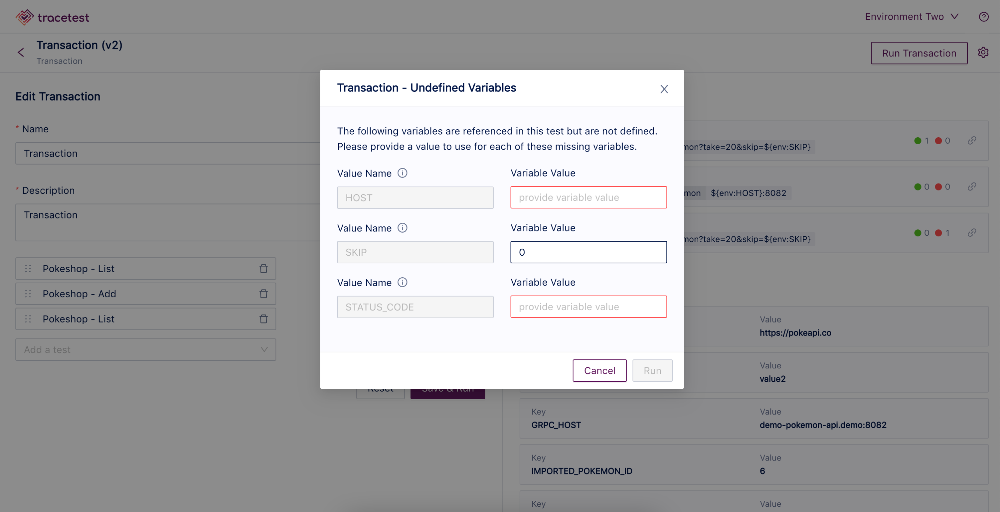

# Ad-hoc Testing

This page showcases use-cases for undefined variables and how to enable ad-hoc testing by utilizing variable sets and undefined variables.

:::tip
[Check out how to configure ad-hoc testing with undefined variables with the **Web UI** here.](../web-ui/undefined-variables.md)
:::

:::tip
[Check out how to configure ad-hoc testing with undefined variables with the **CLI** here.](../cli/undefined-variables.md)
:::

## **Undefined Variables Use Cases**

### **Supply Variable Value at Runtime**

A user wants a test or transaction they can run on a particular user, order id, etc. that is configurable at run time. This makes running an adhoc test in an environment, even production, very easy and convenient. In this case, the user references the variable, but doesn't add it to the environment. Each time they run the test or transaction, they will be prompted for the unspecified variables.

### **Supply Variable Value from a Previous Test**

A user wants to define 3 tests as part of a transaction. The first test has an output variable and this output is used by the second test. They define the first test. They then define the second test and reference the variable value that is output from the first test. 

In Tracetest, undefined variables can be used in both the UI and CLI. 

## **Undefined Variables Transaction with Multiple Tests Example**

1. Create an HTTP Pokemon list test that uses variables for hostname and the SKIP query parameter:

1. Within the test, create test spec assertions that use variables for comparators, something like: `http.status_code = "${env:STATUS_CODE}"`:

1. Create a GRPC Pokemon add test that uses variables for hostname and Pokemon name:

4. Create an output from this test for the SKIP variable that could come from anywhere in the trace:

5. Now, you can create a transaction with the two tests - first, add the list test, then the add test, and then the list test again:

6. From here you can input the values for the undefined variables and complete your trace:

