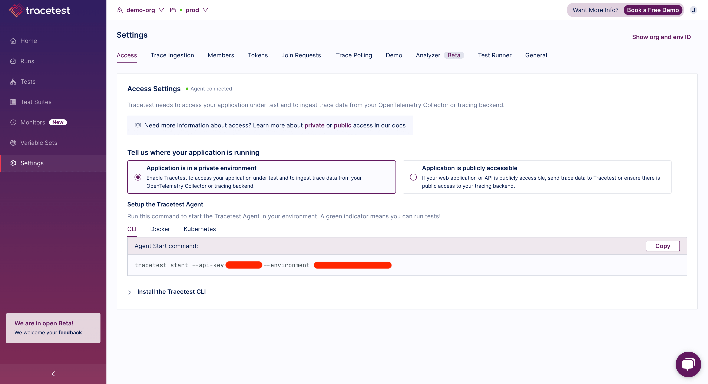

This page explains how Tracetest accesses your private application (VPC, firewall, etc.) and its traces to run tests.

If your application is in a private environment, you will use the Tracetest Agent in your environment to run tests and ingest trace data from your OpenTelemetry Collector or tracing backend.

Tracetest Agent is a lightweight, dependency-free, agent that runs in your environment as an executable, Docker container, or in your Cloud Native infrastructure.

If you have a [publicly accessible application, then view this page](/concepts/cloud-agent).

## Get Started

Go to your Environment Access Settings page.

Select **"Application is in a private environment"**. Use the `--api-key` and `--environment` id to run the Tracetest Agent in your environment.

Enable and configure the tracing backend you're using via the trace ingestion tab or use the supplied OTLP endpoints to alter your OpenTelemetry Collector configuration to send trace information via either gRPC or HTTP directly to Tracetest.

## How It Works

- Tracetest Agent listens for new tests you run from [Tracetest](https://app.tracetest.io). It executes tests in the environment where it is running and returns the response from the trigger. The environment can be either `localhost`, Docker, or Kubernetes.
- Tracetest Agent listens on OTLP ports `4317` (gRPC) and `4318` (HTTP) for OpenTelemetry trace spans to capture distributed trace data and relay it to [Tracetest](https://app.tracetest.io).
- Be able to connect to a trace data store that is not accessible outside of your environment. Eg. a Jaeger instance running in the cluster without an ingress controller.
- With both the response and trace, you build tests and create assertions with data from either or both of them.

## Architecture

:::note
Want to start Tracetest Agent? Check out [this page to get started](../getting-started/installation).
:::
