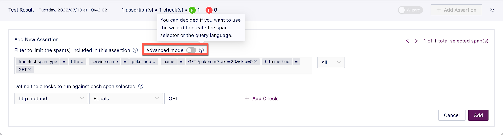

# Assertions

Test Specifications may be added to a trace to set a value for a step in the trace to determine success or failure. If test specs have already been added to a test, they will be on the Test screen:

After you have created a test and your test run is complete, click the **Add Test Spec** button at the bottom right of the Test screen.

The **Add Test Spec** dialog opens.

The span that the new test spec will apply to is hightlighted in the graph view on the left:

To add an assertion to a span, click the first drop down to see the list of attributes that apply to the selected span:

Then select the operator for your assertion:

And add the value for comparison:

Finally, you can give your test spec an optional name and click **Save Test Spec**:

<!--- You can also create assertions by hovering over the **+** sign to the right of an attribute in the trace. 

This will populate the assertion with the correct information for that attribute.

The **Filter** field allows for limiting the spans affected by the assertion.

Use the **Advanced mode** toggle switch to use the wizard or the query language to create the span selector:

<!--- To see adding assertions in action, please watch <Add link to video> --->
