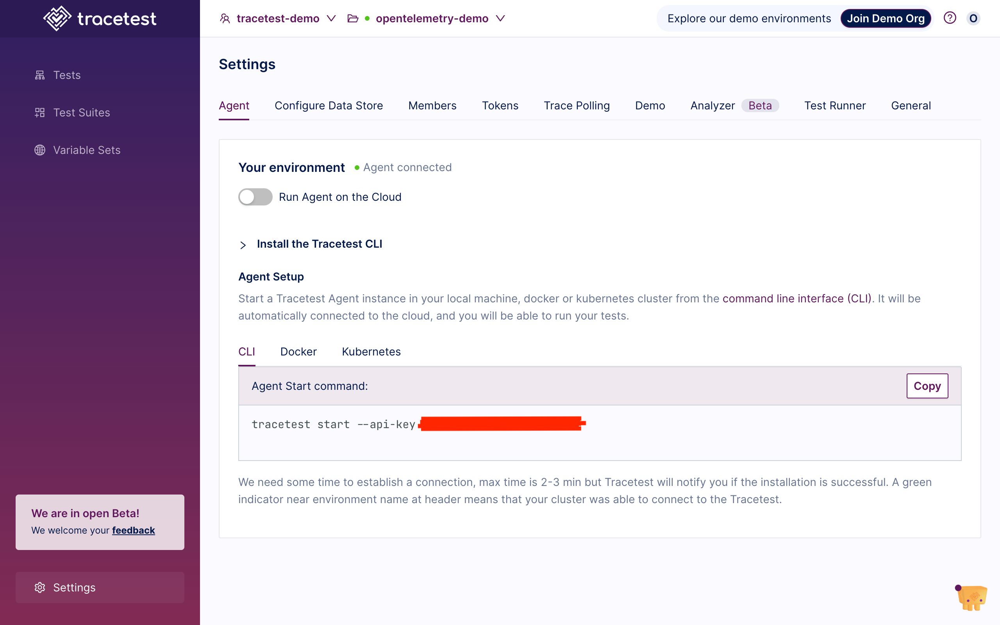
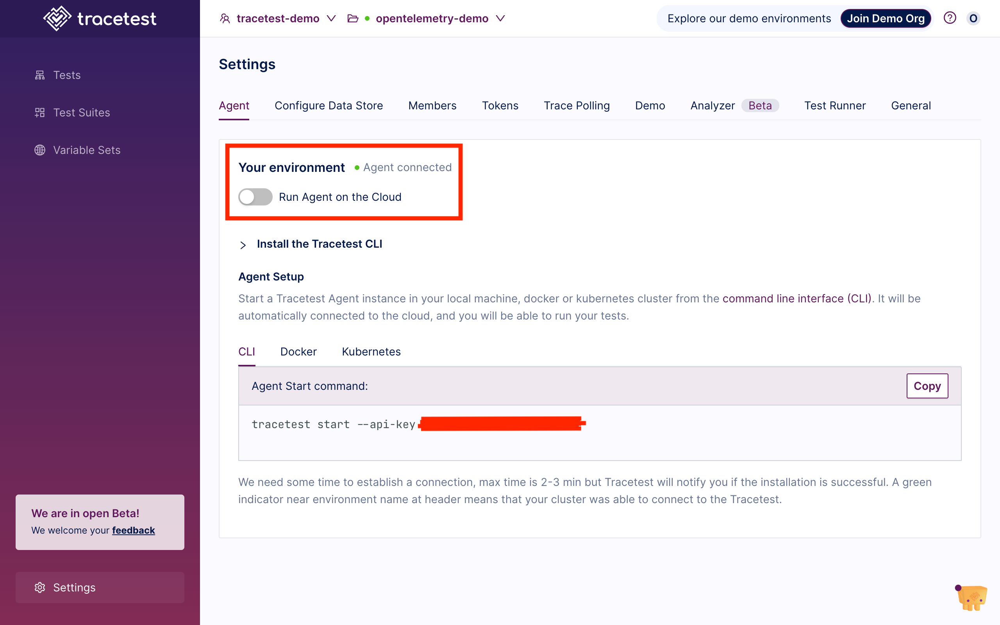
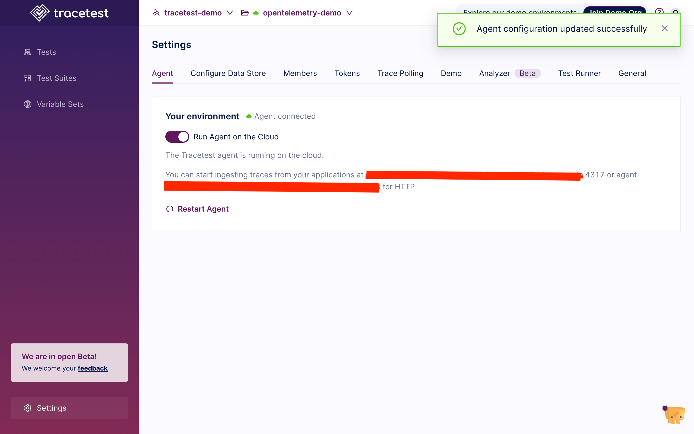

Tracetest Cloud Agent is a lightweight, dependency-free program that runs within the Tracetest Cloud Infrastructure. Allowing you to trigger tests against public endpoints while collecting traces from public data stores or listening for incoming OTLP data.

## Opt-In

### Prerequisites

- Not supported for **localMode**
- Having Admin level access to the Environment

### Steps

Go to your Environment Agent Settings page:

Turn the **Run Agent on the Cloud** switch on:

Wait for the Agent information is ready:

## How It Works

- Tracetest Cloud Agent listens for new tests you run from [Tracetest](https://app.tracetest.io). It executes tests within the Tracetest Cloud Infrastructure and returns the response from the trigger.
- Tracetest Cloud Agent listens on OTLP ports `4317` (gRPC) and `4318` (HTTP) for OpenTelemetry trace spans to capture distributed trace data and relay it to [Tracetest](https://app.tracetest.io).
- Be able to connect to a publicly reachable trace data store. Eg. a Grafana Cloud Tempo instance.
- With both the response and trace, you build tests and create assertions with data from either or both of them.

## Architecture

