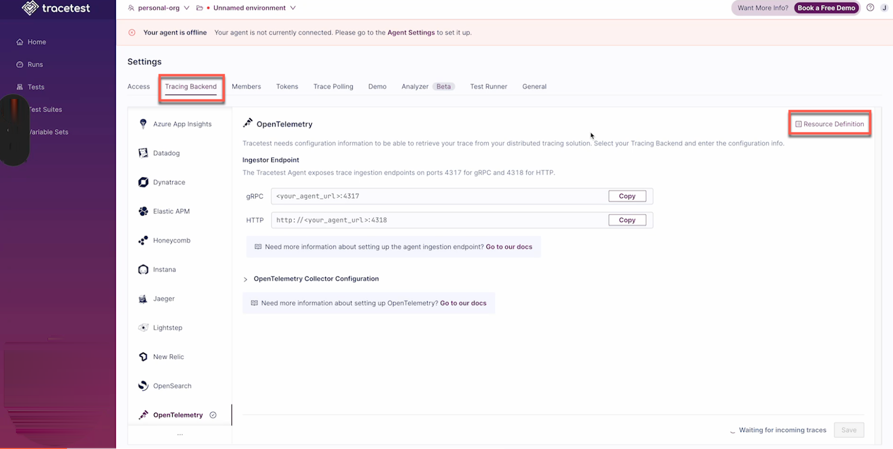

## Resource Definition

The Tracetest Web UI provides several options for maintaining Resource Definitions for Tracetest constructs.

### Tracing Backend

When you are in your tracing environment for your org, in **Settings**, under the **Tracing Backend** tab, you will find the link to the **Resource Definition** modal:



Clicking on the **Resource Definition** link will open the modal:


The YAML definition is in the left panel, where you can rename, download or copy the YAML file.

On the right are the automate commands for applying this resource in the CLI.

### Trace Polling

Similarly, on the **Trace Polling** tab, you will find the **Resource Definition** link for each polling profile in the trace:


Selecting the **Definition** link will open the **Resource Definition** modal:


### Demo

On the **Demo** tab, you will find link to work with resource definitions, as well:


### Analyzer

On the **Analyzer** tab, click on **Resource Definition**:


The analyzer modal shows one single action.


### Test Runner

On the **Test Runner** tab, click on **Resource Definition**:


### Variable Sets

In the navigation panel on the left of the screen, click on **Variable Sets**.


This will open the modal for the Variable Set's resource definition:


## Provisioning Environments

Tracetest allows the creation of an environment from the CLI and provisioning it with any type of resource, including tests, test suites, tracing backends, test runners, polling profiles, invites, tokens, etc.

Use this feature to quickly spin up new environments for integration testing or CI builds.

:::note
You can find code examples [here](https://github.com/kubeshop/tracetest/tree/main/examples/environment-automation).
These files are in a folder called [“/resources”](https://github.com/kubeshop/tracetest/tree/main/examples/environment-automation/resources).
:::

```yaml title="environment.yaml"
type: Environment
spec:
  name: my-demo-env
  description: My env desc
  resources: ./resources # this is a folder
```
The apply command for creating this environment:

```bash title="Terminal"
tracetest apply environment -f ./path/to/environment.yaml
```

You will now see the created environment and all resources from the `resources` folder in the Tracetest Web UI.


