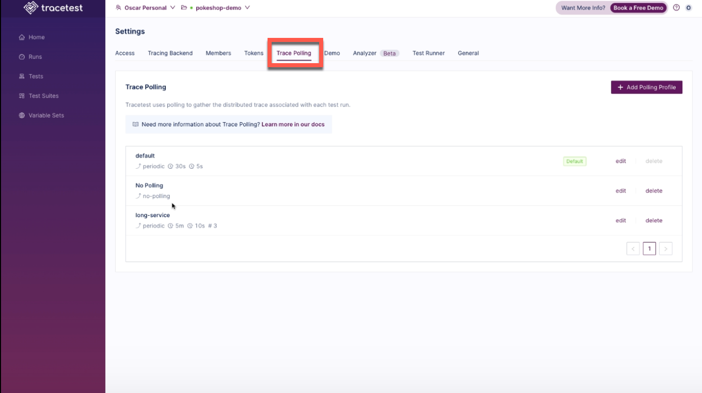
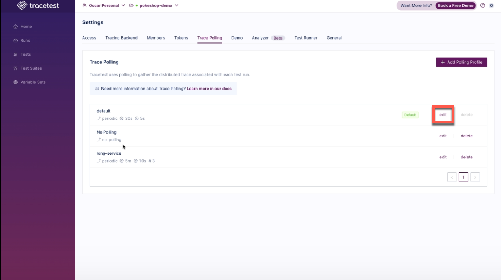
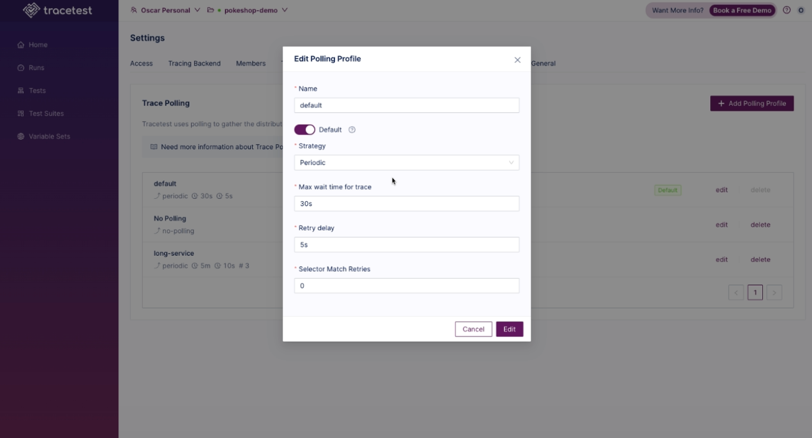
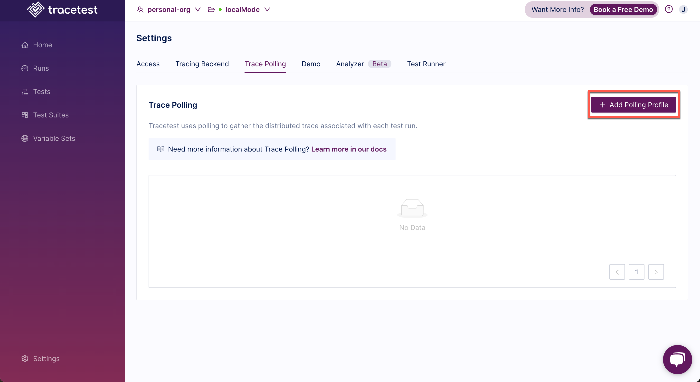
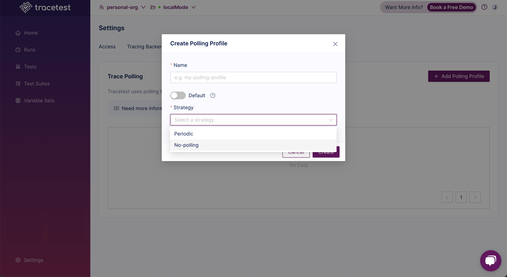
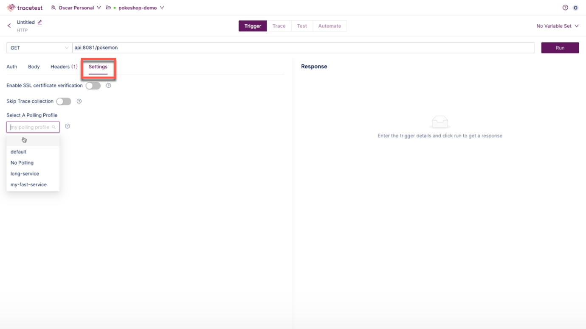

When running trace-based testing, it is crucial to have the trace generated by the test execution. Usually, these traces are stored
in a tracing backend (Jaeger, Tempo, etc) or they can be sent directly to Tracetest via OpenTelemetry Collector. In both cases, the trace is not
complete as soon as the test is run, the application might run a long-running operation or is batching generated spans before sending them
to the tracing backend. In any case, spans are not sent instantaneously and are not available for Tracetest as soon as the test trigger is
done running.

This means that Tracetest needs to check periodically if the trace is complete or not. For this, a **Polling Profile** is used. This profile
tells Tracetest how often and how long to wait for a trace to finish. Every Tracetest environment has one default polling profile, meaning that any
test will use that profile when trying to fetch the trace from the tracing backend. Since version v1.0.0, users can now specify a different
polling profile per test. This makes more sense than having a single profile, due to some tests being pretty quick to run and others can take minutes
to hours to finish executing.

## Adding a Polling Profile in the CLI

```yaml
# test.yaml
type: Test
spec:
    name: my quick test
    pollingProfile: ./quick-polling-profile.yaml
    trigger:
        type: http
        httpRequest:
            url: http://${env:ENDPOINT}/api/resource
            method: GET
```

```yaml
# quick-polling-profile.yaml
type: PollingProfile
spec:
    name: quick polling profile
    strategy: periodic
    periodic:
        retryDelay: 5s
        timeout: 60s
```

**retryDelay**: How long Tracetest must wait between trace polling tries. In this example, Tracetest will try to get the trace every 5 seconds.

**timeout**: How long Tracetest must keep trying getting a trace. If it takes more than the value set in timeout, the test fails.

## Working with Polling Profiles in the UX

In the Tracetest UX, select **Settings** and then select **Trace Polling**:



Here you will create polling profiles for your environment and see all of the polling profiles already created. Click the **Edit** button for a profile to make changes.



The **Edit Polling Profiles** pop up appears where changes can be made to the profile:



To create a Polling Profile, click on the **Add Polling Profile** button:



The **Create Polling Profile** pop up appears:



Input a polling profile name, use the toggle to indicate whether this profile will be a Default profile (a default for all test runs), and pick a polling strategy.

The options for Polling Profile Strategy are:

- **Periodic:** Tracetest periodically queries the tracing backend at predefined intervals to fetch trace data.

- **No-polling:** Tracetest does not query the tracing backend for trace data. It skips the fetching trace step.

A Polling Profile can also be selected from a test. After selecting a test, on the **Trigger** tab, select the **Settings** tab and select an existing polling profile from the drop down.

