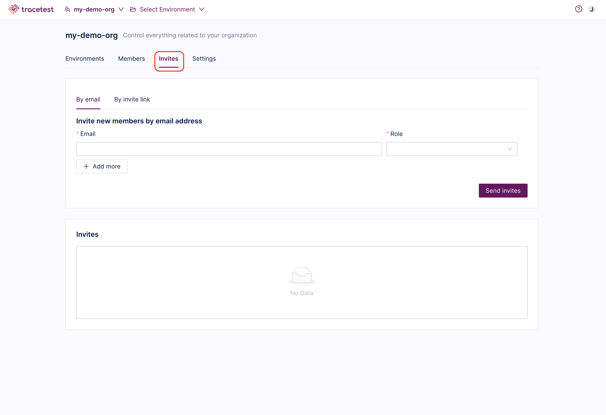
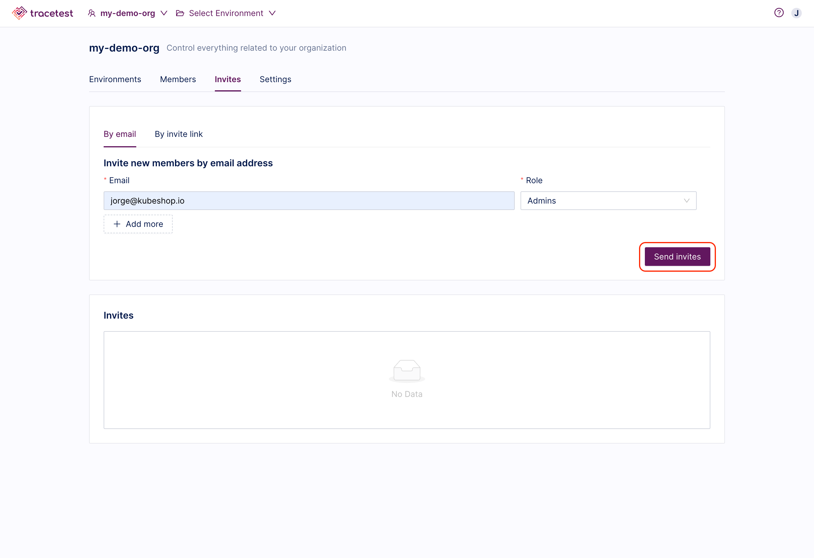
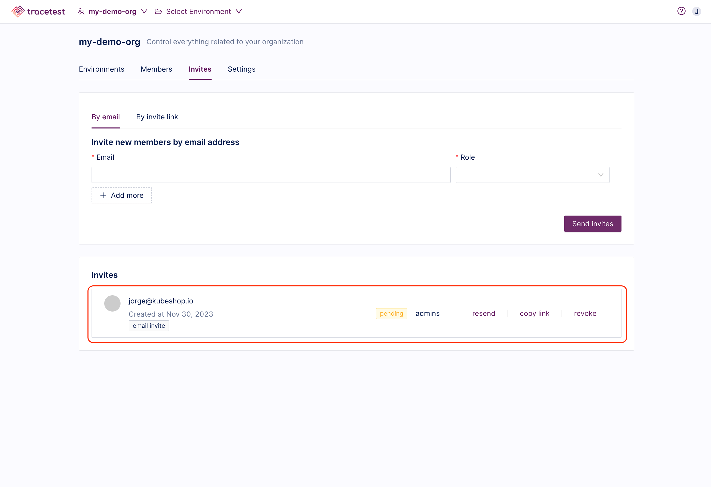
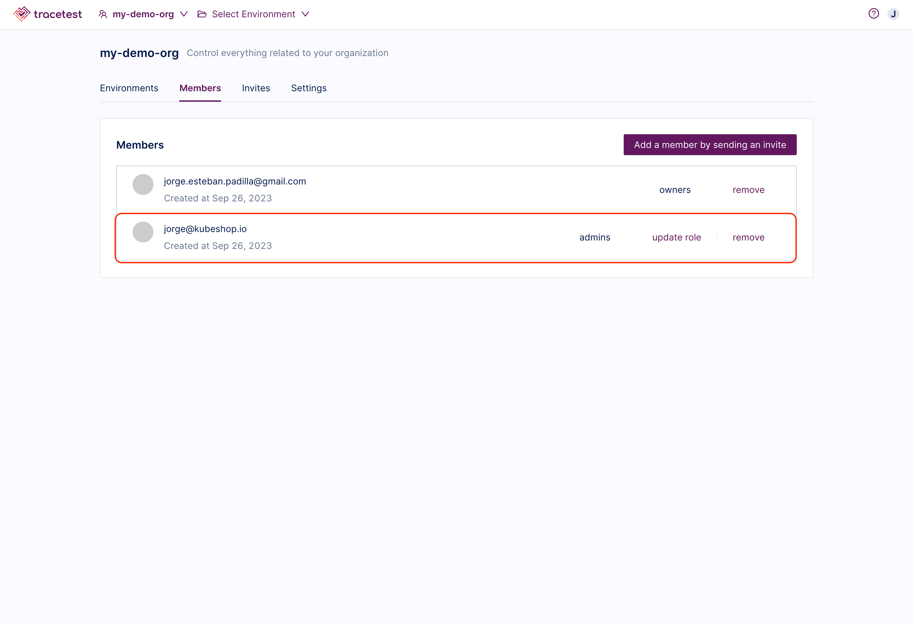
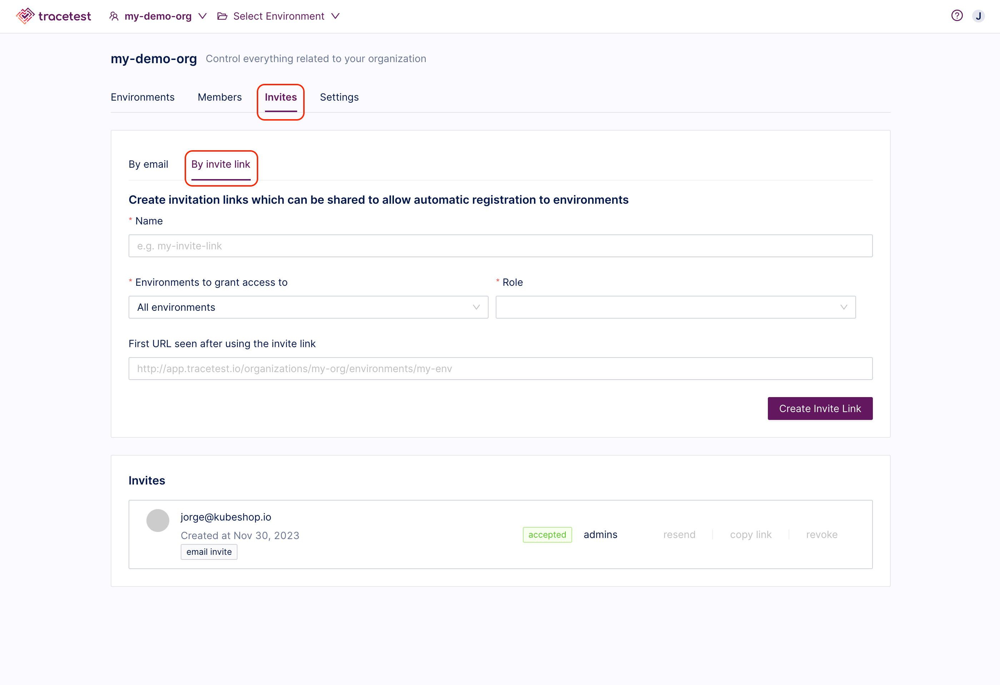
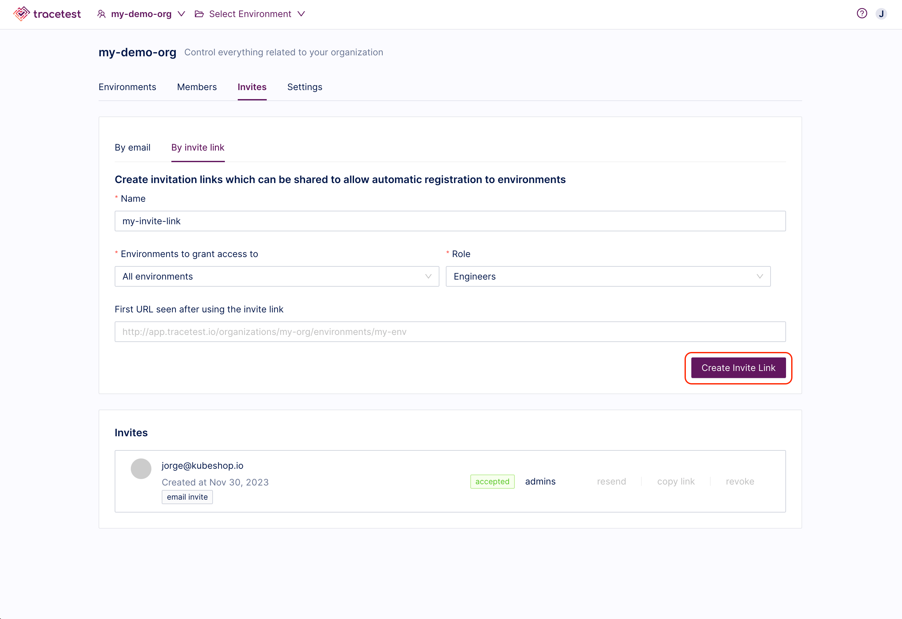
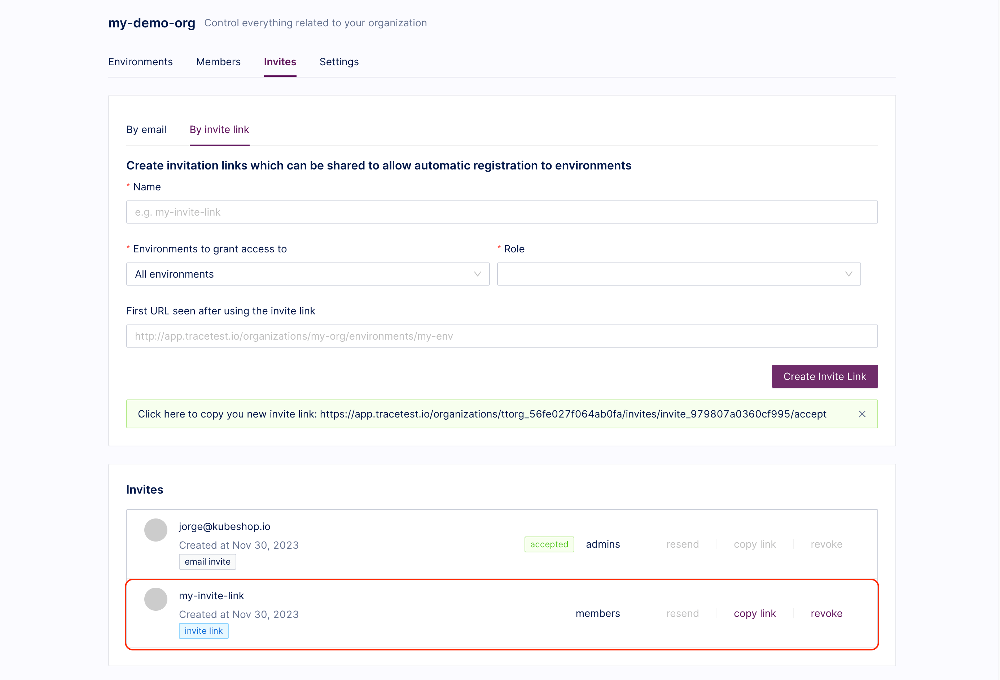
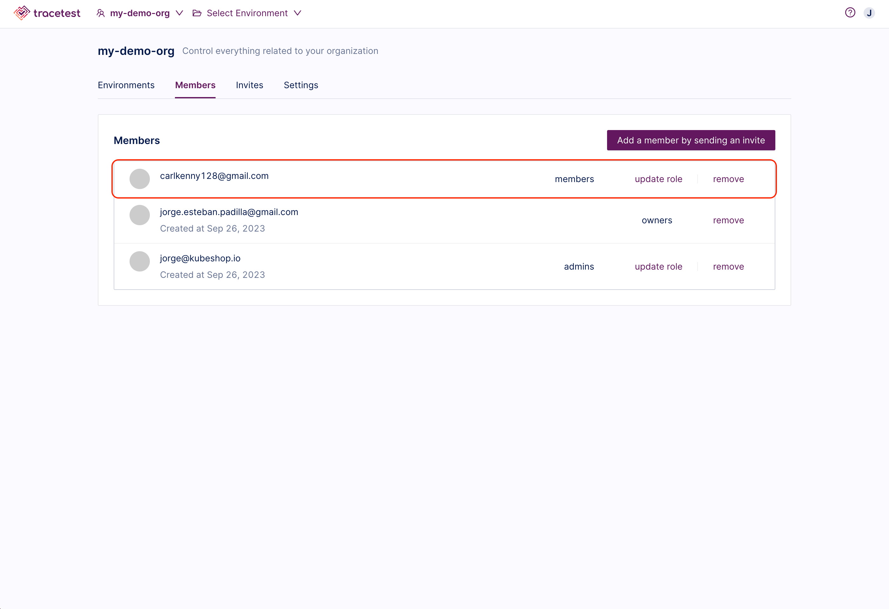

In this section, you will learn everything you need to manage your organization members effectively.

Tracetest distinguishes between different roles to help manage organization members' access levels and permissions. These roles are categorized into two groups: organization level and environment level roles.

## Organization Roles

In Tracetest, organization members play different roles to ensure the operation and success of your team. You can assign different roles to your team members depending on the specific responsibilities. Organization roles include:

- __Owner__: Owners have full control over the platform and can manage all aspects of it, including environment management, team members, invites, general settings, and billing information.

- __Admin__: Administrators have overall control and management of the organization. They have a similar level of permissions as Owners with the exception of managing billing information. Administrators are responsible for ensuring that the organization is configured correctly and that all members have the necessary access and permissions.

- __Member__: Members are users who only need to view data within the organization, but do not need to edit or modify any setting. Members are typically used for adding users to specific environments with a determined level of access.

- __Biller__: Billers are responsible for managing the billing and payment information for the organization. The billing role also gets read-only access to the organization.

## Environment Roles

Environment level roles provide fine-grained control and access to specific environments within an organization. These roles are assigned to individuals and are restricted to the environments they are assigned to. Environment roles include:

- __Admin__: Organization owners and admins inherently act as environment administrators for every environment. Environment administrators can create any test related resource and manage all environment settings.

- __Engineer__: Engineers have control of the environment resources related to tests creation and execution. However, environment engineers can not manage the environment settings.

- __Runner__: Runners have read-only access to a specific environment. Environment runners can only re-run tests that already exist in the environment.

## Managing Organization Members

As the organization owner/admin, you have the ability to manage your organization's composition and the roles of its members. These role assignments define the access level each member has across environments within the organization's scope.

### Adding Organization Members by Email

From the organization dashboard, select the `Invites` tab.

Enter the email address of the person you would like to invite, assign their role, and click the `Send Invite` button. You can invite multiple people at once using the `Add more` button:

You can view all pending invites in the `Invites` section. From here you can resend, copy or revoke the invite.

Once a member has accepted an invitation to the organization, they will be displayed as organization members with their assigned role in the `Members` tabs. You can update their role or remove them as members.

### Adding Organization Members by Invite Link

Organization owners/admins can also share an invite link with others to allow them to join the organization and environments without needing to be invited individually. To generate an invite link:

From the organization dashboard, select the `Invites` tab and the `By Invite Link` option.

Enter a name for the invite link. The invite link will give users a `Member` role within the organization, additionally, you can select the environments and the corresponding role for them. Optionally, you can add a URL that will be used to redirect the user once the invitation is accepted. Finally click the `Create Invite Link` button.

You can view all invite links in the `Invites` section. From here you can copy or revoke the invite link.

Once a member has joined the organization and environments by using the invite link, they will be displayed as organization members in the `Members` tabs. You can update their role or remove them as members.

