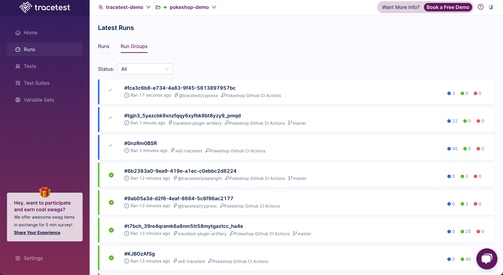
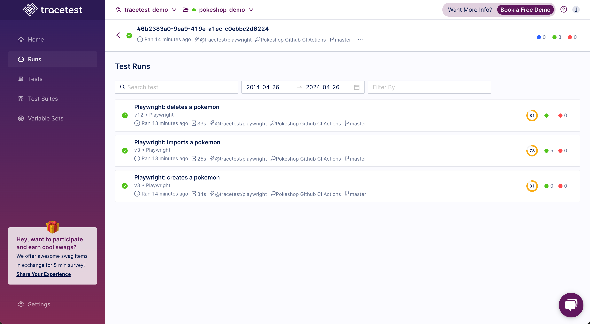

:::tip Commercial Feature
[Feature available only in Cloud-based Managed Tracetest & Enterprise Self-hosted Tracetest.](https://tracetest.io/pricing)
:::

Run Groups are containers that encapsulate one or more runs. Each time a test run is executed in the Tracetest app, a run group is generated that can be found in the UI.



Clicking on a run group will show the runs the run group contains:



Run Groups can be used to logically group runs that have context together. This allows specifying a series of tests or test suites to run concurrently. You then wait for the entire collection to pass or fail before making a decision if the entire group succeeded.

:::note 
You can asynchronously run multiple tests from a script in one run group and wait for all of them to finish before deciding whether to deploy a new release.
:::

Run Groups track the status of all test suites and test runs to yield a single result.

Users are allowed to attach more runs to a run group by adding them in the run information that’s available in the CLI.

[Integrations](https://docs.tracetest.io/tools-and-integrations/overview) support this feature by creating a single run group for every execution.
- [k6](https://docs.tracetest.io/tools-and-integrations/k6)
- [Playwright](https://docs.tracetest.io/tools-and-integrations/playwright)
- [Cypress](https://docs.tracetest.io/tools-and-integrations/cypress)
- [Artillery](https://docs.tracetest.io/tools-and-integrations/artillery-plugin)

Run groups are essential for integrations! Without it, a k6 test could potentially generate thousands of test runs that would pollute the environment and make it almost impossible to search for test runs not associated with that k6 test run.

Another good use case for run groups is for CI runs: usually we don't run a single test or a single test suite to test our systems. You can expect some users to have dozens of suites being run during a CI pipeline. With run groups, all the suite runs from the same pipeline will be shown on the same screen, making it easier for users to understand what failed. 

Last, but not least important, if multiple tests are run inside a run group, they will run in parallel and finish faster than if you use a test suite to organize your tests. (Test suites run sequentially, so for the next test to be run, the current test must finish executing, which can be pretty time consuming.)

## Using Run Groups from the CLI

:::note
[Check out the sample code on GitHub here.](https://github.com/kubeshop/tracetest/tree/main/examples/tracetest-run-groups-cli)
:::

You can run multiple tests at once by providing multiple `-f file.yaml` parameters to the `tracetest run test` command. These tests will be placed under the same run group.

You can also manually wait for a run group to be done from the CLI. 

View the [sample code](https://github.com/kubeshop/tracetest/tree/main/examples/environment-automation). You will see multiple test definitions.

```yaml title="facebook.yaml"
type: Test
spec:
  id: facebook-test
  name: Facebook
  trigger:
    type: http
    httpRequest:
      method: GET
      url: facebook.com
      headers:
        - key: Content-Type
          value: application/json
  skipTraceCollection: true
```

```yaml title="google.yaml"
type: Test
spec:
  id: google-test
  name: Google
  trigger:
    type: http
    httpRequest:
      method: GET
      url: google.com
      headers:
        - key: Content-Type
          value: application/json
  skipTraceCollection: true
```

Run these two tests in a run group like this:

```bash
tracetest run test -f facebook.yaml -f google.yaml -f file.yaml -f ...
```

Normally, if you run two tests separately, both test runs would be part of different run groups:

```bash
tracetest run test -f test1.yaml
```

```bash
tracetest run test -f test2.yaml
```

You also can specify the run group id when running a test. This would make the test part of the run group.

```bash
tracetest run test -f test1.yaml --group my-pipeline
tracetest run test -f test2.yaml --group my-pipeline
```

With the `--group` argument, both tests would be run in parallel but would be seen inside the same run group.

The CLI will by default wait for the group to finish running. Use the `-W` or `--skip-result-wait` flags to not wait for results and exit immediately after the run group has started.

## Running multiple tests inside the same group

```bash
tracetest run test -f test1.yaml -f test2.yaml
```

Both test runs will be shown on the same run group (with a random id).

## Running multiple tests inside the same group and choosing the group id

```bash
tracetest run test -f test1.yaml -f test2.yaml --group my-group-id
```

Both tests will be shown on the same run group (id = my-group-id). If this run group already exists, the two new runs will be placed there with any other test run from that group.

## Adding a new run to an existing group

```bash
tracetest run test -f test3.yaml --group my-group-id
```

This new run will be part of the `my-group-id` group along with the `test1` and `test2` runs.

## Running multiple tests via `id` inside the same group and choosing the group id

```bash
tracetest run test --id testid1 --id testid2 --group my-group-id
```

You can also use the `--id` of a test saved in Tracetest instead of a test definition file.

## Running a test suite and multiple tests inside the same run group

```bash
tracetest run test -f suite.yaml -f test1.yaml -f test2.yaml
```

Test suites can also be part of a run group along with other suites or tests.

## Difference between a test suite and a run group


### Execution time

A test suite only executes the next test when the current test has finished running. So if it contains 4 tests that take 1 minute each, the whole suite will take 4 minutes to complete. Run group tests are run in parallel, so if the same 4 tests are run inside a group, it will complete in 1 minute.

### Using data from a previous test

In suites, you can chain your tests and share data from one test to another. For example, getting the response from the first test and use it as part of the second test definition. This is not possible with run groups.

### Composition

Suites can only contain tests inside of it. Groups can contain both tests and suites. This means that if you have 5 tests where 3 are totally independent but the other 2 need each other to work, you can use groups to run those tests in an efficient way:

- Running the suite (with 2 tests) and the 3 independent tests in parallel.
- If all tests take 1 minute to run, the run group would take 2 minutes to run.
