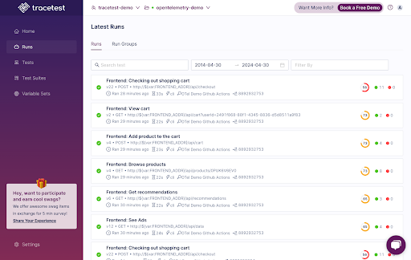

# Runs

Tracetest uses the concept of Runs to define every time a Test was triggered. Runs from different Tests can be grouped into Run Groups to be triggered in parallel.
- [Tests](../concepts/tests.md)
- [Run Groups](../concepts/run-groups.md)

