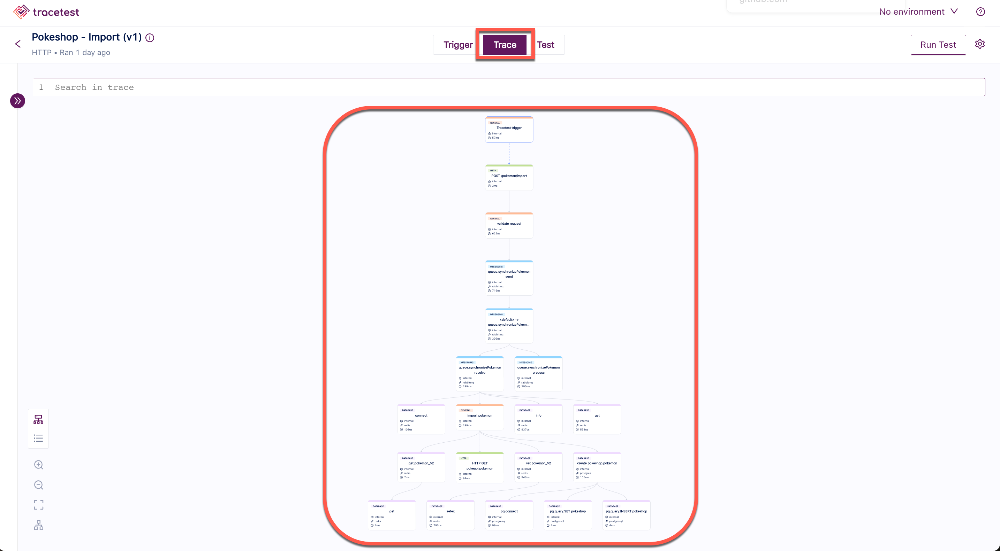

**Trace-based testing** is a means of conducting deep integration or system tests by utilizing the rich data contained in a distributed system trace.

## Why Trace-based Testing?

In traditional testing, the focus is primarily on verifying that inputs and outputs match an expected result. While this approach is useful, it often overlooks critical issues such as race conditions, performance bottlenecks, failing interactions between services, broken 3rd party services, an many other issues.

Trace-based testing validates entire application flows and transactions. It ensures that each step in the process is executed as intended as well as the final result. This is particularly important in microservices architectures, where complex interdependencies can make it difficult to detect and diagnose issues.

| Traditional Testing                                                    | Trace-based Testing                                                                  |
|------------------------------------------------------------------------|--------------------------------------------------------------------------------------|
| Validates outputs                                                      | Validates entire transactions                                                        |
| Limited to input/output validation                                     | Detailed insight into each step in the transaction                                   |
| Can miss race conditions, bottlenecks, service-to-service interactions | Identifies race conditions, bottlenecks, etc.                                        |
| Only sutied for testing isolated components and functions              | Ideal for testing full transactions in complex distributed systems and microservices |
| Manual correlation of issues across components                         | Contextually links issues in a transaction                                           |
| Cannot find issues caused by service dependencies                      | Finds and validates issues between services                                          |
| Cannot find performance bottlenecks unless specifically tested         | Validates trace span duration and performance                                        |

## What is a Distributed Trace?

A Distributed Trace, more commonly known as a Trace, records the paths taken by requests (made by an application or end-user) take as they propagate through multi-service architectures, like microservice and serverless applications. [Source - OpenTelemetry.io](https://opentelemetry.io/docs/concepts/observability-primer/)

In Tracetest, after selecting a test from the first screen and clicking on the **Trace** tab, you will see the distributed trace for the selected test:

### What is a Span?

Traces are comprised of spans. A span represents a single operation in a trace. Spans are nested, typically with a parent child relationship to form a deeply nested tree.

### What Data do Spans Contain?

A span contains the data about the operation it represents. This data includes:

- The span name.
- Start and end timestamp.
- List of events (if instrumented).
- Attributes

### What are Attributes?

Attributes are a key-value pair, and they contain information about the operation. A developer can manually add additional attributes to a span, enriching the data. There are [Semantic Conventions](https://opentelemetry.io/docs/reference/specification/trace/semantic_conventions/) that provide recommended names for the attributes for common types of calls such as database, http, messaging, etc.

## What is a Test Spec?

In Tracetest, a Test Spec is comprised of two parts:

- Selectors
- Checks

### What is a Selector?

A selector contains criteria to limit the scope of the spans from a trace that we wish to assert against. A selector can be very narrow, only selecting on one span, or very wide, selecting all spans or all spans of a certain type or other characteristics. Underlying this capability is a [selector language](/concepts/selectors).

### What is a Check?

A check is a logical verification that will be performed on all spans that match the selector. It is comprised of an attribute, a comparison operator and a value.

### What is a Span Signature?

A span signature is an automatically computed selector that has enough elements to specify a single span. It uses a combination of attributes in the selected span to automatically build the selector. If a trace has multiple spans that are almost identical, the span signature may still match more than one span. You can alter the selector in this case to be more specific by adding other attributes or specifying an ancestor span.
