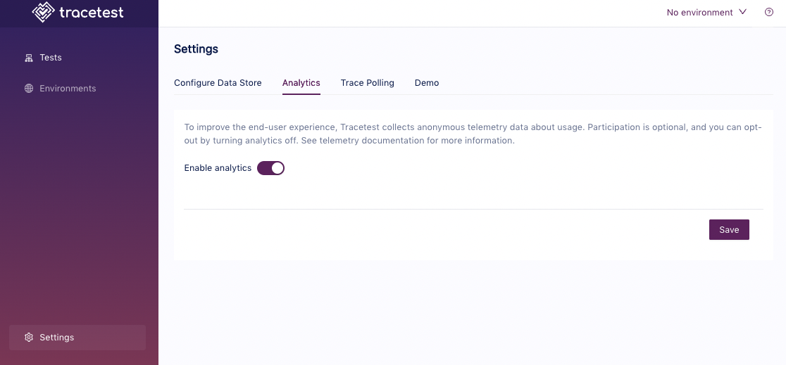

# Analytics Settings

To improve the end user experience and to help the team decide where to focus resources to improve the tool, Tracetest collects analytics and telemetry information from the system.

Participation in this program is optional, and you may opt-out by following the directions below if you'd prefer not to share any information.

The data collected is anonymous and is not traceable to the source. You can learn more about how we treat your data by [reading our privacy statement](https://kubeshop.io/privacy).

## Changing Analytics Settings from the UI

In the Web UI, open settings, and select Analytics.



From this analytics settings page you can enable or disable the analytics.

## Changing Analytics Settings with the CLI

Or, if you prefer using the CLI, you can use this file config to disable analytics:

```yaml
type: Config
spec:
  analyticsEnabled: false
  id: current
  name: Config
```

Proceed to run this command in the terminal, and specify the file above.

```bash
tracetest apply config -file my/resource/analytics-resource.yaml
```

