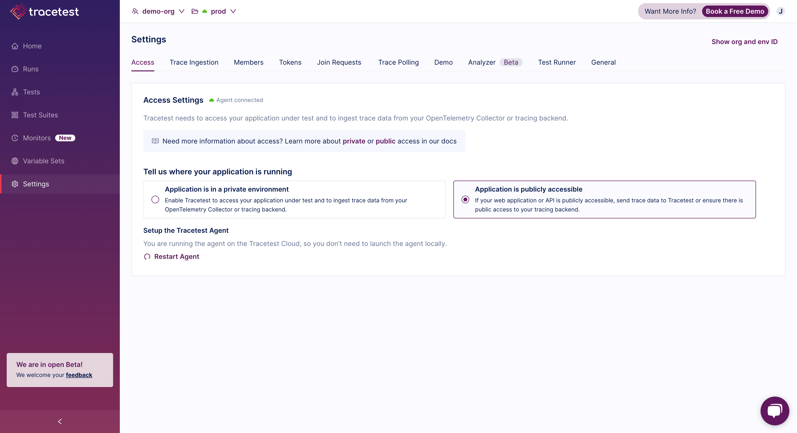

The Tracetest Cloud Agent allows you to run Tracetest tests against public facing endpoints without deploying the Tracetest Agent locally. This allows you to trigger tests against public endpoints and collect trace data from either public tracing backends or, alternatively, directly receive incoming OTLP data.

Tracetest Cloud Agent is the same as Tracetest Agent but is managed and running as part of your Tracetest account.

## Start Tracetest Cloud Agent

Tracetest Cloud Agent runs in your Tracetest account.

[Sign in to Tracetest](https://app.tracetest.io/) and follow the instructions on the `Settings > Access` page.

Select `Application is publicly accessible`.

## Configure Tracetest Cloud Agent

Once started, Tracetest Cloud Agent exposes TLS port `443` to ingest traces via `gRPC` and `HTTP` and is responsible for running tests. [Read the detailed concepts here](/concepts/cloud-agent).
