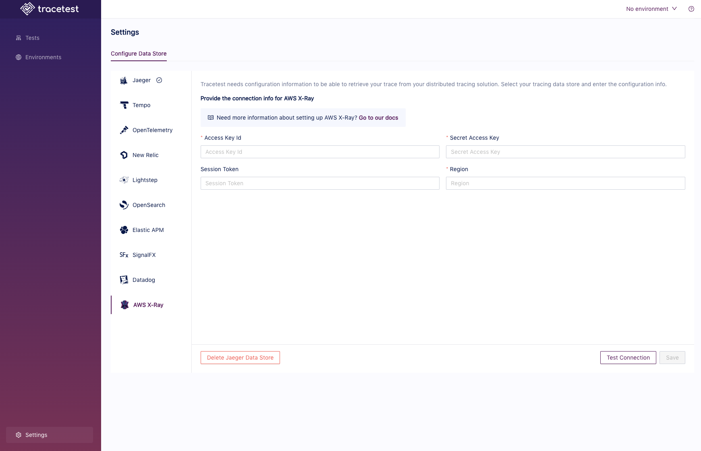

# AWS X-Ray

If you want to use [AWS X-Ray](https://aws.amazon.com/xray/) as the trace data store, you can use the native connection from Tracetest to pull telemetry data directly from any region.

:::tip
Examples of configuring Tracetest with X-Ray can be found in the [`examples` folder of the Tracetest GitHub repo](https://github.com/kubeshop/tracetest/tree/main/examples).
:::

## Configure Tracetest to Use X-Ray as a Trace Data Store

Configure Tracetest to be aware that it has to fetch trace data from X-Ray.

Tracetest uses the golang [AWS-SDK](https://aws.amazon.com/sdk-for-go/) library to pull to fetch trace data.

:::tip
Need help configuring the OpenTelemetry Collector so send trace data from your application to AWS X-Ray? Read more in [the reference page here](../opentelemetry-collector-configuration-file-reference).
:::

## Connect Tracetest to X-Ray with the Web UI

In the Web UI, open settings, and select AWS X-Ray.



From the configuration page, add your AWS credentials, you can use temporary credentials by running `aws sts get-session-token`.
Lastly, you can ensure the connection is working as expected by pressing the `Test Connection` button.

## Connect Tracetest to AWS X-Ray with the CLI

Or, if you prefer using the CLI, you can use this file config.

```yaml
type: DataStore
spec:
  type: awsxray
  awsxray:
    accessKeyId: <your-accessKeyId>
    secretAccessKey: <your-secretAccessKey>
    sessionToken: <your-session-token>
    region: "us-west-2"
```

Proceed to run this command in the terminal, and specify the file above.

```bash
tracetest datastore apply -f my/data-store/file/location.yaml
```

:::tip
To learn more, [read the recipe on running a sample app with AWS X-Ray and Tracetest](../../examples-tutorials/recipes/running-tracetest-with-aws-x-ray.md).
:::
