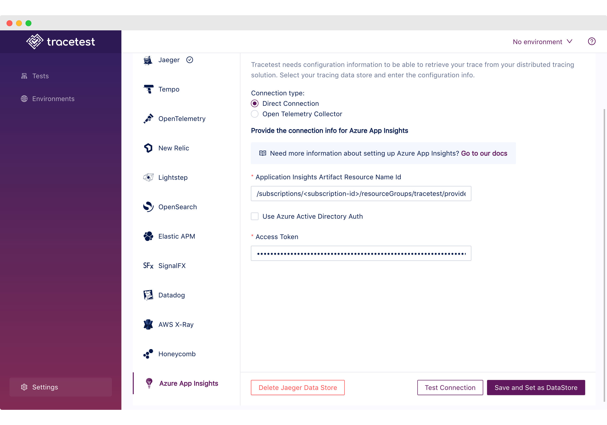
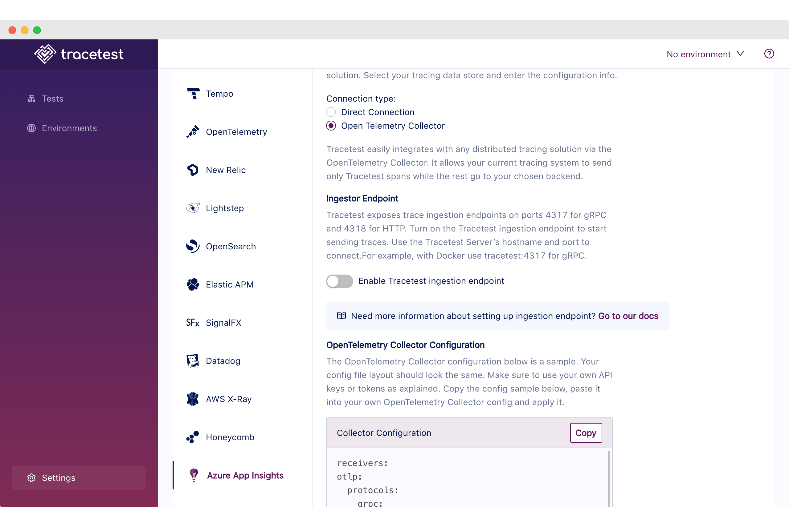

If you want to use [Azure App Insights](https://learn.microsoft.com/en-us/azure/azure-monitor/app/app-insights-overview) as the trace data store, you can use the native connection from Tracetest to pull telemetry data.

:::tip
Examples of configuring Tracetest with Azure App Insights can be found in the [`examples` folder of the Tracetest GitHub repo](https://github.com/kubeshop/tracetest/tree/main/examples).
:::

## Direct Connection - Configure Tracetest to Use Azure App Insights as a Trace Data Store

Configure Tracetest to be aware that it has to fetch trace data from Azure App Insights.

Tracetest uses the Golang [Azure SDK](https://learn.microsoft.com/en-us/azure/developer/go/) library to pull to fetch trace data.

### Tracetest Direct Connection to Azure App Insights with the Web UI

In the Web UI, (1) open Settings, and, on the (2) Configure Data Store tab, select (3) Azure App Insights.



From the configuration page, add your [App Insights API Access Token](https://learn.microsoft.com/en-us/azure/azure-monitor/app/app-insights-azure-ad-api). Or if you are running Tracetest from a authorized container, you can use the default Active Directory Authentication.

Finally, add the resource ARM ID for the Azure App Insights instance.

### Tracetest Direct Connection to Azure App Insights with the CLI

Or, if you prefer using the CLI, you can use this file config.

```yaml
type: DataStore
spec:
  name: AzureAppInsights
  type: azureappinsights
  default: true
  azureappinsights:
    connectionType: direct
    resourceArmId: <your-arm-id>
    accessToken: <your-access-token>
    useAzureActiveDirectoryAuth: false
```

Run this command in the terminal and specify the file above.

```bash
tracetest apply datastore -f my/data-store/file/location.yaml
```

:::tip
To learn more, [read the recipe on running a sample app with Azure App Insights and Tracetest](/examples-tutorials/recipes/running-tracetest-with-azure-app-insights).
:::

## OpenTelemetry Collector

You can configure Tracetest to listen for incoming telemetry data from ports `4317` and `4318` for gRPC and REST accordingly, giving you the option to stream the information to both Azure App Insights and Tracetest at the same time.

:::tip
Need help configuring the [OpenTelemetry Collector](https://github.com/open-telemetry/opentelemetry-collector-contrib) to send trace data from your application to Azure App Insights? Read more in [the reference page here](/configuration/opentelemetry-collector-configuration-file-reference).
:::

### Tracetest OpenTelemetry Collector connection to Azure App Insights with the Web UI

In the Web UI, (1) open Settings, and, on the (2) Configure Data Store tab, select (3) Azure App Insights, (4) Select Open Telemetry Collector as Connection Type.



From the configuration page, copy and customize the OpenTelemetry configuration YAML including the instrumentation key.

### Tracetest OpenTelemetry Collector connection to Azure App Insights with the CLI

Or, if you prefer using the CLI, you can use this file config.

```yaml
type: DataStore
spec:
  name: AzureAppInsights
  type: azureappinsights
  default: true
  azureappinsights:
    connectionType: collector
    useAzureActiveDirectoryAuth: false
```

Run this command in the terminal and specify the file above.

```bash
tracetest apply datastore -f my/data-store/file/location.yaml
```

:::tip
To learn more, [read the recipe on running a sample app with Azure App Insights, The OpenTelemetry Collector and Tracetest](/examples-tutorials/recipes/running-tracetest-with-azure-app-insights-collector).
:::
