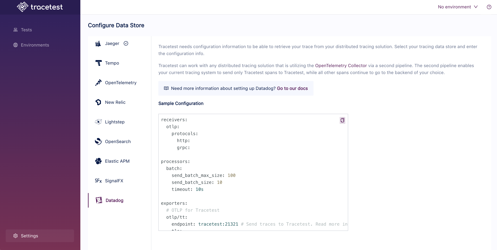

# Datadog

If you want to use [Datadog](https://www.datadoghq.com/) as the trace data store, you'll configure the OpenTelemetry Collector to receive traces from your system and then send them to both Tracetest and Datadog. And, you don't have to change your existing pipelines to do so.

:::tip
Examples of configuring Tracetest with Datadog can be found in the [`examples` folder of the Tracetest GitHub repo](https://github.com/kubeshop/tracetest/tree/main/examples). 
:::

## Configuring OpenTelemetry Collector to Send Traces to both Datadog and Tracetest

In your OpenTelemetry Collector config file:

- Set the `exporter` to `otlp/tt`
- Set the `endpoint` to your Tracetest instance on port `21321`

:::tip
If you are running Tracetest with Docker, the endpoint might look like this `http://tracetest:21321`
:::

Additionally, add another config:

- Set the `exporter` to `datadog`
- Set the `endpoint` pointing to your Datadog account
- Set the site to the Datadog API `datadoghq.com` and add your API key

```yaml
# collector.config.yaml

# If you already have receivers declared, you can just ignore
# this one and still use yours instead.
receivers:
  otlp:
    protocols:
      http:
      grpc:

processors:
  batch: # this configuration is needed to guarantee that the data is sent correctly to Datadog
    send_batch_max_size: 100
    send_batch_size: 10
    timeout: 10s

exporters:
  # OTLP for Tracetest
  otlp/tt:
    endpoint: tracetest:21321 # Send traces to Tracetest.
                              # Read more in docs here: https://docs.tracetest.io/configuration/connecting-to-data-stores/opentelemetry-collector
    tls:
      insecure: true
  # Datadog exporter
  # One example on how to set up a collector configuration for Datadog can be seen here:
  # https://docs.datadoghq.com/opentelemetry/otel_collector_datadog_exporter/?tab=onahost
  datadog:
    api:
      site: datadoghq.com
      key: ${DATADOG_API_KEY} # Add here you API key for Datadog

service:
  pipelines:
    traces/tt:
      receivers: [otlp]
      processors: [batch]
      exporters: [otlp/tt] # exporter sending traces to your Tracetest instance
    traces/dd:
      receivers: [otlp]
      processors: [batch]
      exporters: [datadog] # exporter sending traces to directly to Datadog
```

### Configure Tracetest to Use Lightstep as a Trace Data Store

Configure your Tracetest instance to expose an `otlp` endpoint to make it aware it will receive traces from the OpenTelemetry Collector. This will expose Tracetest's trace receiver on port `21321`.

## Connect Tracetest to Lightstep with the Web UI

In the Web UI, open settings, and select Datadog.



## Connect Tracetest to Lightstep with the CLI

Or, if you prefer using the CLI, you can use this file config.

```yaml
type: DataStore
spec:
  name: Datadog pipeline
  type: datadog
  isDefault: true
```

Proceed to run this command in the terminal, and specify the file above.

```bash
tracetest datastore apply -f my/data-store/file/location.yaml
```
:::tip
To learn more, [read the recipe for running a sample app with Datadog and Tracetest](../../examples-tutorials/recipes/running-tracetest-with-datadog.md).
:::
