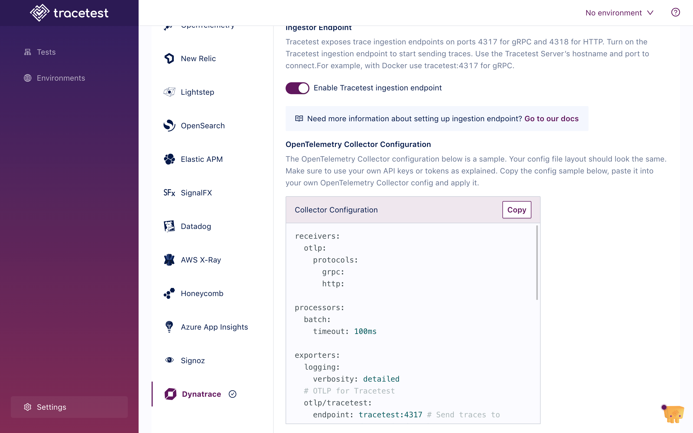

If you want to use [Dynatrace](https://www.dynatrace.com/) as the trace data store, you'll configure the OpenTelemetry Collector to receive traces from your system and then send them to both Tracetest and Dynatrace. And, you don't have to change your existing pipelines to do so.

:::tip
Examples of configuring Tracetest with Dynatrace can be found in the [`examples` folder of the Tracetest GitHub repo](https://github.com/kubeshop/tracetest/tree/main/examples).
:::

## Configuring OpenTelemetry Collector to Send Traces to both Dynatrace and Tracetest

In your OpenTelemetry Collector config file:

- Set the `exporter` to `otlp/tracetest`
- Set the `endpoint` to your Tracetest instance on port `4317`

:::tip
If you are running Tracetest with Docker, and Tracetest's service name is `tracetest`, then the endpoint might look like this `http://tracetest:4317`
:::

Additionally, add another config:

- Set the `exporter` to `otlphttp/dynatrace`
- Set the `endpoint` to your Dynatrace tenant and include the: `https://{your-environment-id}.live.dynatrace.com/api/v2/otlp`

```yaml
# collector.config.yaml

# If you already have receivers declared, you can just ignore
# this one and still use yours instead.
receivers:
  otlp:
    protocols:
      grpc:
      http:

processors:
  batch:
    timeout: 100ms

exporters:
  logging:
    verbosity: detailed
  # OTLP for Tracetest
  otlp/tracetest:
    endpoint: tracetest:4317 # Send traces to Tracetest. Read more in docs here:  https://docs.tracetest.io/configuration/connecting-to-data-stores/opentelemetry-collector
    tls:
      insecure: true
  # OTLP for Dynatrace
  otlphttp/dynatrace:
    endpoint: https://abc123.live.dynatrace.com/api/v2/otlp # Send traces to Dynatrace. Read more in docs here: https://www.dynatrace.com/support/help/extend-dynatrace/opentelemetry/collector#configuration
    headers:
      Authorization: "Api-Token dt0c01.sample.secret" # Requires "openTelemetryTrace.ingest" permission
service:
  pipelines:
    traces/tracetest: # Pipeline to send data to Tracetest
      receivers: [otlp]
      processors: [batch]
      exporters: [logging, otlp/tracetest]
    traces/Dynatrace: # Pipeline to send data to Dynatrace
      receivers: [otlp]
      processors: [batch]
      exporters: [logging, otlphttp/dynatrace]
```

## Configure Tracetest to Use Dynatrace as a Trace Data Store

Configure your Tracetest instance to expose an `otlp` endpoint to make it aware it will receive traces from the OpenTelemetry Collector. This will expose Tracetest's trace receiver on port `4317`.

## Connect Tracetest to Dynatrace with the Web UI

In the Web UI, (1) open Settings, and, on the (2) Configure Data Store tab, select (3) Dynatrace.

<!-- TODO: create this image using the same standard as the other stores -->


## Connect Tracetest to Dynatrace with the CLI

Or, if you prefer using the CLI, you can use this file config.

```yaml
type: DataStore
spec:
  name: Dynatrace pipeline
  type: dynatrace
  default: true
```

Proceed to run this command in the terminal and specify the file above.

```bash
tracetest apply datastore -f my/data-store/file/location.yaml
```

<!-- 
TODO: create a tutorial for Dynatrace
:::tip
To learn more, [read the recipe on running a sample app with Dynatrace and Tracetest](../../examples-tutorials/recipes/running-tracetest-with-dynatrace.md).
::: 
-->
