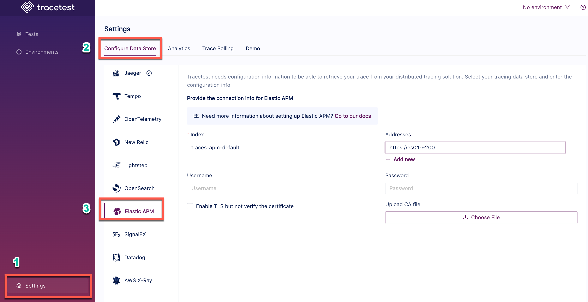

Tracetest fetches traces from [Elasticsearch's default port](https://discuss.elastic.co/t/what-are-ports-9200-and-9300-used-for/238578) `9200`.

:::tip
Examples of configuring Tracetest can be found in the [`examples` folder of the Tracetest GitHub repo](https://github.com/kubeshop/tracetest/tree/main/examples).
:::

## Configure Tracetest to Use Elastic APM as a Trace Data Store

Configure Tracetest to fetch trace data from Elasticsearch.

Tracetest uses Elasticsearch's **default port** `9200` to fetch trace data.

You need to know which **Index name**, **Address**, and **credentials** you are using.

The defaults can be:

- **Index name**: `traces-apm-default`
- **Address**: `https://es01:9200`
- **Username**: `elastic`
- **Password**: `changeme`

To configure Elastic APM you will need to download the CA certificate from the Docker image and upload it to the config under "Upload CA file".

- The command to download the `ca.crt` file is:
  `docker cp tracetest-elasticapm-with-elastic-agent-es01-1:/usr/share/elasticsearch/config/certs/ca/ca.crt .`
- Alternatively, you can skip CA certificate validation by setting the `Enable TLS but don't verify the certificate` option.

:::tip
Need help configuring the OpenTelemetry Collector so send trace data from your application to Elastic? Read more in [the reference page here](/configuration/opentelemetry-collector-configuration-file-reference).
:::

## Connect Tracetest to Elastic with the Web UI

In the Web UI, (1) open Settings and, on the (2) Configure Data Store tab, select (3) Elastic APM. If you are using Docker, as in the screenshot below, use the service name as the hostname with port `9200`. Use `http`, or `https` if TLS is enabled.

```
https://es01:9200
```



## Connect Tracetest to Elastic with the CLI

Or, if you prefer using the CLI, you can use this file config.

```yaml
type: DataStore
spec:
  name: Elastic Data Store
  type: elasticapm
  default: true
  elasticapm:
    addresses:
      - https://es01:9200
    username: elastic
    password: changeme
    index: traces-apm-default
    insecureSkipVerify: true
```

Proceed to run this command in the terminal and specify the file above.

```bash
tracetest apply datastore -f my/data-store/file/location.yaml
```

:::tip
To learn more, [read the recipe on running a sample app with Elastic APM and Tracetest](/examples-tutorials/recipes/running-tracetest-with-elasticapm).
:::
