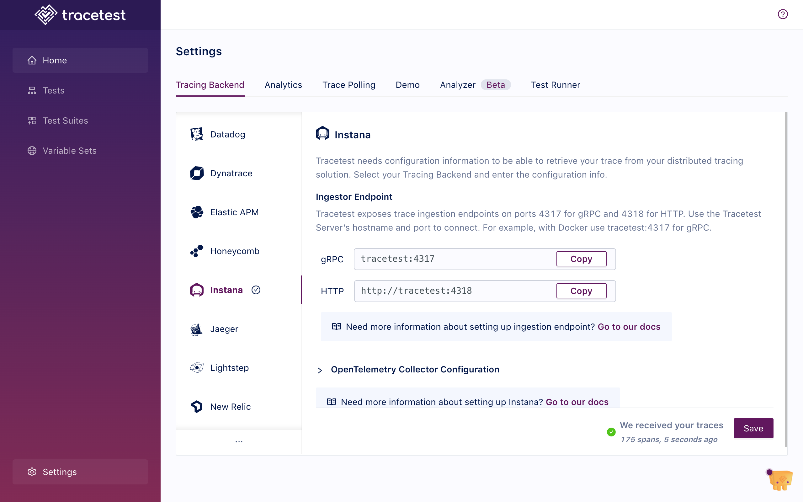

If you want to use [Instana](https://www.ibm.com/products/instana) as the trace data store, you'll configure the OpenTelemetry Collector to receive traces from your system and then send them to both Tracetest and Instana. And, you don't have to change your existing pipelines to do so.

:::tip
Examples of configuring Tracetest with Instana can be found in the [`examples` folder of the Tracetest GitHub repo](https://github.com/kubeshop/tracetest/tree/main/examples).
:::

## Configuring OpenTelemetry Collector to Send Traces to Both Instana and Tracetest

In your OpenTelemetry Collector config file:

- Set the `exporter` to `otlp/tracetest`
- Set the `endpoint` to your Tracetest instance on port `4317`

:::tip
If you are running Tracetest with Docker, and Tracetest's service name is `tracetest`, then the endpoint might look like this `http://tracetest:4317`
:::

Additionally, add another config:

- Set the `exporter` to `otlp/instana`.
- Set the `endpoint` to use the same OTLP stack as your agents. The correct endpoints can be found [here](https://www.ibm.com/docs/en/instana-observability/current?topic=opentelemetry-sending-data-instana-backend).
- Set the `headers` to have `x-instana-key` as key and a hash as value. This hash correspond to the `INSTANA_AGENT_KEY` value shown on Instana UI.

```yaml
# collector.config.yaml

# If you already have receivers declared, you can just ignore
# this one and still use yours instead.
receivers:
  otlp:
    protocols:
      http:
      grpc:

processors:
  # This configuration is needed to guarantee that the data is sent correctly to Datadog
  batch:
    send_batch_max_size: 100
    send_batch_size: 10
    timeout: 10s

exporters:
  # OTLP for Tracetest
  # Send traces to Tracetest.
  # Read more in docs here: https://docs.tracetest.io/configuration/connecting-to-data-stores/opentelemetry-collector
  otlp/tracetest:
    endpoint: tracetest:4317
    tls:
      insecure: true

  # Instana exporter
  # One example on how to set up a collector configuration for Instana can be seen here:
  # https://www.ibm.com/docs/en/instana-observability/current?topic=opentelemetry-sending-data-instana-backend
  # You can replace the variables INSTANA_OTLP_GRPC_ENDPOINT and INSTANA_API_KEY for their respective values
  # or declare them as environment variables where your Open Telemetry Collector is installed
  otlp/instana:
    endpoint: ${INSTANA_OTLP_GRPC_ENDPOINT}
    headers:
      x-instana-key: ${INSTANA_API_KEY}

service:
  pipelines:
    traces/tracetest:
      receivers: [otlp]
      processors: [batch]
      exporters: [otlp/tracetest] # exporter sending traces to your Tracetest instance
    traces/instana:
      receivers: [otlp]
      processors: [batch]
      exporters: [otlp/instana] # exporter sending traces to directly to Instana
```

## Configure Tracetest to Use Instana as a Trace Data Store

Configure your Tracetest instance to expose an `otlp` endpoint to make it aware it will receive traces from the OpenTelemetry Collector. This will expose Tracetest's trace receiver on port `4317`.

## Connect Tracetest to Instana with the Web UI

In the Web UI, (1) open Settings, and, on the (2) Tracing Backend tab, select (3) Datadog.



## Connect Tracetest to Instana with the CLI

Or, if you prefer using the CLI, you can use this file config.

```yaml
type: DataStore
spec:
  name: Instana pipeline
  type: instana
  default: true
```

Proceed to run this command in the terminal and specify the file above.

```bash
tracetest apply datastore -f my/data-store/file/location.yaml
```

{/*
TODO: when the Instana tutorial is released, add link to learn more here
*/}
