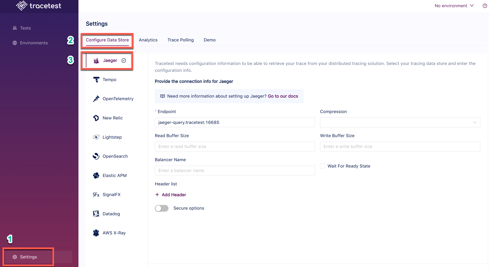

# Jaeger

Tracetest fetches traces from [Jaeger's gRPC	Protobuf/gRPC QueryService](https://www.jaegertracing.io/docs/1.42/deployment/#query-service--ui) on port `16685`.

:::tip
Examples of configuring Tracetest can be found in the [`examples` folder of the Tracetest GitHub repo](https://github.com/kubeshop/tracetest/tree/main/examples). 
:::

## Configure Tracetest to Use Jaeger as a Trace Data Store

Configure Tracetest to be aware that it has to fetch trace data from Jaeger. 

Tracetest uses [Jaeger's gRPC	Protobuf/gRPC QueryService](https://www.jaegertracing.io/docs/1.42/deployment/#query-service--ui) on port `16685` to fetch trace data.

:::tip
Need help configuring the OpenTelemetry Collector so send trace data from your application to Jaeger? Read more in [the reference page here](../opentelemetry-collector-configuration-file-reference)). 
:::

## Connect Tracetest to Jaeger with the Web UI

In the Web UI, (1) open Settings, and, on the (2) Configure Data Store tab, (3) select Jaeger. If you are using Docker like in the screenshot below, use the service name as the hostname with port `16685` like this:

```
jaeger:16685
```




<!----->


## Connect Tracetest to Jaeger with the CLI

Or, if you prefer using the CLI, you can use this file config.

```yaml
type: DataStore
spec:
  name: jaeger
  type: jaeger
  isDefault: true
  jaeger:
    endpoint: jaeger:16685
    tls:
      insecure: true
```

Proceed to run this command in the terminal, and specify the file above.

```bash
tracetest datastore apply -f my/data-store/file/location.yaml
```

:::tip
To learn more, [read the recipe on running a sample app with Jaeger and Tracetest](../../examples-tutorials/recipes/running-tracetest-with-jaeger.md).
:::
