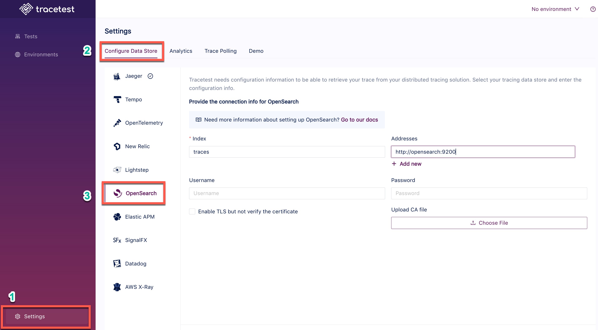

# OpenSearch

Tracetest fetches traces from [OpenSearch's default port](https://logz.io/blog/opensearch-tutorial-installation-configuration/#:~:text=This%20is%20because%20OpenSearch%20runs,use%20port%205601%20by%20default.) `9200`.

:::tip
Examples of configuring Tracetest can be found in the [`examples` folder of the Tracetest GitHub repo](https://github.com/kubeshop/tracetest/tree/main/examples).
:::

## Configure Tracetest to Use OpenSearch as a Trace Data Store

Configure Tracetest to fetch trace data from OpenSearch.

Tracetest uses OpenSearch's **default port** `9200` to fetch trace data.

You need to know which **Index name** and **Address** you are using.

The defaults can be:

- **Index name**: `traces`
- **Address**: `http://opensearch:9200`

:::tip
Need help configuring the OpenTelemetry Collector so send trace data from your application to OpenSearch? Read more in [the reference page here](../opentelemetry-collector-configuration-file-reference)).
:::

## Connect Tracetest to OpenSearch with the Web UI

In the Web UI, (1) open settings, and, on the (2) Configure Data Store tab, select (3) OpenSearch. If you are using Docker like in the screenshot below, use the service name as the hostname with port `9200`. Use `http`, or `https` if TLS is enabled.

```
http://opensearch:9200
```



<!----->

## Connect Tracetest to OpenSearch with the CLI

Or, if you prefer using the CLI, you can use this file config.

```yaml
type: DataStore
spec:
  name: OpenSearch Data Store
  type: openSearch
  default: true
  opensearch:
    addresses:
      - http://opensearch:9200
    index: traces
```

Proceed to run this command in the terminal, and specify the file above.

```bash
tracetest apply datastore -f my/data-store/file/location.yaml
```

:::tip
To learn more, [read the recipe on running a sample app with OpenSearch and Tracetest](../../examples-tutorials/recipes/running-tracetest-with-opensearch.md).
:::
