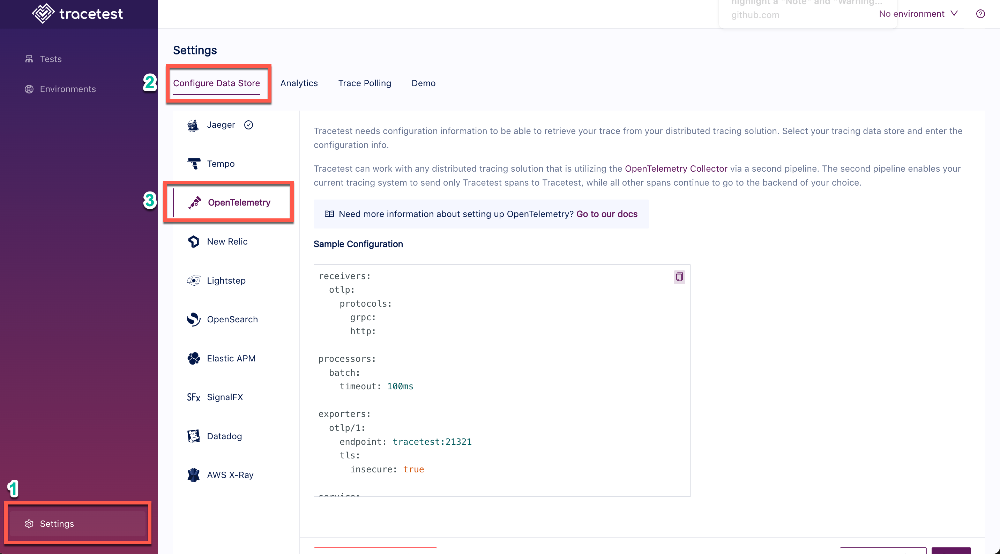

# OpenTelemetry Collector

Tracetest receives trace data on port `21321`. Tracetest's trace receiver endpoint might look like:

```
http://your-tracetest-instance.com:21321
```

:::tip
Examples of configuring Tracetest can be found in the [`examples` folder of the Tracetest GitHub repo](https://github.com/kubeshop/tracetest/tree/main/examples).
:::

## Configuring OpenTelemetry Collector to Send Traces to Tracetest

If you don't want to use a trace data store, you can send all traces directly to Tracetest using your OpenTelemetry Collector. And, you don't have to change your existing pipelines to do so.

In your OpenTelemetry Collector config file:

- Set the `exporter` to `otlp/1`
- Set the `endpoint` to your Tracetest instance on port `21321`

:::tip
If you are running Tracetest with Docker, and Tracetest's service name is `tracetest`, then the endpoint might look like this `http://tracetest:21321`
:::

```yaml
# collector.config.yaml

# If you already have receivers declared, you can just ignore
# this one and still use yours instead.
receivers:
  otlp:
    protocols:
      grpc:
      http:

processors:
  batch:
    timeout: 100ms

exporters:
  # This is the exporter that will send traces to Tracetest
  otlp/1:
    endpoint: http://your-tracetest-instance.com:21321
    tls:
      insecure: true

service:
  pipelines:
    # your probably already have a traces pipeline, you don't have to change it.
    # just add this one to your configuration. Just make sure to not have two
    # pipelines with the same name
    traces/1:
      receivers: [otlp] # your receiver
      processors: [batch]
      exporters: [otlp/1] # your exporter pointing to your tracetest instance
```

## Configure Tracetest to Use OpenTelemetry Collector

Configure your Tracetest instance to expose an `otlp` endpoint to make it aware it will receive traces from the OpenTelemetry Collector. This will expose Tracetest's trace receiver on port `21321`.

## Connect Tracetest to OpenTelemetry Collector with the Web UI

In the Web UI, (1) open Settings, and, on the (2) Configure Data Store tab, select (3) OpenTelemetry.



<!--- -->

## Connect Tracetest to OpenTelemetry Collector with the CLI

Or, if you prefer using the CLI, you can use this file config.

```yaml
type: DataStore
spec:
  name: Opentelemetry Collector pipeline
  type: otlp
  default: true
```

Proceed to run this command in the terminal, and specify the file above.

```bash
tracetest datastore apply -f my/data-store/file/location.yaml
```

:::tip
To learn more, [read the recipe on running a sample app with OpenTelemetry Collector and Tracetest](../../examples-tutorials/recipes/running-tracetest-without-a-trace-data-store.md).
:::
