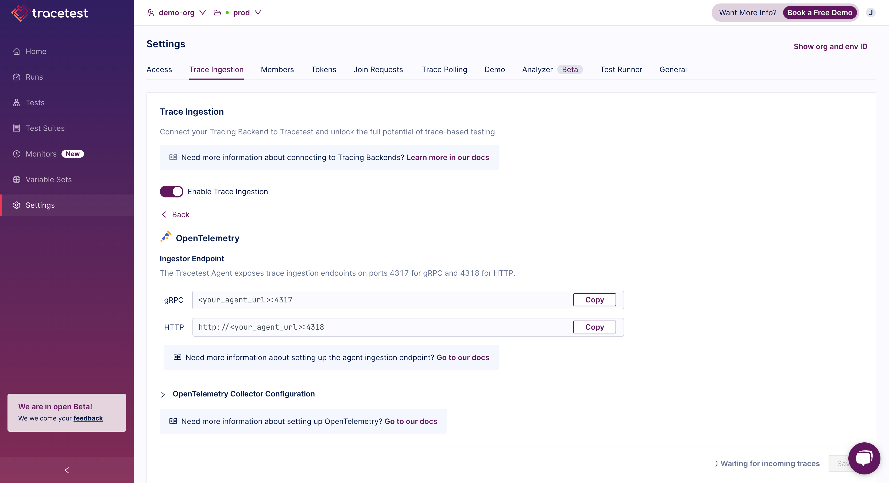

Tracetest Agent receives trace data on port `4317` and `4318`. The OTLP endpoint might look like:

```bash
http://tracetest-agent:4317
```

:::tip
Examples of configuring Tracetest can be found in the [`examples` folder of the Tracetest GitHub repo](https://github.com/kubeshop/tracetest/tree/main/examples).
:::

## Connect Tracetest to Ingest OpenTelemetry Traces with the Web UI

In the Web UI, (1) open Settings, and, on the (2) Trace Ingestion tab, select (3) OpenTelemetry.



## Connect Tracetest to OpenTelemetry Collector with the CLI

Or, if you prefer using the CLI, you can use this file config.

```yaml
type: DataStore
spec:
  name: Opentelemetry Collector pipeline
  type: otlp
  default: true
```

Proceed to run this command in the terminal, and specify the file above.

```bash
tracetest apply datastore -f my/data-store/file/location.yaml
```

:::tip
To learn more, [read the recipe on running a sample app with OpenTelemetry Collector and Tracetest](/examples-tutorials/recipes/running-tracetest-without-a-trace-data-store).
:::
