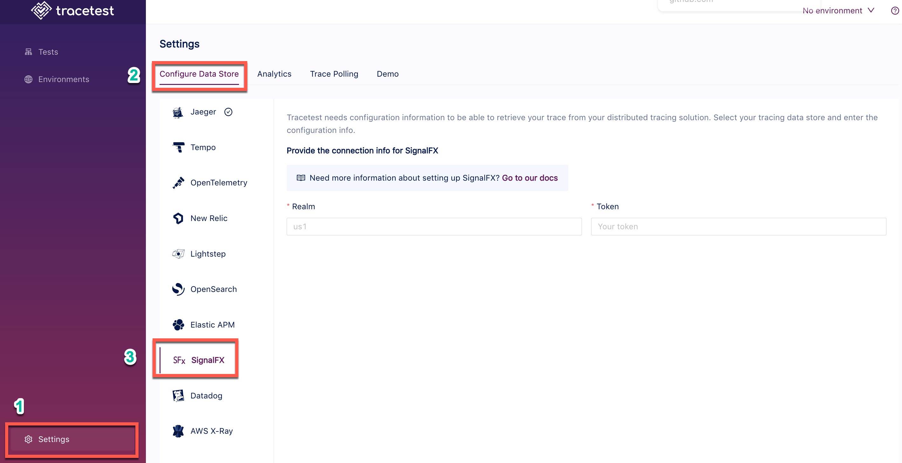

# SignalFx

Tracetest fetches traces from [SignalFx's realm and token](https://docs.splunk.com/Observability/references/organizations.html).

:::tip
Examples of configuring Tracetest can be found in the [`examples` folder of the Tracetest GitHub repo](https://github.com/kubeshop/tracetest/tree/main/examples).
:::

## Configure Tracetest to Use SignalFx as a Trace Data Store

Configure Tracetest to be aware that it has to fetch trace data from SignalFx.

:::tip
Need help configuring the OpenTelemetry Collector so send trace data from your application to SignalFx? Read more in [the reference page here](../opentelemetry-collector-configuration-file-reference)).
:::

## Connect Tracetest to SignalFx with the Web UI

In the Web UI, (1) open Settings, and, on the (2) Configure Data Store tab, (3) select SignalFx.

You need your SignalFx:

- **Realm**
- **Token**

Follow this [guide](https://docs.splunk.com/Observability/references/organizations.html).



<!----->

## Connect Tracetest to SignalFx with the CLI

Or, if you prefer using the CLI, you can use this file config.

```yaml
type: DataStore
spec:
  name: SignalFX
  type: signalFx
  default: true
  signalFx:
    realm: us1
    token: mytoken
```

Proceed to run this command in the terminal, and specify the file above.

```bash
tracetest apply datastore -f my/data-store/file/location.yaml
```
