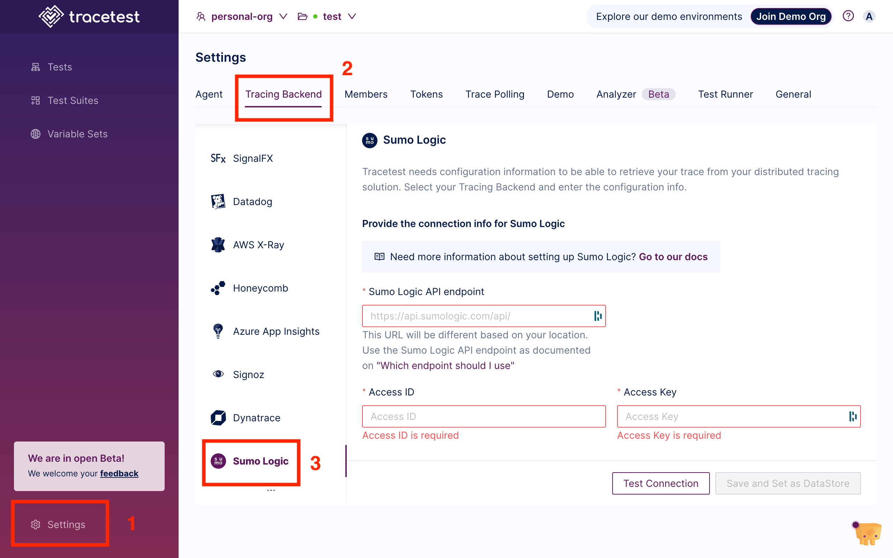

Tracetest fetches traces from [Sumo Logic's API](https://help.sumologic.com/docs/api/tracing/).

:::tip
Examples of configuring Tracetest can be found in the [`examples` folder of the Tracetest GitHub repo](https://github.com/kubeshop/tracetest/tree/main/examples).
:::

## Configure Tracetest to Use Sumo Logic as a Trace Data Store

Configure Tracetest to fetch trace data from Sumo Logic.

- Tracetest uses Sumo Logic's **API** `https://api.sumologic.com/api/` to fetch trace data. Your Sumo Logic URL will differ based on which region you are using. [Here's a guide which Sumo Logic API endpoint to use](https://help.sumologic.com/docs/api/getting-started/#which-endpoint-should-i-should-use).

- You need to know which **Access ID**, **Access Key** you are using. [Create your ID and Key under Administration > Security > Access Keys in your Sumo Logic account](https://help.sumologic.com/docs/manage/security/access-keys/#create-your-access-key).

:::tip
Need help configuring the OpenTelemetry Collector so send trace data from your application to Sumo Logic? Read more in [the reference page here](/configuration/opentelemetry-collector-configuration-file-reference).
:::

## Connect Tracetest to Sumo Logic with the Web UI

In the Web UI, (1) open Settings and, on the (2) Configure Data Store tab, select (3) Sumo Logic. Add the Sumo Logic **API**, your **Access ID**, and **Access Key**.



## Connect Tracetest to Sumo Logic with the CLI

If you prefer using the CLI, you can use this file config.

```yaml
---
type: DataStore
spec:
  name: Sumo Logic
  type: sumologic
  sumologic:
    # The URL will differ based on your location. View this
    # docs page to figure out which URL you need:
    # https://help.sumologic.com/docs/api/getting-started/#which-endpoint-should-i-should-use
    url: "https://api.sumologic.com/api/"
    # Create your ID and Key under Administration > Security > Access Keys
    # in your Sumo Logic account:
    # https://help.sumologic.com/docs/manage/security/access-keys/#create-your-access-key
    accessID: "your-access-id"
    accessKey: "your-access-key"
```

Proceed to run this command in the terminal, and specify the file above.

```bash
tracetest apply datastore -f my/data-store/file/location.yaml
```
