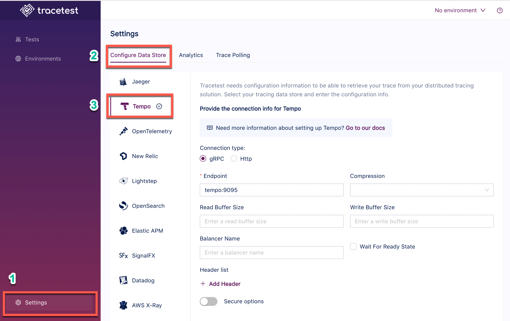

Tracetest fetches traces from [Tempo on the default gRPC port](https://grafana.com/docs/tempo/latest/configuration/#server) `9095`, or [default HTTP port](https://grafana.com/docs/tempo/latest/configuration/#server) `80`.

:::tip
Examples of configuring Tracetest can be found in the [`examples` folder of the Tracetest GitHub repo](https://github.com/kubeshop/tracetest/tree/main/examples).
:::

## Configure Tempo

Tempo uses port `9095` as the default `grpc_listen_port`. The default `http_listen_port` is `80`. Here is a full example of a config file:

```yaml
# tempo.config.yaml

auth_enabled: false
server:
  http_listen_port: 80
  grpc_listen_port: 9095
distributor:
  receivers: # This configuration will listen on all ports and protocols that Tempo is capable of.
    jaeger: # the receives all come from the OpenTelemetry collector.  more configuration information can
      protocols: # be found here: https://github.com/open-telemetry/opentelemetry-collector/tree/master/receiver.
        thrift_http: #
        grpc: # For a production deployment you should only enable the receivers you need!
        thrift_binary:
        thrift_compact:
    zipkin:
    otlp:
      protocols:
        http:
        grpc:
    opencensus:
ingester:
  trace_idle_period: 10s # The length of time after a trace has not received spans to consider it complete and flush it.
  max_block_bytes: 1_000_000 # Cut the head block when it hits this size or ...
  #traces_per_block: 1_000_000
  max_block_duration: 5m #   this much time passes.
compactor:
  compaction:
    compaction_window: 1h # Blocks in this time window will be compacted together.
    max_compaction_objects: 1000000 # Maximum size of compacted blocks.
    block_retention: 1h
    compacted_block_retention: 10m
storage:
  trace:
    backend: local # Backend configuration to use.
    wal:
      path: /tmp/tempo/wal # Where to store the the wal locally.
      #bloom_filter_false_positive: .05 # Bloom filter false positive rate.  Lower values create larger filters but fewer false positives.
      #index_downsample: 10             # Number of traces per index record.
    local:
      path: /tmp/tempo/blocks
    pool:
      max_workers: 100 # The worker pool mainly drives querying, but is also used for polling the blocklist.
      queue_depth: 10000
```

## Configure Tracetest to Use Tempo as a Trace Data Store

Configure Tracetest to be aware that it has to fetch trace data from Tempo.

Tracetest uses [Tempo's gRPC endpoint](https://grafana.com/docs/tempo/latest/configuration/#server) on port `9095` to fetch trace data. Alternatively, you can use Tempo's HTTP endpoint and default port `80`.

:::tip
Need help configuring the OpenTelemetry Collector so send trace data from your application to Jaeger? Read more in [the reference page here](/configuration/opentelemetry-collector-configuration-file-reference).
:::

## Connect Tracetest to Tempo with the Web UI

IIn the Web UI, (1) open Settings, and, on the (2) Configure Data Store tab, (3) select Tempo. Then, select either `gRPC` or `HTTP`.

If you are using Docker and the `gRPC` endpoint like in the screenshot below, use the service name as the hostname with port `9095` like this:

```
tempo:9095
```



If you are using Docker and the `HTTP` URL like in the screenshot below, use the service name as the hostname with port `80` or no specified port like this:

```
http://tempo
```


## Connect Tracetest to Tempo with the CLI

Or, if you prefer using the CLI, you can use this file config.

For gRPC:

```yaml
type: DataStore
spec:
  name: Grafana Tempo
  type: tempo
  default: true
  tempo:
    type: grpc
    grpc:
      endpoint: tempo:9095
      tls:
        insecure: true
```

For HTTP:

```yaml
type: DataStore
spec:
  name: Grafana Tempo
  type: tempo
  default: true
  tempo:
    type: http
    http:
      url: http://tempo
      tls:
        insecure: true
```

Proceed to run this command in the terminal, and specify the file above.

```bash
tracetest apply datastore -f my/data-store/file/location.yaml
```

:::tip
To learn more, [read the recipe on running a sample app with Tempo and Tracetest](/examples-tutorials/recipes/running-tracetest-with-tempo).
:::
