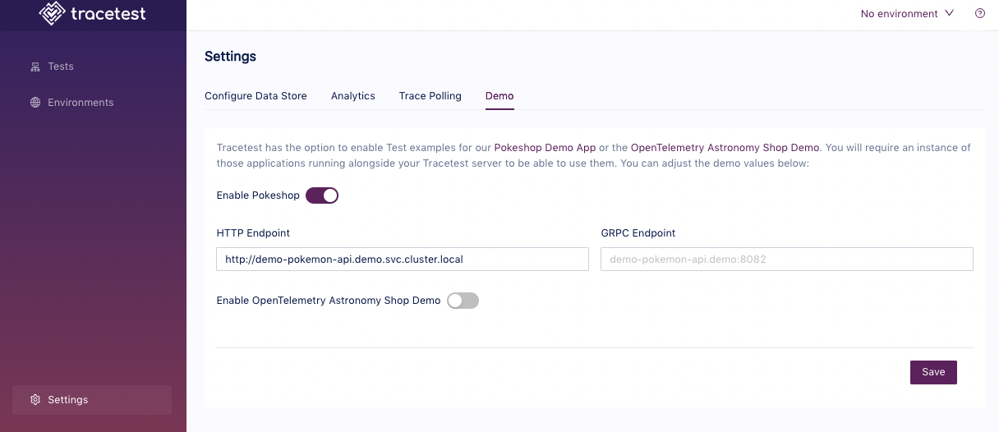

# Demo Settings

Tracetest has the option to enable Test examples for our Pokeshop Demo App or the OpenTelemetry Astronomy Shop Demo. You will require an instance of those applications running alongside your Tracetest server to be able to use them. The demo settings can be adjusted both from the Tracetest UI and from the CLI. 

## Changing Demo Settings from the UI

In the Web UI, open Settings and select Demo:



From this demo settings page, you can enable the Pokeshop and/or OpenTelemetry Astronomy Shop demos. For each demo, you will need to tell Tracetest the location of the relevant demo's endpoints, adjusting the domain name/ip address and, possibly, the port to match your configuration.

## Changing Demo Settings with the CLI

Or, if you prefer using the CLI, you can use this resource definition to enable the Pokemon app demo:

```yaml
type: Demo
spec:
  type: pokeshop
  enabled: true
  id: pokeshop
  name: pokeshop
  opentelemetryStore: {}
  pokeshop:
    httpEndpoint: http://demo-pokemon-api.demo.svc.cluster.local
    grpcEndpoint: demo-pokemon-api.demo:8082
```

Proceed to run this command in the terminal, and specify the file above.

```bash
tracetest apply demo -file my/resource/demo-resource.yaml
```

You can configure the OpenTelemetry Community Demo using the same commands with this yaml file:

```yaml
type: Demo
spec:
  type: opentelemetryStore
  enabled: true
  id: opentelemetrystore
  name: opentelemetryStore
  opentelemetryStore:
    cartEndpoint: http://otel-cartservice.otel-demo:7070
    checkoutEndpoint: http://otel-checkoutservice.otel-demo:5050
    frontendEndpoint: http://otel-frontend.otel-demo:8084
    productCatalogEndpoint: http://otel-productcatalogservice.otel-demo:3550
  pokeshop: {}

```
