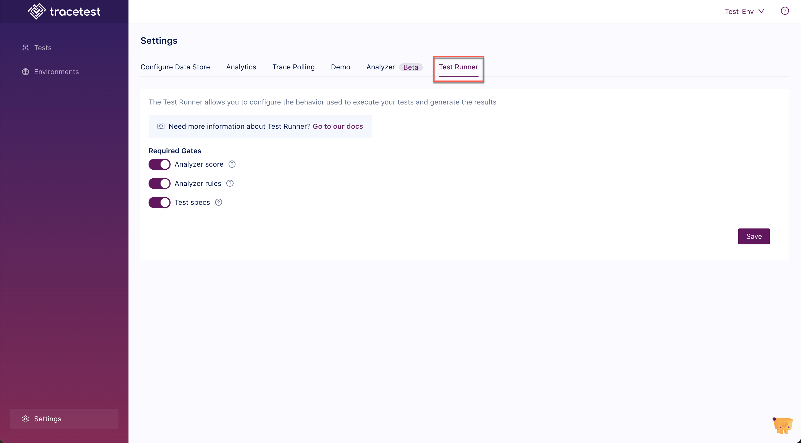
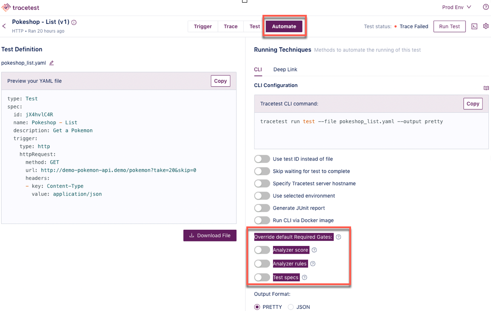

# Test Runner

Test Runner is a tool that is used to run or execute tests and export results. It is a library that selects the source code directory and picks the test files to run them for verifying bugs and errors.

The Test Runner settings allow you to configure the default behavior used when executing your tests to determine whether to mark the test as passed or failed. Only the enabled gates will be will be used to determine whether a test is passed or failed.

## Setting Up Test Runner with Tracetest

In the Tracetest settings, on the **Test Runner** tab, select the default gates used for every test to determine success or failure:

For a specific test, change the gates used when running that test from the **Automate** tab: 

