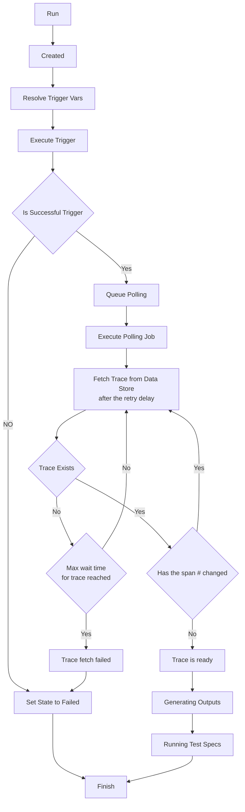

# Trace Polling Settings

Tracetest currently has one algorithm for gathering the trace associated with a test which is based on periodic polling. We will be adding the ability to add multiple polling settings in the coming releases, as well as adding new polling strategies. Let us know as you have specific needs by [adding an issue](https://github.com/kubeshop/tracetest/issues/new/choose).

## Periodic Polling Strategy

Tracetest polls the trace data store to find and retrieve the trace that is generated by the current test run. Both the total length of time to wait to receive the trace, i.e., the 'Max wait time for trace' and the time to delay between each polling attempt, i.e., 'Retry delay', can be adjusted. The following diagram shows how the polling for the trace works:


  

## Changing Trace Polling Settings from the UI

In the Tracetest Web UI, open Settings and select Trace Polling:


From this trace polling page, under settings, you can adjust the speed with which the trace data store is polled when gathering the trace associated with a test run.

## Changing Trace Polling Settings with the CLI

Or, if you prefer using the CLI, you can use this resource definition file to set the polling parameters for the Tracetest server:

```yaml
type: PollingProfile
spec:
  default: true
  periodic:
    retryDelay: 500ms
    timeout: 50s
  strategy: periodic
```

Proceed to run this command in the terminal, and specify the file above.

```bash
tracetest apply pollingprofile -file my/resource/pollingprofile-resource.yaml
```
