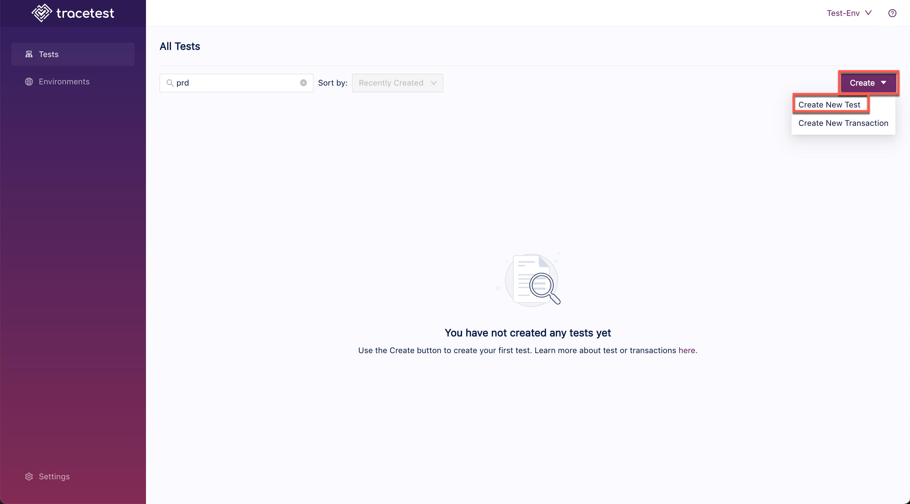
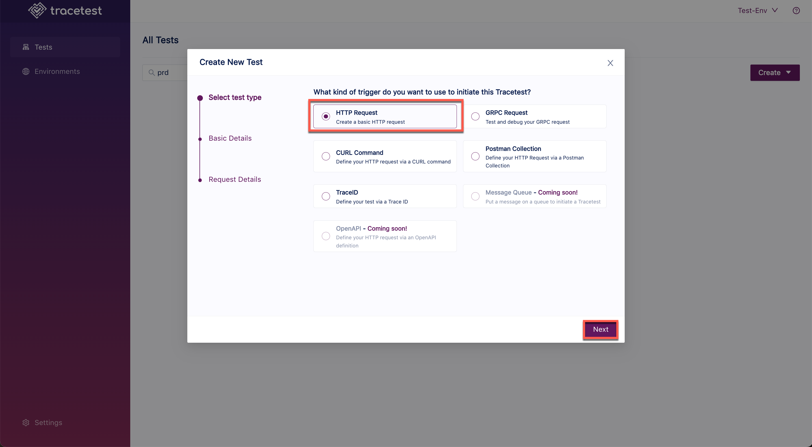
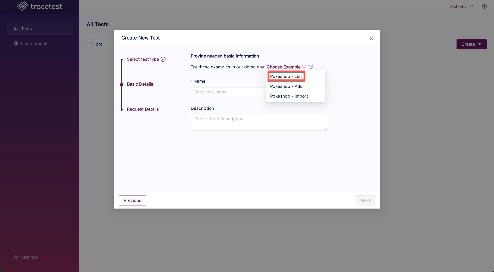
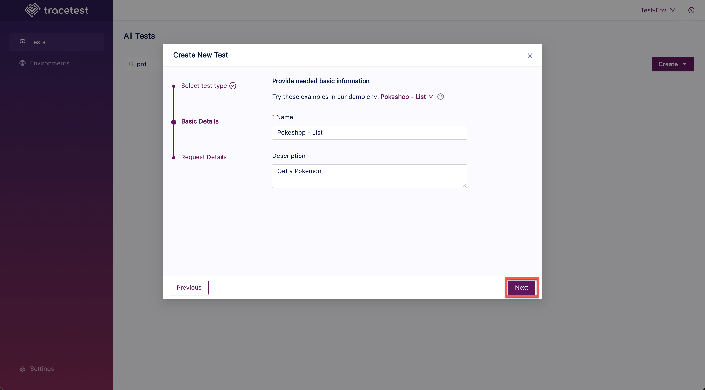
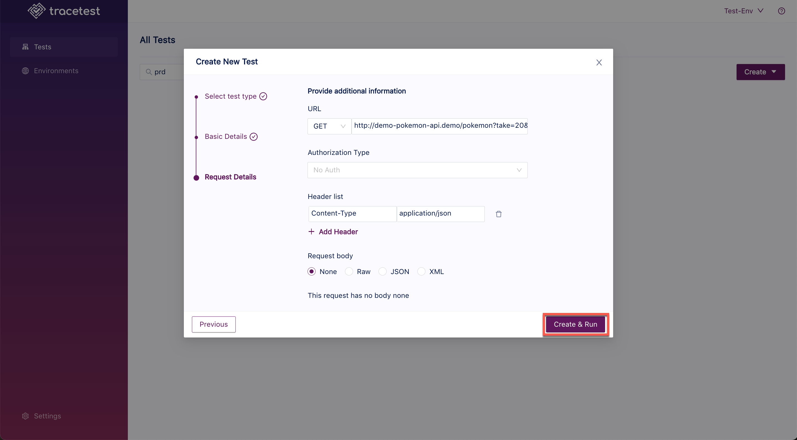
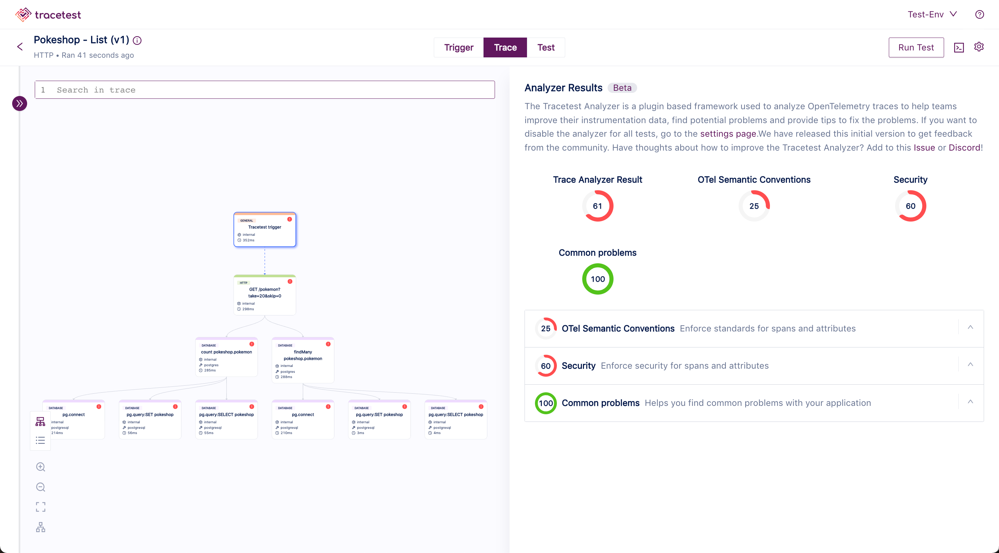

# Tracetest Analyzer Settings

Tracetest Analyzer is provided in the Tracetest application to aid in the analysis of traces and easily pinpoint issues to speed up resolution.

:::tip
[Read more about Tracetest Analyzer concepts here.](../analyzer/concepts.md)
:::

## Create a Test

For this example, we will use the Pokemon List test provided in the Tracetest Pokeshop demo.

Start Tracetest, click the **Create** button and select **Create New Test** in the drop down:

Select the **HTTP Request** trigger and click **Next**:

Select **Pokemon List** and click **Next**:

Leave the default values and click **Create and Run**:

## View the Trace Analyzer Results

The Tracetest Analyzer results help teams improve their instrumentation data, find potential problems and provide tips to fix the problems.

Click the arrow next to any category to see suggestions for trace improvements:

## Disable Tracetest Analyzer

In the Tracetest UI, go to **Settings** and the **Analyzer** tab:

This feature will be available in the CLI very soon. Stay tuned!
