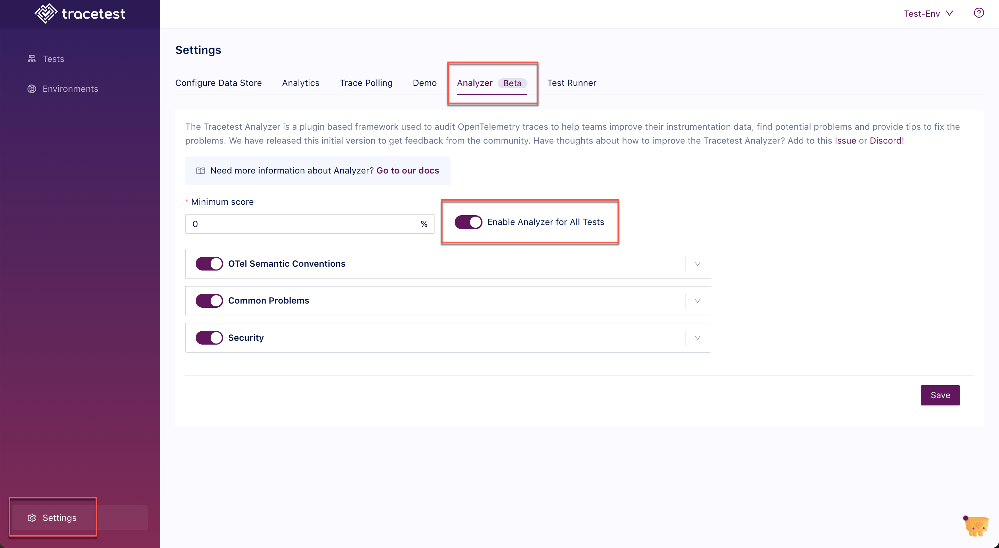

The Trace Analyzer is provided in the Tracetest application to aid in the analysis of traces and easily pinpoint issues to speed up resolution. Every time you run a test the trace will be analyzed and provide a score.

:::tip
[Read more about Trace Analyzer concepts here.](/analyzer/concepts)
:::

## View the Trace Analyzer Results

The Trace Analyzer results help teams improve their instrumentation data, find potential problems and provide tips to fix the problems.

Click the arrow next to any category to see suggestions for trace improvements:

## Disable Trace Analyzer

In the Tracetest UI, go to **Settings** and the **Analyzer** tab:

Toggle `Enable Analyzer for All Tests` off to disable the Analyzer.

Here, you can also set the thresholds for `Otel Semantic Conventions`, `Common Problems` and `Security` analyzer settings.

## Trace Analyzer in the CLI

You can use Trace Analyzer in the CLI to analyze per individual test.
