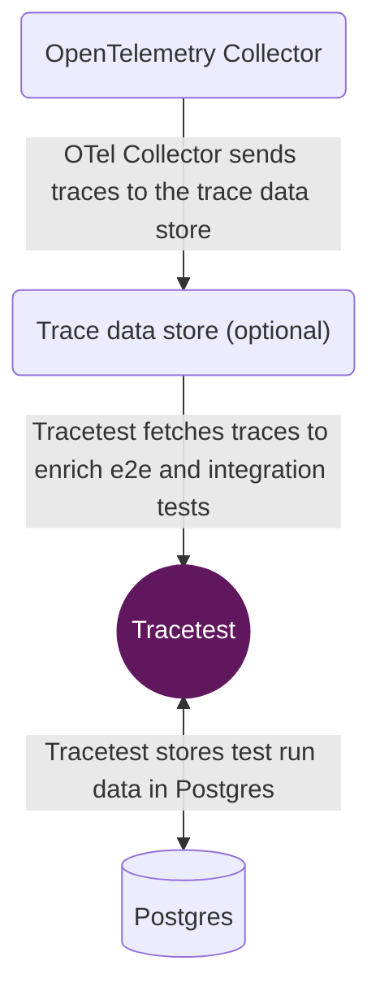

This section contains a general overview of deploying Tracetest in production. You can find platform-specific guides for:

- [Docker](/core/deployment/docker)
- [Kubernetes](/core/deployment/kubernetes)

As shown in the diagram below, a typical production Tracetest deployment consists of Postgres, an OpenTelemetry Colletor and a [trace data store](/configuration/overview.mdx). But, if you do not want to use a trace data store, you can rely entirely on OpenTelemetry Collector.



Postgres stores all Tracetest-related data.

OpenTelemetry Collector ingests traces from your distributed system and forwards them to a trace data store.

A trace data store is used to store traces. Tracetest will fetch trace data from the trace data store when running tests.

Tracetest can be configured via a configuration file:

```yaml
# tracetest.yaml

postgres:
  host: postgres
  user: postgres
  password: postgres
  port: 5432
  dbname: postgres
  params: sslmode=disable
```

Read more in the [configuration docs](/configuration/overview.mdx).

Or, continue reading to see how to run Tracetest Core in production with [Docker](/core/deployment/docker) or [Kubernetes](/core/deployment/kubernetes).
