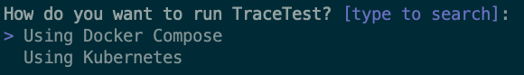

# Docker Deployment

This guide walks you through using the Tracetest CLI to deploy Tracetest with Docker.

:::note
This is an example of a production-ready deployment, but real-world deployments can vary significantly depending on desired performance and scale.
:::

In this form, Tracetest runs in parallel to your Dockerized application,
allowing you to interact with your app and its traces, create and run tests over them, etc.

After installing the CLI, run:

```bash
tracetest server install
```

```bash title="Expected output"
How do you want to run TraceTest? [type to search]:
> Using Docker Compose
  Using Kubernetes
```

<!--  -->

Select `Using Docker Compose` and follow the instructions.

**Tools required (installed if missing)**:

- Docker
- Docker Compose

**Requirements**:

- Jaeger or other compatible backend. If missing, the installer will help you configure one.
- OpenTelemetry Collector. If missing, the installer will help you configure one.
- A `docker-compose.yaml` (configurable) file in the project directory. If missing, the installer will create an empty file.

**Optionals**:

- [PokeShop demo app](https://github.com/kubeshop/pokeshop/). A sample microservice app to test your Tracetest installation.

**Result**:

- `tracetest/` directory (configurable) with a `docker-compose.yaml` and other config files.
- [Jaeger](https://www.jaegertracing.io/) instance, if selected.
- [OpenTelemetry Collector](https://opentelemetry.io/docs/collector/), if selected.
- [PokeShop demo app](https://github.com/kubeshop/pokeshop/), if selected.

**How to start**:

In the folder where you ran `tracetest server install`, run this command to start the Tracetest cluster:

```bash
docker compose -f tracetest/docker-compose.yaml up -d
```

```bash title="Condensed expected output from the Tracetest container:"
Starting tracetest ...
...
2022/11/28 18:24:09 HTTP Server started
...
```

Then launch a browser to [http://localhost:11633/](http://localhost:11633/).

For more configuration options, read more in the [configuration docs](../configuration/overview.md).
