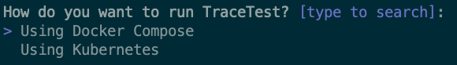

# Kubernetes Deployment

This guide walks you through using the Tracetest CLI to deploy Tracetest with Kubernetes.

:::note
This is an example of a production-ready deployment, but real-world deployments can vary significantly depending on desired performance and scale.
:::

This setup is ideal for CI/CD environments and QA teams working in shared environments.
You can use a remote or local (minikube, kind, etc) cluster.

We'll even help you setup a local cluster, if you need one.

After installing the CLI, go ahead and run:

```bash
tracetest server install
```

```bash title="Expected output"
How do you want to run TraceTest? [type to search]:
  Using Docker Compose
> Using Kubernetes
```

<!--  -->

Select `Using Kubernetes` and follow the instructions.

**Tools required (installed if missing)**:
- kubectl
- helm

If you selected to run locally and want the installer to set up [minikube](https://minikube.sigs.k8s.io/docs/) for you:
- Docker

**Requirements**:
- Jaeger or other compatible backend. If missing, the installer will help you configure one.
- OpenTelemetry Collector. If missing, the installer will help you configure one.

**Optionals**:
- [PokeShop demo app](https://github.com/kubeshop/pokeshop/). A sample microservice app to test your Tracetest installation.

**Result**:
- `tracetest` helm chart deployed in the `tracetest` (configurable) namespace.
- [Jaeger](https://www.jaegertracing.io/) instance deployed in the `tracetest` namespace, if selected.
- [Cert Manager](https://cert-manager.io/), if selected.
- [Jaeger Operator](https://www.jaegertracing.io/docs/latest/operator/), if selected.
- [OpenTelemetry Collector](https://opentelemetry.io/docs/collector/) deployed in the `tracetest` (configurable) namespace, if selected.
- [PokeShop demo app](https://github.com/kubeshop/pokeshop/) deployed in the `demo` namespace, if selected.

**How to start**:

Once installed, you can get started by launching Tracetest:

```sh
kubectl port-forward svc/tracetest 11633
```

Then launch a browser to [http://localhost:11633/](http://localhost:11633/).

For more configuration options, read more in the [configuration docs](../configuration/overview.md).
