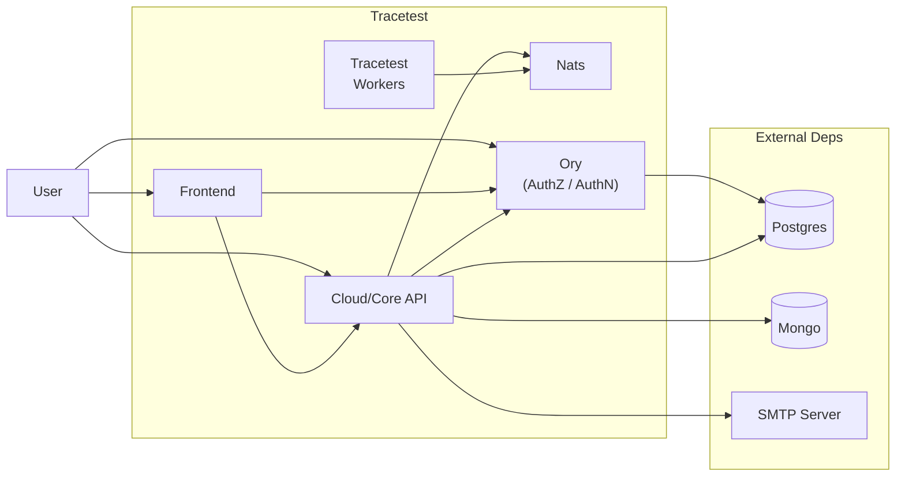

This page showcases getting started with [Tracetest](https://app.tracetest.io/) installing it in your own GKE (Google Kubernetes Engine) cluster.

## Prerequisites for install

- A Kubernetes cluster running on GKE ([installation instructions](https://cloud.google.com/kubernetes-engine/docs/how-to/creating-an-autopilot-cluster))
- Traefik installed in your cluster ([installation instructions](https://doc.traefik.io/traefik/getting-started/install-traefik/))
- Cert Manager installed in your cluster ([installation instructions](https://cert-manager.io/docs/installation/kubernetes/))
- A Tracetest license key. If you don't have one, you can request a trial license key [here](https://tracetest.io/on-prem-installation).
- `kubectl` installed on your local machine
- `helm` installed on your local machine

## Tracetest On-Prem components

Tracetest is composed of a few different internal services that installed in your cluster to work. These services are:
- **Frontend**: WebUI used to interact with the Tracetest, allowing users to [create and manage tests](https://docs.tracetest.io/web-ui/creating-tests).
- **Cloud/Core API**: APIs that are called directly by the Frontend, the Tracetest CLI and the Tracetest Agent to perform operations on the systems, like creating and running tests.
- **Ory**: Tracetest relies on the [Ory](https://www.ory.sh/) for authentication and authorization. This includes [Ory Kratos](https://www.ory.sh/kratos/docs/), [Ory Keto](https://www.ory.sh/keto/docs/), and [Ory Oathkeeper](https://www.ory.sh/oathkeeper/docs/).
- **Tracetest Workers**: A set of workers that manage the test execution.
- **Nats**: An instance of [nats.io](https://nats.io/) uses a message broker that works as a communication bridge between the different services.



They rely on a few external dependencies to work, like:
  - **MongoDB**: used to manage users, projects and organizations
  - **Postgres**: used to manage test results and other metadata
  - **SMTP Server**: used to send emails for user registration and invites

## Installation

To install Tracetest in your GKE cluster, be sure that you have a [Cert-manager](https://cert-manager.io) installed in your cluster with a valid issuer. If you don't have one, you can follow the [Cert-manager installation guide](https://cert-manager.io/docs/installation/) or use the following command to install it:

```sh
# create namespace for cert-manager in your cluster
kubectl create namespace cert-manager

# add the jetstack repository to helm
helm repo add jetstack https://charts.jetstack.io --force-update

# install cert-manager, setting the CRDs and leader election namespace (needed for GKE)
helm install cert-manager jetstack/cert-manager      \
  --namespace cert-manager                           \
  --version v1.15.0                                  \
  --set crds.enabled=true                            \
  --set global.leaderElection.namespace=cert-manager
```

Also, you will need to have a Traefik proxy, that will handle all connections to the Tracetest services. You can install Traefik, by creating a `values-traefik.yaml` file with the following content:

```yaml
dnsNames:
  - "tracetest.localdev" # add here your DNS domain to access Tracetest

tls:
  issuerRef:
    ... # add here your issuer reference

providers:
  kubernetesCRD:
    enabled: true

service:
  type: NodePort

ports:
  websecure:
    port: 30000
    exposedPort: 30000
    nodePort: 30000
    protocol: TCP
    tls:
      enabled: true
    http2:
      maxConcurrentStreams: 250
```

And then run the following commands:

```sh
# create namespace for traefik in your cluster
kubectl create namespace traefik

# add traefik charts in your machine
helm repo add traefik https://helm.traefik.io/traefik --force-update

# install traefik in your cluster
helm install traefik traefik/traefik                \
  --namespace traefik                                \
  --values values-traefik.yaml
```

After that, you will create a `values.yaml` file that defines what is the DNS domain that you will use to access the Tracetest services and the connection details for Postgres and MongoDB.
You can see more details about the `values.yaml` file [here](https://github.com/kubeshop/tracetest-cloud-charts/blob/main/charts/tracetest-onprem/values.yaml).

You can use the following template to create your `values.yaml` file, where we are using the domain `tracetest.localdev` as the DNS, `tracetest-postgres-postgresql.external` as the Postgres and `tracetest-dependencies-mongodb.external` MongoDB server:

```yaml
global:
  urls:
    protocol: &protocol "https"
    port: &port "30000"
    rootDomain: &rootDomain "tracetest.localdev"
    cookieDomain: *rootDomain

    web:
      protocol: *protocol
      hostname: *rootDomain
      port: *port

    api:
      protocol: *protocol
      hostname: *rootDomain
      port: *port

    auth:
      protocol: *protocol
      hostname: *rootDomain
      port: *port

    agents:
      domain: *rootDomain
      port: *port

    controlPlane:
      protocol: *protocol
      hostname: *rootDomain
      port: *port

  postgresql:
    auth:
      host: "tracetest-postgres-postgresql.external"
      username: "tracetest"
      password: "tracetest"
      database: "tracetest"

  mongodb:
    auth:
      protocol: "mongodb"
      host: "tracetest-dependencies-mongodb.external"
      username: "tracetest"
      password: "tracetest"
      database: "tracetest"
      options:
        retryWrites: "true"
        authSource: admin
```

And finally, run the `helm install` command with your license key and the `values.yaml` file:

```sh
# create namespace for tracetest cloud in your cluster
kubectl create namespace tracetestcloud

# add tracetest cloud charts in your machine
helm repo add tracetestcloud https://kubeshop.github.io/tracetest-cloud-charts --force-update

# and then install tracetest cloud in your cluster
helm install my-tracetest-cloud tracetestcloud/tracetest-onprem   \
    --namespace tracetestcloud                                    \
    --set global.licenseKey=YOUR-LICENSE-KEY \
    --values values.yaml
```
