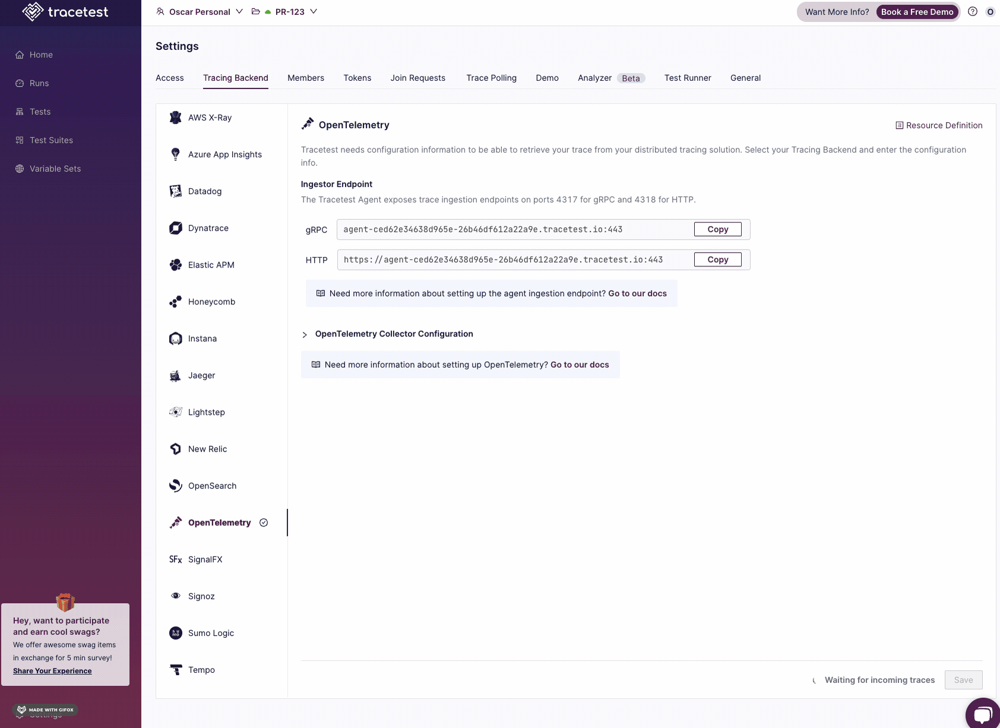
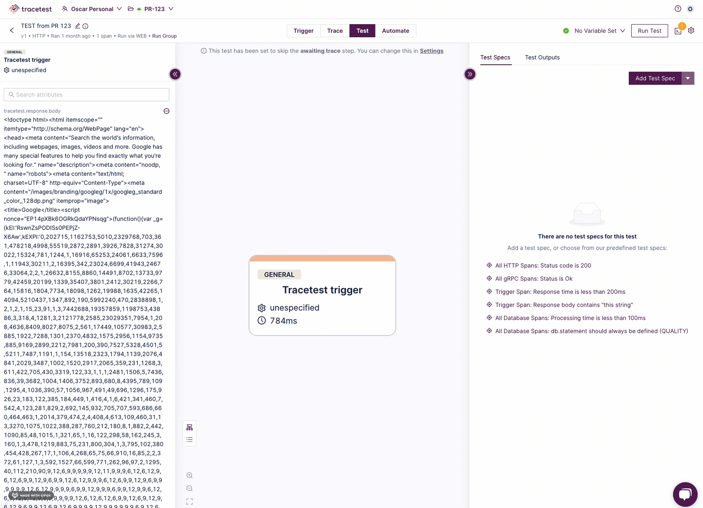

:::info Version Compatibility
The features described here are compatible with the [Tracetest CLI v1.3.0](https://github.com/kubeshop/tracetest/releases/tag/v1.2.0) and above.
:::

:::note
[Check out the source code on GitHub here.](https://github.com/kubeshop/tracetest/tree/main/examples/provisioning-developer-environment-cli)
:::

[Tracetest](https://tracetest.io/) is a testing tool based on [OpenTelemetry](https://opentelemetry.io/) that permits you to test your distributed application. It allows you to use the trace data generated by your OpenTelemetry tools to check and assert if your application has the desired behavior defined by your test definitions.

## Why is this important?

Developer experience is one of the key values we always push forward at Tracetest. This enables teams to have a consistent and reliable way to onboard new developers.
By using the Tracetest CLI, you can build scripts to automate the process of creating a new environment for a developer joining your team.
This ensures that the developer has the necessary environment to start working on the project without any manual intervention.

## Supported Provisioning Resources

- [Environments](https://docs.tracetest.io/concepts/environments)
- [Environment Tokens](https://docs.tracetest.io/concepts/environment-tokens)
- [Polling Profiles](https://docs.tracetest.io/concepts/polling-profiles)
- [Test](https://docs.tracetest.io/concepts/tests)
- [Test Suites](https://docs.tracetest.io/concepts/test-suites)
- [Test Runners](https://docs.tracetest.io/configuration/test-runner)
- [Tracing Backends](https://docs.tracetest.io/configuration/connecting-to-data-stores/overview)
- [Organization Invites](https://docs.tracetest.io/concepts/roles-and-permissions#adding-organization-members-by-email)
- [Variable Sets](https://docs.tracetest.io/concepts/variable-sets)
- [Analyzer](https://docs.tracetest.io/analyzer/concepts)

## Finding the Resource Definition

Tracetest Definitions are found across the app, for resources under settings you can click the `Resource Definition` button to find the YAML definition of the resource.



For Tests and Test Suites, you can find the YAML definition by clicking the `Automate` tab.



## Requirements

**Tracetest CLI**:

- Download & Install the [Tracetest CLI](https://docs.tracetest.io/cli/cli-installation-reference).
- Login or Signup to your Tracetest account using the CLI with `tracetest configure`

**Docker Compose**:

- Install [Docker Compose](https://docs.docker.com/compose/install/)
- Ensure Docker Compose is running on your machine

## Run This Quckstart Example

The example below is provided as part of the Tracetest GitHub repo. You can download and run the example by following these steps:
Clone the Tracetest project and go to the Privisioning Developer Environment with CLI example directory:

```bash
git clone https://github.com/kubeshop/tracetest
cd tracetest/examples/provisioning-developer-environment-script
```

Follow these instructions to run Provision an Environment using the example:

1. Create an [organization token](https://docs.tracetest.io/concepts/organization-tokens) from the UI and set it as an environment variable:

```bash title="Set the organization token"
export TRACETEST_TOKEN=<your-organization-token>
```

2. Spin up the Pokeshop API and Jaeger backend by running the `docker-compose up -d` command.
3. Run the `./provision.sh` bash script.
4. Execute the test suite by running the `tracetest run -f ./resources/suites/pokeshop.yaml --vars tracetesting-vars` command.
5. Follow the link to the Tracetest UI to view the test results.

## Project Structure

The project structure for the Provisioning Developer Environment with CLI example is as follows:

```bash
provision.sh
collector.yaml
docker-compose.yaml
environment.yaml
/resources
  /tests
    add-pokemon.yaml
    import-pokemon.yaml
    list-pokemon.yaml
  /suites
    pokeshop.yaml
  /config
    variableset.yaml
    pollingprofile.yaml
    runner.yaml
    tracing-backend.yaml
```

The Environment Definition includes a section to specify the resources that will be applied along with the environment. The resources are defined in the `/resources` directory.

```yaml title="environment.yaml"
type: Environment
spec:
  id: automated-pokeshop-demo
  name: Automated Pokeshop Demo
  agentConfiguration:
    serverless: true
  resources: ./resources
```

The resources are defined in the `/resources` directory. The resources include tests, test suites, variable sets, polling profiles, test runners, and tracing backends.

## Provisioned Resources

The example provisions the following resources:

### Polling Profile

```yaml title="resources/config/pollingprofile.yaml"
type: PollingProfile
spec:
  id: pokeshop-demo
  name: pokeshop-demo
  default: true
  strategy: periodic
  periodic:
    retryDelay: 5s
    timeout: 1m
    selectorMatchRetries: 3
```

### Test Runner

```yaml title="resources/config/runner.yaml"
type: TestRunner
spec:
  id: current
  name: default
  requiredGates:
    - test-specs
```

### Tracing Backend

```yaml title="resources/config/tracing-backend.yaml"
type: DataStore
spec:
  id: tracing-backend
  name: jaeger
  type: jaeger
  default: true
  jaeger:
    endpoint: localhost:16685
    tls:
      insecure: true
      settings: {}
```

### Variable Set

```yaml title="resources/config/variableset.yaml"
type: VariableSet
spec:
  id: tracetesting-vars
  name: tracetesting-vars
  values:
    - key: POKESHOP_API_URL
      value: http://localhost:8081
```

### Tests

```yaml title="resources/tests/add-pokemon.yaml"
type: Test
spec:
  id: pokeshop-demo-add-pokemon
  name: Pokeshop - Add
  description: Add a Pokemon
  trigger:
    type: http
    httpRequest:
      method: POST
      url: ${var:POKESHOP_API_URL}/pokemon
      body: |
        {
          "name": "meowth",
          "type":"normal",
          "imageUrl":"https://assets.pokemon.com/assets/cms2/img/pokedex/full/052.png",
          "isFeatured": true
        }
      headers:
        - key: Content-Type
          value: application/json
  specs:
    - selector: span[tracetest.span.type="http" name="POST /pokemon" http.method="POST"]
      name: The POST /pokemon was called correctly
      assertions:
        - attr:http.status_code = 201
    - selector: span[tracetest.span.type="general" name="validate request"]
      name: The request sent to API is valid
      assertions:
        - attr:validation.is_valid = "true"
    - selector: span[tracetest.span.type="database" name="create pokeshop.pokemon" db.operation="create" db.sql.table="pokemon"]
      name: A Pokemon was inserted on database
      assertions:
        - attr:db.result | json_path '$.imageUrl'  =  "https://assets.pokemon.com/assets/cms2/img/pokedex/full/052.png"
```

```yaml title="resources/tests/import-pokemon.yaml"
type: Test
spec:
  id: pokeshop-demo-import-pokemon-queue
  name: Import a Pokemon using API and MQ Worker
  description: Import a Pokemon
  trigger:
    type: http
    httpRequest:
      method: POST
      url: ${var:POKESHOP_API_URL}/pokemon/import
      body: |
        {
          "id": 143
        }
      headers:
        - key: Content-Type
          value: application/json
  specs:
    - selector: span[tracetest.span.type="http" name="POST /pokemon/import" http.method="POST"]
      name: POST /pokemon/import was called successfuly
      assertions:
        - attr:http.status_code  =  200
        - attr:http.response.body | json_path '$.id' = "143"
    - selector: span[tracetest.span.type="general" name="validate request"]
      name: The request was validated correctly
      assertions:
        - attr:validation.is_valid = "true"
    - selector: span[tracetest.span.type="messaging" name="queue.synchronizePokemon publish" messaging.system="rabbitmq" messaging.destination="queue.synchronizePokemon" messaging.operation="publish"]
      name: A message was enqueued to the worker
      assertions:
        - attr:messaging.payload | json_path '$.id' = "143"
    - selector: span[tracetest.span.type="messaging" name="queue.synchronizePokemon process" messaging.system="rabbitmq" messaging.destination="queue.synchronizePokemon" messaging.operation="process"]
      name: A message was read by the worker
      assertions:
        - attr:messaging.payload | json_path '$.fields.routingKey' = "queue.synchronizePokemon"
    - selector: span[tracetest.span.type="general" name="import pokemon"]
      name: A "import pokemon" action was triggered
      assertions:
        - attr:tracetest.selected_spans.count >= 1
```

```yaml title="resources/tests/list-pokemon.yaml"
type: Test
spec:
  id: pokeshop-demo-list-pokemon
  name: List Pokemons
  description: List Pokemons registered on Pokeshop API
  trigger:
    type: http
    httpRequest:
      method: GET
      url: ${var:POKESHOP_API_URL}/pokemon?take=100&skip=0
      headers:
        - key: Content-Type
          value: application/json
  specs:
    - selector: span[tracetest.span.type="http" name="GET /pokemon?take=100&skip=0" http.method="GET"]
      name: GET /pokemon endpoint was called and returned valid data
      assertions:
        - attr:http.status_code  =  200
    - selector: span[tracetest.span.type="database" name="count pokeshop.pokemon" db.system="postgres" db.name="pokeshop" db.user="ashketchum" db.operation="count" db.sql.table="pokemon"]
      name: A count operation was triggered on database
      assertions:
        - attr:db.operation = "count"
    - selector: span[tracetest.span.type="database" name="findMany pokeshop.pokemon" db.system="postgres" db.name="pokeshop" db.user="ashketchum" db.operation="findMany" db.sql.table="pokemon"]
      name: A select operation was triggered on database
      assertions:
        - attr:db.operation = "findMany"
```

### Test Suite

```yaml title="resources/suites/pokeshop.yaml"
type: TestSuite
spec:
  id: pokeshop-demo-test-suite
  name: Pokeshop Demo Test Suite
  steps:
    - ../tests/add-pokemon.yaml
    - ../tests/import-pokemon.yaml
    - ../tests/list-pokemons.yaml
```

## Provisioning the Environment

The `provision.sh` looks like the following:

```bash title="provision.sh"
#!/bin/bash

# NEEDS TRACETEST_TOKEN to be set in the environment with organization admin access
# https://docs.tracetest.io/concepts/organization-tokens
TRACETEST_TOKEN=$TRACETEST_TOKEN

# configure tracetest
tracetest configure --token $TRACETEST_TOKEN

# create environment
ENVIRONMENT_ID=$(tracetest apply environment -f environment.yaml --output json | jq -r '.spec.id')
echo "Environment ID: $ENVIRONMENT_ID"

# switching to the environment
tracetest configure --environment $ENVIRONMENT_ID

# start agent
tracetest start --api-key $TRACETEST_TOKEN --environment $ENVIRONMENT_ID
```

## Running the Test Suite
Finally, you can run the test suite by executing the following command:

```bash
tracetest run -f ./resources/suites/pokeshop.yaml --vars tracetesting-vars
```

## Learn More

Please visit our [examples in GitHub](https://github.com/kubeshop/tracetest/tree/main/examples) and join our [Slack Community](https://dub.sh/tracetest-community) for more info!
