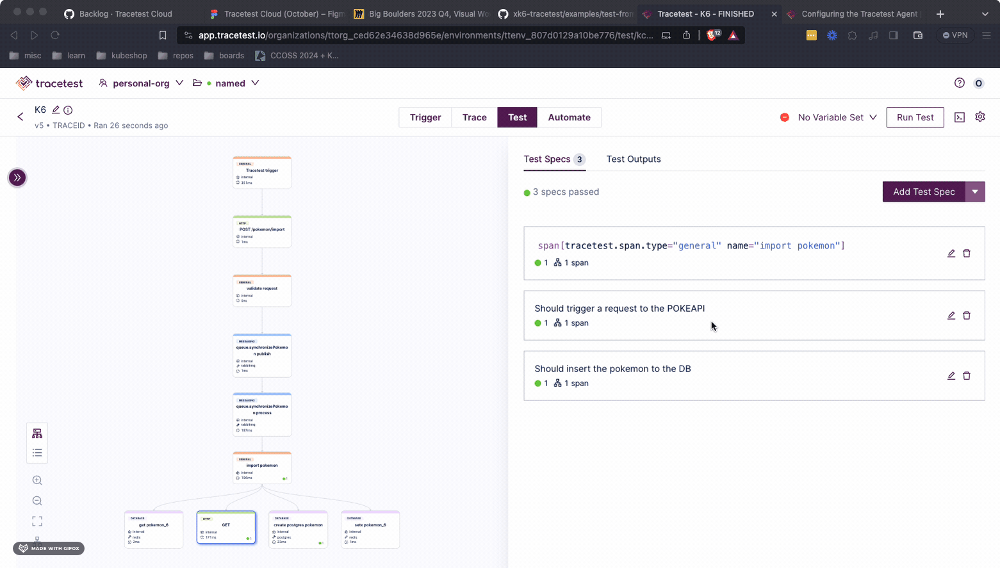

:::note
[Check out the source code on GitHub here.](https://github.com/kubeshop/tracetest/tree/main/examples/tracetest-cloud-k6)
:::

[Tracetest Cloud](https://app.tracetest.io/) is a testing tool based on [OpenTelemetry](https://opentelemetry.io/) that allows you to test your distributed application. It allows you to use data from distributed traces generated by OpenTelemetry to validate and assert if your application has the desired behavior defined by your test definitions.

[K6](https://k6.io/) is an open-source performance testing tool used for testing the performance of APIs, microservices, and websites. It is designed to be developer-centric, making it easy for developers to write and maintain performance tests as code.

## Performance Tests and Trace-Based Testing using Tracetest Cloud and K6 (Pokeshop Demo)

This is a simple quick start guide on how to run the Tracetest K6 extension to run enhanced performance tests with Trace-Based testing. The infrastructure will use the Pokeshop Demo as a testing ground, triggering requests against it and generating telemetry data.

## Prerequisites

- Sign up to [app.tracetest.io](https://app.tracetest.io).
- Create an [environment](/concepts/environments).
- Having access to the environment's [agent token](/configuration/agent).
- [Docker](https://docs.docker.com/get-docker/) and [Docker Compose](https://docs.docker.com/compose/install/) installed on your machine to run this quick start app!

## Project Structure

The project is built with Docker Compose.

### 1. Pokeshop Demo App

The `docker-compose-yaml` file in the root directory is for the Pokeshop Demo app, the OpenTelemetry setup and the [Tracetest Agent](/concepts/agent).

### Docker Compose Network

All `services` in the `docker-compose.yaml` are on the same network and will be reachable by hostname from within other services. For example, `jaeger:14250` in the `collector.config.yaml` file will map to the `jaeger` service, where port `14250` is the port where the Jaeger all-in-one instance accepts telemetry data.

## Pokeshop Demo App

The Pokeshop Demo App is a complete example of a distributed application using different backend and front-end services, implementation code is written in Typescript.

:::note
To find out more about the Pokeshop Demo visit the [documentation page](/live-examples/pokeshop/overview).
:::

## Tracetest Test Definition

The `tests/test.yaml` file contains the test definition that will be used to run the tests. It uses the trace id trigger which is required for the k6 integrations as well as adding assertions using test-based TDD patterns.

```yaml
type: Test
spec:
  id: kc_MgKoVR
  name: K6
  description: K6
  trigger:
    type: traceid
    traceid:
      id: ${env:TRACE_ID}
  specs:
    - selector: span[tracetest.span.type="general" name="import pokemon"]
      name: Should have imported the pokemon
      assertions:
        - attr:tracetest.selected_spans.count = 1
    - selector: |-
        span[tracetest.span.type="http" net.peer.name="pokeapi.co" http.method="GET"]
      name: Should trigger a request to the POKEAPI
      assertions:
        - attr:http.url   =  "https://pokeapi.co/api/v2/pokemon/6"
    - selector: span[tracetest.span.type="database" name="create postgres.pokemon"]
      name: Should insert the pokemon to the DB
      assertions:
        - attr:db.result | json_path '.name'  =  "charizard"
```

## K6 Script

The `import-pokemon.js` file contains the K6 script that will be used to run the performance tests. It is a simple script that will trigger a `POST` request to the `/pokemon/import` Pokeshop Demo app endpoint.

```javascript
import { Http, Tracetest } from "k6/x/tracetest";
import { sleep } from "k6";

export const options = {
  vus: 1,
  duration: "5s",
};

const http = new Http();
const testId = "kc_MgKoVR";
const tracetest = Tracetest();

let pokemonId = 6; // charizard

export default function () {
  const url = "http://localhost:8081/pokemon/import";
  const payload = JSON.stringify({
    id: pokemonId++,
  });
  const params = {
    headers: {
      "Content-Type": "application/json",
    },
    tracetest: {
      testId,
    },
  };

  const response = http.post(url, payload, params);

  tracetest.runTest(
    response.trace_id,
    {
      test_id: testId,
      variable_name: "TRACE_ID",
      should_wait: true,
    },
    {
      id: "123",
      url,
      method: "GET",
    }
  );

  sleep(1);
}

export function handleSummary() {
  return {
    stdout: tracetest.summary(),
  };
}

export function teardown() {
  tracetest.validateResult();
}
```

## Tracetest Cloud

The `docker-compose.yaml` file includes the Tracetest Agent image, which is going to fetch traces from the Jaeger all-in-one instance and send them to Tracetest Cloud.

```yaml
version: "3"

services:
  tracetest-agent:
    image: kubeshop/tracetest-agent:latest
    environment:
      TRACETEST_DEV: ${TRACETEST_DEV}
      TRACETEST_API_KEY: ${TRACETEST_API_KEY}
```

Do not forget to set the `TRACETEST_API_KEY` environment variable in the `.env` file to your Tracetest Agent API key available on the settings page of your environment.

The `tracetest.config.yaml` file contains the basic setup of connecting Tracetest to the Postgres instance.

## Building the Tracetest xk6 Binary

The Tracetest extension can be found in the official k6 documentation [here](https://k6.io/docs/extensions/get-started/bundle/).

But to simplify things you can build it yourself using the following command:

```bash
xk6 build v0.48.0 --with github.com/kubeshop/xk6-tracetest
```

This will generate the `k6-tracetest` binary in the current directory.

## Run the Pokeshop Demo App and the Tracetest Agent

To start the full setup, run the following command:

```bash
docker-compose up -d
```

This will start the Pokeshop Demo HTTP API on `http://localhost:8081/`.

## Run the K6 Script

Having the full setup ready, the final step is to run the K6 script. To do that, run the following command:

```bash
XK6_TRACETEST_API_TOKEN=<your-environment-token> ./k6 run ./import-pokemon.js -o xk6-tracetest
context menu


          /\      |‾‾| /‾‾/   /‾‾/
     /\  /  \     |  |/  /   /  /
    /  \/    \    |     (   /   ‾‾\
   /          \   |  |\  \ |  (‾)  |
  / __________ \  |__| \__\ \_____/ .io

  execution: local
     script: ./import-pokemon.js
     output: xk6-tracetest-output (TestRunID: 38055)

  scenarios: (100.00%) 1 scenario, 1 max VUs, 35s max duration (incl. graceful stop):
           * default: 1 looping VUs for 5s (gracefulStop: 30s)

[TotalRuns=6, SuccessfulRus=1, FailedRuns=5]
[FAILED]
[Request=GET - http://localhost:8081/pokemon/import, TraceID=dc0718bcecceeec731b343235eb9c15a, RunState=FINISHED FailingSpecs=true, TracetestURL= https://app.tracetest.io/organizations/ttorg_ced62e34638d965e/environments/ttenv_807d0129a10be776/test/kc_MgKoVR/run/11]
[Request=POST - http://localhost:8081/pokemon/import, TraceID=dc0718fe83cfeec7315daf10d212d351, RunState=FINISHED FailingSpecs=true, TracetestURL= https://app.tracetest.io/organizations/ttorg_ced62e34638d965e/environments/ttenv_807d0129a10be776/test/kc_MgKoVR/run/4]
[Request=POST - http://localhost:8081/pokemon/import, TraceID=dc0718a8f4ceeec731e47f13762e61b8, RunState=FINISHED FailingSpecs=true, TracetestURL= https://app.tracetest.io/organizations/ttorg_ced62e34638d965e/environments/ttenv_807d0129a10be776/test/kc_MgKoVR/run/8]
[Request=POST - http://localhost:8081/pokemon/import, TraceID=dc0718bcecceeec731b343235eb9c15a, RunState=FINISHED FailingSpecs=true, TracetestURL= https://app.tracetest.io/organizations/ttorg_ced62e34638d965e/environments/ttenv_807d0129a10be776/test/kc_MgKoVR/run/9]
[Request=POST - http://localhost:8081/pokemon/import, TraceID=dc071893fcceeec731148270c6671a1e, RunState=FINISHED FailingSpecs=true, TracetestURL= https://app.tracetest.io/organizations/ttorg_ced62e34638d965e/environments/ttenv_807d0129a10be776/test/kc_MgKoVR/run/6]
[SUCCESSFUL]
[Request=POST - http://localhost:8081/pokemon/import, TraceID=dc0718cee4ceeec731f3f414bf3a2a16, RunState=FINISHED FailingSpecs=false, TracetestURL= https://app.tracetest.io/organizations/ttorg_ced62e34638d965e/environments/ttenv_807d0129a10be776/test/kc_MgKoVR/run/3]

running (05.0s), 0/1 VUs, 5 complete and 0 interrupted iterations
default ✓ [======================================] 1 VUs  5s
```

## What's Next?

After running the initial set of tests, you can click the run link for any of them, update the assertions and run the scripts once more. This flow enables complete a trace-based TDD flow.



## Learn More

Please visit our [examples in GitHub](https://github.com/kubeshop/tracetest/tree/main/examples) and join our [Discord Community](https://discord.gg/8MtcMrQNbX) for more info!
