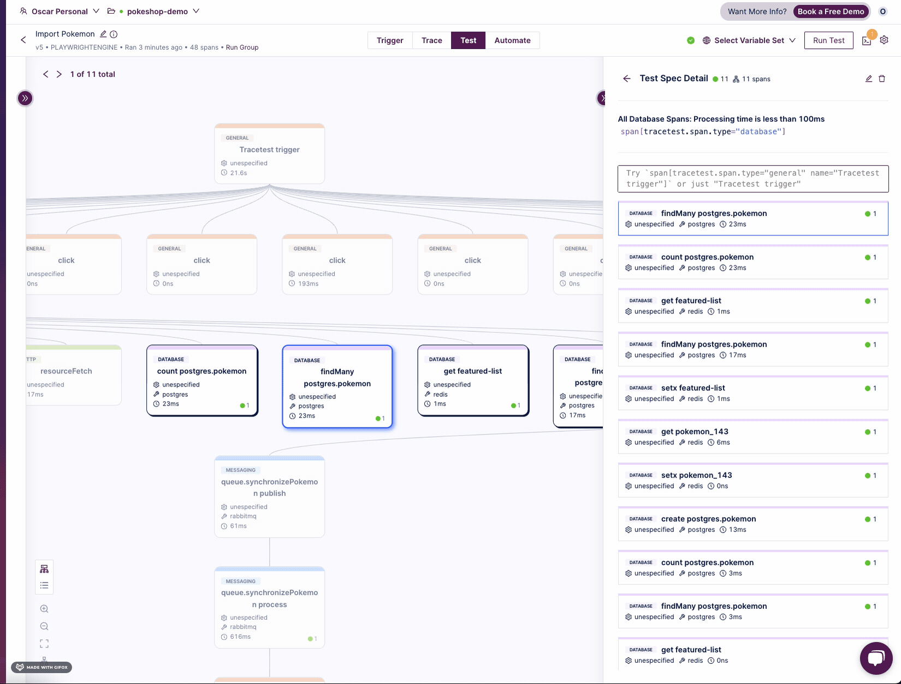

:::info Tracetest x Playwright Frontend Instrumentation Requirements
Find out the requirements for your instrumented app to start using [Tracetest x Playwright](https://tracetest.io/blog/tracetest-tip-instrumentation-for-end-to-end-tests).
:::

:::info Version Compatibility
The features described here are compatible with the [Tracetest CLI v1.4.1](https://github.com/kubeshop/tracetest/releases/tag/v1.4.1) and above.
:::

:::note
[Check out the source code on GitHub here.](https://github.com/kubeshop/tracetest/tree/main/examples/tracetest-playwright-engine)
:::

[Tracetest](https://tracetest.io/) is a testing tool based on [OpenTelemetry](https://opentelemetry.io/) that permits you to test your distributed application. It allows you to use the trace data generated by your OpenTelemetry tools to check and assert if your application has the desired behavior defined by your test definitions.
[Playwright](https://playwright.dev/) is an open-source automation framework developed by Microsoft that enables cross-browser automation for web applications. It provides a set of APIs and libraries for automating interactions with web browsers such as Chrome, Firefox, and Microsoft Edge.

## Why is this important?

The Tracetest Playwright Engine trigger enables you to combine the power of end-to-end tests with trace-based testing to easily capture a full distributed trace from your OpenTelemetry instrumented front-end and back-end system.

By creating a Tracetest Playwright Engine test, you will be able to create trace-based assertions to be applied across the entire flow like any other Tracetest test. Not only that but it allows you to mix and match it with your existing Monitors, Test Suites and CI/CD validations.

Another big benefit of using traces as test specs is that you can:

- Get faster MTTR for failing performance tests
- Assert against the Playwright test execution and the system under test
- Validate functionality of other parts of your system that may be broken, even when end-to-end tests are passing

## Requirements

**Tracetest Account**:

- Sign up to [`app.tracetest.io`](https://app.tracetest.io) or follow the [get started](/getting-started/installation) docs.
- Create an [environment](/concepts/environments).
- Create an [environment token](/concepts/environment-tokens) with **admin role**.
- Copy the environment id to your clipboard.

**Docker**: Have [Docker](https://docs.docker.com/get-docker/) and [Docker Compose](https://docs.docker.com/compose/install/) installed on your machine.

## Run This Example

The example below is provided as part of the Tracetest GitHub repo. You can download and run the example by following these steps:

```bash
git clone https://github.com/kubeshop/tracetest
cd tracetest/examples/tracetest-playwright-engine
```

Follow these instructions to run the example:

1. Log into the [Tracetest app](https://app.tracetest.io/).
2. Copy the `.env.template` file to `.env`.
3. Fill out the [TRACETEST_API_TOKEN](https://docs.tracetest.io/concepts/environment-tokens) and [TRACETEST_ENVIRONMENT_ID](https://docs.tracetest.io/concepts/agent) details by editing your `.env` file. You can find these values in the Settings area for your environment.
4. Run `docker compose run tracetest-run`.
5. Follow the link in the terminal with the results to view the test run.

## Project Structure

The project structure for running Tracetest Playwright Engine tests is as follows:

```bash
.env.template
.gitignore
.Dockerfile
collector.config.yaml
docker-compose.yaml
/resources
  apply.sh
  datastore.yaml
  import-pokemon.yaml
  run.sh
  script.js
```

The [Pokeshop Demo App](/live-examples/pokeshop/overview) is a complete example of a distributed application using different back-end and front-end services. We will be launching it and running tests against it as part of this example.
The `docker-compose.yaml` file in the root directory of the quick start runs the Pokeshop Demo app, the OpenTelemetry Collector, Jaeger, and the [Tracetest Agent](/concepts/agent) setup.

The Tracetest resource definitions and scripts are defined under the `/resources` directory. The resources include tests and the tracing backend definition, while the scripts include the `apply.sh` and `run.sh` scripts to apply the resources and run the tests.

## Provisioned Resources

The example provisions the following resources:

### Import Pokemon Test

```yaml title="resources/import-pokemon.yaml"
type: Test
spec:
  id: import-pokemon
  name: Import Pokemon
  trigger:
    type: playwrightengine
    playwrightEngine:
      target: http://api:8081
      script: ./script.js
      method: importPokemon
  specs:
    - selector: span[tracetest.span.type="general" name="documentLoad"]
      name: Document Load Should be fast
      assertions:
        - attr:tracetest.span.duration < 500ms
    - selector: span[tracetest.span.type="http" http.scheme="http"]
      name: All HTTP request should return 200
      assertions:
        - attr:http.status_code = 200
    - selector: span[tracetest.span.type="messaging" name="queue.synchronizePokemon
        process" messaging.system="rabbitmq"
        messaging.destination="queue.synchronizePokemon"
        messaging.operation="process"]
      name: The worker should be processed
      assertions:
        - attr:tracetest.selected_spans.count = 1
    - selector: span[tracetest.span.type="database"]
      name: "All Database Spans: Processing time is less than 100ms"
      assertions:
        - attr:tracetest.span.duration  <  250ms
```

### Playwright Script

```javascript title="resources/script.js"
const { expect } = require("@playwright/test");

async function importPokemon(page) {
  expect(await page.getByText("Pokeshop")).toBeTruthy();

  await page.click("text=Import");
  await page.getByLabel("ID").fill("143");

  await Promise.all([
    page.waitForResponse((resp) => resp.url().includes("/pokemon/import") && resp.status() === 200),
    page.getByRole("button", { name: "OK", exact: true }).click(),
  ]);
}

module.exports = { importPokemon };
```

### Jaeger Tracing Backend

```yaml title="resources/datastore.yaml"
type: DataStore
spec:
  id: current
  name: jaeger
  type: jaeger
  default: true
  jaeger:
    endpoint: jaeger:16685
    headers:
      "": ""
    tls:
      insecure: true
```

### The Apply Script

The apply script configures and provisions the resources in the Tracetest environment:

```bash title="resources/apply.sh"
#!/bin/sh

set -e

TOKEN=$TRACETEST_API_KEY
ENVIRONMENT_ID=$TRACETEST_ENVIRONMENT_ID

apply() {
  echo "Configuring TraceTest"
  tracetest configure --token $TOKEN --environment $ENVIRONMENT_ID

  echo "Applying Resources"
  tracetest apply datastore -f /resources/datastore.yaml
  tracetest apply test -f /resources/import-pokemon.yaml
}

apply
```

### The Run Script

The run script runs the test suite against the provisioned resources:

```bash title="resources/run.sh"
#!/bin/sh

set -e

TOKEN=$TRACETEST_API_KEY
ENVIRONMENT_ID=$TRACETEST_ENVIRONMENT_ID

run() {
  echo "Configuring Tracetest"
  tracetest configure --token $TOKEN --environment $ENVIRONMENT_ID

  echo "Running Trace-Based Tests..."
  tracetest run test -f /resources/import-pokemon.yaml
}

run
```

## Setting the Environment Variables

Copy the `.env.template` file to `.env` and add the Tracetest API token and agent tokens to the `TRACETEST_API_TOKEN` and `TRACETEST_ENVIRONMENT_ID` variables.

## Running the Full Example

Everything is automated for you to only run the following command:

```bash
docker compose run tracetest-run
```

This command will run the `apply.sh` script to provision the resources and the `run.sh` script to run the test suite.

## Finding the Results

The output from the Tracetest Engine script should be visible in the console log after running the test command.

```bash title=Output
docker compose run tracetest-run

[+] Running 2/2
 ✔ worker Pulled                                                                                                                                                  0.9s
 ✔ api Pulled                                                                                                                                                     1.2s
[+] Creating 6/0
 ✔ Container tracetest-playwright-engine-tracetest-agent-1  Running                                                                                               0.0s
 ✔ Container tracetest-playwright-engine-otel-collector-1   Running                                                                                               0.0s
 ✔ Container tracetest-playwright-engine-jaeger-1           Running                                                                                               0.0s
 ✔ Container tracetest-playwright-engine-postgres-1         Running                                                                                               0.0s
 ✔ Container tracetest-playwright-engine-queue-1            Running                                                                                               0.0s
 ✔ Container tracetest-playwright-engine-cache-1            Running                                                                                               0.0s
[+] Running 6/6
 ✔ Container tracetest-playwright-engine-queue-1            Healthy                                                                                               0.5s
 ✔ Container tracetest-playwright-engine-postgres-1         Healthy                                                                                               0.5s
 ✔ Container tracetest-playwright-engine-cache-1            Healthy                                                                                               0.5s
 ✔ Container tracetest-playwright-engine-worker-1           Started                                                                                               0.1s
 ✔ Container tracetest-playwright-engine-api-1              Healthy                                                                                               1.7s
 ✔ Container tracetest-playwright-engine-tracetest-apply-1  Started                                                                                               0.1s
[+] Running 2/2
 ✔ api Pulled                                                                                                                                                     1.0s
 ✔ worker Pulled                                                                                                                                                  1.0s
Configuring Tracetest
 SUCCESS  Successfully configured Tracetest CLI
Running Trace-Based Tests...
✔ RunGroup: #2XdxnzuIR (https://app.tracetest.io/organizations/ttorg_ced62e34638d965e/environments/ttenv_b42fa137465c6e04/run/2XdxnzuIR)
 Summary: 1 passed, 0 failed, 0 pending
  ✔ Import Pokemon (https://app.tracetest.io/organizations/ttorg_ced62e34638d965e/environments/ttenv_b42fa137465c6e04/test/import-pokemon/run/19/test) - trace id: 3d5cf7f8d3c78b2bc49eaa355809dc0e
	✔ Document Load Should be fast
	✔ All HTTP request should return 200
	✔ The worker should be processed
	✔ All Database Spans: Processing time is less than 100ms
```

## What's Next?

After running the test, you can click the run link, update the assertions, and run the scripts once more. This flow enables complete a trace-based TDD flow.



## Learn More

Please visit our [examples in GitHub](https://github.com/kubeshop/tracetest/tree/main/examples) and join our [Slack Community](https://dub.sh/tracetest-community) for more info!
