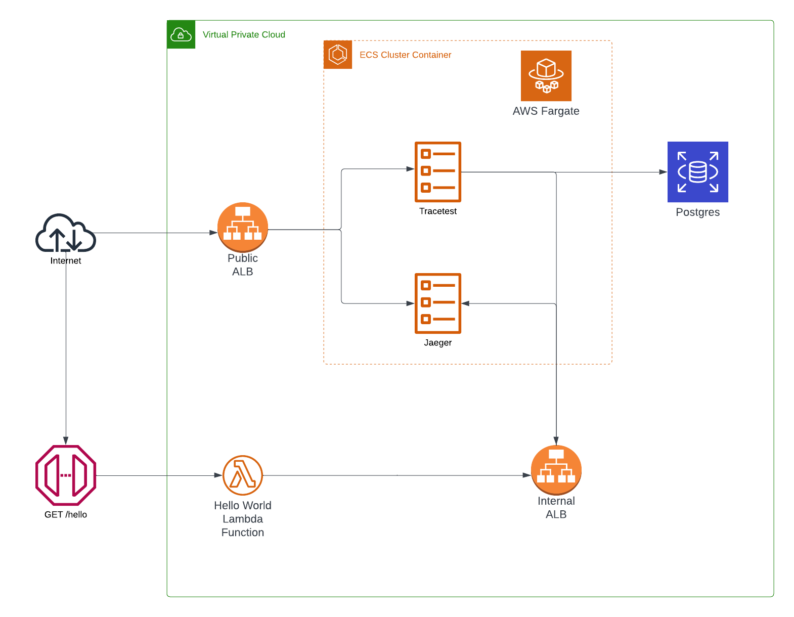
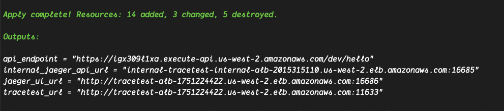

# Running Tracetest on AWS Fargate with Terraform

:::note
[Check out the source code on GitHub here.](https://github.com/kubeshop/tracetest/tree/main/examples/tracetest-aws-terraform-serverless) 
:::

[Tracetest](https://tracetest.io/) is a testing tool based on [OpenTelemetry](https://opentelemetry.io/) that allows you to test your distributed application. It allows you to use your telemetry data generated by the OpenTelemetry tools to check and assert if your application has the desired behavior defined by your test definitions.

[Jaeger](https://www.jaegertracing.io/) is an open-source, end-to-end distributed tracing solution. It allows you to monitor and troubleshoot transactions in complex distributed systems. It was developed and open sourced by Uber Technologies. Jaeger provides a distributed tracing solution to enable transactions across multiple heterogeneous systems or microservices to be tracked and displayed as a cascading series of spans.

[Terraform](https://www.terraform.io/) is an infrastructure as code tool that lets you define both cloud and on-prem resources in human-readable configuration files that you can version, reuse, and share. You can then use a consistent workflow to provision and manage all of your infrastructure throughout its lifecycle.

[AWS Fargate](https://aws.amazon.com/fargate/) is a serverless, pay-as-you-go compute engine that lets you focus on building applications without managing servers. AWS Fargate is compatible with both Amazon Elastic Container Service (ECS) and Amazon Elastic Kubernetes Service (EKS).

## Sample Node.js Serverless API with Jaeger, OpenTelemetry, AWS Fargate and Tracetest

This is a simple quick start guide on how to deploy a Node.js Serverless API to use OpenTelemetry instrumentation with traces and Tracetest for enhancing your E2E and integration tests with trace-based testing. The infrastructure will use Jaeger as the trace data store, and OpenTelemetry Collector to receive traces from the Node.js app and Terraform to provision the required AWS services to run Tracetest in the cloud.

## Services Architecture



## Prerequisites

You will need [Terraform](https://www.terraform.io/), a configured instance of the [AWS CLI](https://aws.amazon.com/cli/) installed on your machine to run this quick start Serverless API!

## Project Structure

The project is built with Terraform. It contains multiple `.tf` files where each part of the infra is divided.

### 1. Node.js Serverless API

The `src` folder is the root directory that contains the Node.js files for both the API and the OpenTelemetry instrumentation.
The infrastructure required to run the serverless API can be found as part of the `api.tf` file.

### 2. Tracetest

The `tracetest.tf` file contains the different services and dependencies to run the Tracetest server using AWS Fargate.

### 3. Jaeger

Inside the `jaeger.tf` file you'll find the required services to run them all in one instance using AWS Fargate.

### AWS Network

To connect all of the services, the example generates a VPC network which includes private and public subnets. Internal services like the Postgres RDS instance are protected behind the VPC and only accessible through a node within the internal network.

There are two [Application Load Balancers](https://aws.amazon.com/elasticloadbalancing/application-load-balancer/), a public balancer which provides access to the Tracetest task instance through port `11633` and to the Jaeger UI from `16686`.

The second is an internal load balancer that allows the instrumented Node.js Lambda functions connect to the Jaeger OTLP endpoint using a DNS instead of an IP.

## Node.js Serverless API

The Node.js Serverless API is a simple Lambda function, contained in the `src/hello.js` file.

The OpenTelemetry tracing is contained in the `src/tracing.js` file.
Traces will be sent to the Jaeger OpenTelemetry Collector Endpoint.

Here's the content of the `tracing.js` file:

```js
const { Resource } = require("@opentelemetry/resources");
const api = require("@opentelemetry/api");
const { BatchSpanProcessor } = require("@opentelemetry/sdk-trace-base");
const { OTLPTraceExporter } = require("@opentelemetry/exporter-trace-otlp-http");
const { NodeTracerProvider } = require("@opentelemetry/sdk-trace-node");
const { registerInstrumentations } = require("@opentelemetry/instrumentation");
const { getNodeAutoInstrumentations } = require("@opentelemetry/auto-instrumentations-node");
const { SemanticResourceAttributes } = require("@opentelemetry/semantic-conventions");

const provider = new NodeTracerProvider({
  resource: new Resource({
    [SemanticResourceAttributes.SERVICE_NAME]: "tracetest",
  }),
});
const spanProcessor = new BatchSpanProcessor(new OTLPTraceExporter());

provider.addSpanProcessor(spanProcessor);
provider.register();

registerInstrumentations({
  instrumentations: [
    getNodeAutoInstrumentations({
      "@opentelemetry/instrumentation-aws-lambda": {
        disableAwsContextPropagation: true,
        eventContextExtractor: (event) => {
          event.headers.traceparent = event.headers.Traceparent;
          const eventContext = api.propagation.extract(api.context.active(), event.headers);

          return eventContext;
        },
      },
    }),
  ],
});
```

The hostname for the Jaeger OTLP Endpoint will be:

- HTTP: `http://<internal_load_balancer_dns_name>:4318`

Enabling the tracer is done by adding an environment variable to the lambda function.

```bash
NODE_OPTIONS="--require tracing.js"
```

## Tracetest

The `tracetest.tf` file contains the required services for the Tracetest server which include.

- **Postgres RDS** - Postgres is a prerequisite for Tracetest to work. It stores the trace-based tests you create, information about prior test runs and other data that Tracetest needs.
- **Tracetest Task Definition** - The information on how to configure and provision Tracetest using ECS.
- [**ECS Service**](https://docs.aws.amazon.com/AmazonECS/latest/developerguide/ecs_services.html) - The server provisioning metadata to run the Tracetest Task Definition.
- **Networking** - Security groups, target groups and load balancer listeners required to have Tracetest connected to the rest of the AWS infrastructure.

### Configuring the Tracetest Container

The Tracetest Docker image supports environment variables as the entry point for the bootstrap configuration, in this case, the task definition includes the following:

```json
{
  "environment" : [
    // POSTGRES CONNECTION
    {
      "name" : "TRACETEST_POSTGRES_HOST",
      "value" : "${module.db.db_instance_address}"
    },
    {
      "name" : "TRACETEST_POSTGRES_PORT",
      "value" : "${tostring(module.db.db_instance_port)}"
    },
    {
      "name" : "TRACETEST_POSTGRES_DBNAME",
      "value" : "${module.db.db_instance_name}"
    },
    {
      "name" : "TRACETEST_POSTGRES_USER",
      "value" : "${module.db.db_instance_username}"
    },
    {
      "name" : "TRACETEST_POSTGRES_PASSWORD",
      "value" : "${module.db.db_instance_password}"
    },
    // DATA STORE PROVISIONING
    {
      "name" : "TRACETEST_PROVISIONING",
      "value" : base64encode(local.provisioning)
    }
  ]
}
```

## Jaeger

Similar to the Tracetest setup, there is a file called `jaeger.tf` which contains a basic setup to run the all-in-one Jaeger image using AWS Fargate. In this case, it includes networking rules for the internal and external load balancers, so we can provide a way for both the Node.js Lambdas and Tracetest to have access to the API endpoints from within the VPC while providing public access to the UI.

### Jaeger OTLP Endpoints

The latest version of Jaeger supports enabling OpenTelemetry endpoints by including the following:

```json
"environment" : [{
  "name" : "COLLECTOR_OTLP_ENABLED",
  "value" : "true"
}],
```

### Jaeger GRPC API Endpoint

As Tracetest uses GRPC to interact with the Jaeger API and load balancers only support the HTTPS protocol for this type of endpoints, we need to include a certificate to the load balancer listener to go around this requirement.

```tf
resource "aws_lb_listener" "tracetest-jaeger-api-alb-listener" {
  load_balancer_arn = aws_lb.internal_tracetest_alb.arn
  port              = "16685"
  protocol          = "HTTPS"
  certificate_arn   = aws_acm_certificate.cert.arn

  default_action {
    type             = "forward"
    target_group_arn = aws_lb_target_group.tracetest-jaeger-api-tg.arn
  }
}

resource "tls_private_key" "tracetest_private_key" {
  algorithm = "RSA"
}

resource "tls_self_signed_cert" "tracetest_self_signed_cert" {
  private_key_pem = tls_private_key.tracetest_private_key.private_key_pem

  subject {
    common_name  = "tracetest.com"
    organization = "Tracetest"
  }

  validity_period_hours = 720

  allowed_uses = [
    "key_encipherment",
    "digital_signature",
    "server_auth",
  ]
}

resource "aws_acm_certificate" "cert" {
  private_key      = tls_private_key.tracetest_private_key.private_key_pem
  certificate_body = tls_self_signed_cert.tracetest_self_signed_cert.cert_pem
}
```

## How Does Tracetest Reach Jaeger?

The provisioning configuration for Tracetest can be found in the `variables.tf` file under the `locals` configuration which uses the internal load balancer DNS endpoint to build the data store entry.

```tf
provisioning = <<EOF
---
type: PollingProfile
spec:
  name: default
  strategy: periodic
  default: true
  periodic:
    retryDelay: 5s
    timeout: 10m

---
type: DataStore
spec:
  name: jaeger
  type: jaeger
  jaeger:
    endpoint: ${aws_lb.internal_tracetest_alb.dns_name}:16685
    tls:
      insecure_skip_verify: true
  EOF

  tags = {
    Name    = local.name
    Example = local.name
  }
}

  EOF
```

## How Do Traces Reach Jaeger?

Similar to the Tracetest provisioning configuration, you can find the environment entry in the `api.tf` file that uses the internal load balancer DNS endpoint for the `OTEL_EXPORTER_OTLP_ENDPOINT` entry.

```tf
environment {
    variables = {
      NODE_OPTIONS                = "--require tracing.js"
      OTEL_EXPORTER_OTLP_ENDPOINT = "http://${aws_lb.internal_tracetest_alb.dns_name}:4318"
    }
  }
```

## Running the Example

To create the AWS infrastructure using Terraform you can simply run:

```bash
terraform init \
terraform apply
```

After accepting the changes after running the `terraform apply` command and finalizing the infra creation you can find the set of output with the required endpoints to continue with some tests.
The final output from the Terraform command should be a list of endpoints that is similar to the following:



## Running Trace-based Tests

Now that all of the required services and infra have been created, you can start running some Trace-based testing by doing the following:

1. From the Terraform output you can copy the `api_endpoint` and replace the `<your_api_endpoint>` placeholder from the `tests/test.yaml` file.
2. Configure the [Tracetest CLI](https://docs.tracetest.io/cli/configuring-your-cli) to point to the public load balancer endpoint with `tracetest configure --endpoint <tracetest_url>`.
3. Run the test YAML file using the CLI `tracetest test run -d tests/test.yaml`.
4. Follow the link to find the results.

## Learn More

Check out our [examples on GitHub](https://github.com/kubeshop/tracetest/tree/main/examples) and join our [Discord Community](https://discord.gg/8MtcMrQNbX) for more info!
