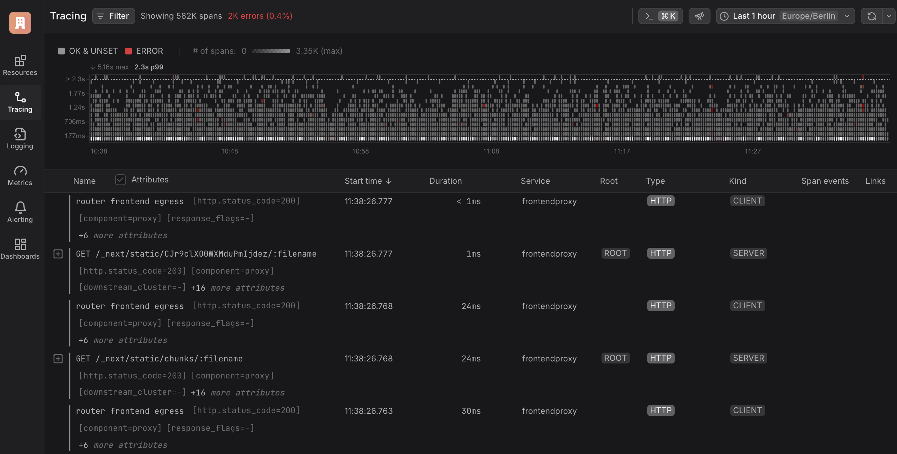
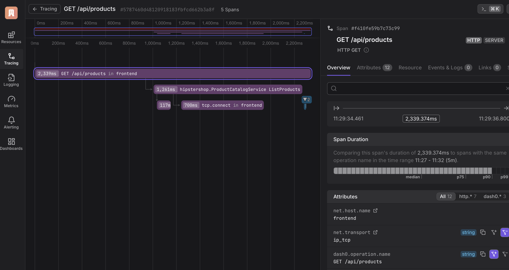

:::note
[Check out the source code on GitHub here.](https://github.com/kubeshop/tracetest/tree/main/examples/tracetest-dash0)
:::

[Tracetest](https://tracetest.io/) is a testing tool based on [OpenTelemetry](https://opentelemetry.io/) that allows you to test your distributed application. It allows you to use data from distributed traces generated by OpenTelemetry to validate and assert if your application has the desired behavior defined by your test definitions.

[Dash0](https://www.dash0.com/) Dash0 is a OpenTelemetry Native Observability Solution, built on CNCF Open Standards such as PromQL, Perses and OTLP with full cost control.

## OpenTelemetry Demo `v1.3.0` with Dash0, OpenTelemetry and Tracetest

This is a simple sample app on how to configure the [OpenTelemetry Demo `v1.3.0`](https://github.com/open-telemetry/opentelemetry-demo) to use [Tracetest](https://tracetest.io/) for enhancing your E2E and integration tests with trace-based testing and [Dash0](https://www.dash0.com/) as a trace data store.

## Prerequisites

**Tracetest Account**:

- Sign up to [`app.tracetest.io`](https://app.tracetest.io) or follow the [get started](/getting-started/overview) docs.
- Have access to the environment's [agent API key](https://app.tracetest.io/retrieve-token).

**Docker**: Have [Docker](https://docs.docker.com/get-docker/) and [Docker Compose](https://docs.docker.com/compose/install/) installed on your machine.

## Run This Quickstart Example

The example below is provided as part of the Tracetest project. You can download and run the example by following these steps:

Clone the Tracetest project and go to the example folder:

```bash
git clone https://github.com/kubeshop/tracetest
cd tracetest/examples/tracetest-dash0
```

Follow these instructions to run the quick start:

1. Copy the `.env.template` file to `.env`.
2. Fill out the [TRACETEST_TOKEN and ENVIRONMENT_ID](https://app.tracetest.io/retrieve-token) details by editing your `.env` file.
3. Fill out the [DASH0_AUTHORIZATION_TOKEN](https://www.dash0.com/) details by editing your `.env` file.
4. Run `docker compose run tracetest-run`.
5. Follow the links in the output to view the test results.

Follow the sections below for a detailed breakdown of what the example you just ran did and how it works.

## Project Structure

The project is built with Docker Compose. It contains two distinct `docker-compose.yaml` files.

### 1. OpenTelemetry Demo

The `docker-compose.yaml` file and `.env` file in the root directory are for the OpenTelemetry Demo.

### 2. Tracetest

The `docker-compose.yaml` file, `collector.config.yaml`, `tracetest-provision.yaml`, and `tracetest-config.yaml` in the `tracetest` directory are for setting up Tracetest and the OpenTelemetry Collector.

### Docker Compose Network

All `services` in the `docker-compose.yaml` are on the same network, defined by the `networks` section on each file, and will be reachable by hostname from within other services. E.g. `tracetest-agent:4317` in the `collector.config.yaml` will map to the `tracetest-agent` service, where port `4317` is the port where Tracetest Agent accepts traces.

## OpenTelemetry Demo

The [OpenTelemetry Demo](https://github.com/open-telemetry/opentelemetry-demo) is a sample microservice-based app with the purpose to demo how to correctly set up OpenTelemetry distributed tracing.

Read more about the OpenTelemetry Demo [here](https://opentelemetry.io/blog/2022/announcing-opentelemetry-demo-release/).

The `docker-compose.yaml` contains 14 services for the demo and 3 supporting dependent services.

To start the OpenTelemetry Demo **by itself**, run this command:

```bash
docker compose up
```

This will start the OpenTelemetry Demo. Open up `http://localhost:8084` to make sure it's working. But, you're not sending the traces anywhere.

Let's fix this by configuring Tracetest and the OpenTelemetry Collector to forward trace data to both Dash0 and Tracetest.

### Sending Traces to Tracetest and Dash0

The `collector.config.yaml` explains that. It receives traces via either `grpc` or `http`. Then, exports them to Tracetest Agent's OTLP endpoint `tracetest-agent:4317` in one pipeline, and to Dash0 in another.

```yaml
receivers:
  otlp:
    protocols:
      http:
      grpc:
  hostmetrics:
    collection_interval: 10s
    scrapers:
      paging:
        metrics:
          system.paging.utilization:
            enabled: true
      cpu:
        metrics:
          system.cpu.utilization:
            enabled: true
      disk:
      filesystem:
        metrics:
          system.filesystem.utilization:
            enabled: true
      load:
      memory:
      network:
      processes:
  # The prometheus receiver scrapes metrics needed for the OpenTelemetry Collector Dashboard.
  prometheus:
    config:
      scrape_configs:
      - job_name: 'otelcol'
        scrape_interval: 10s
        static_configs:
        - targets: ['0.0.0.0:8888']

processors:
  batch: # this configuration is needed to guarantee that the data is sent correctly to Dash0
    send_batch_max_size: 100
    send_batch_size: 10
    timeout: 10s

exporters:
  # OTLP for Tracetest
  otlp/tracetest:
    endpoint: tracetest-agent:4317
    tls:
      insecure: true
  # OTLP for Dash0
  otlp/dash0:
    endpoint: ingress.eu-west-1.aws.dash0.com:4317
    headers:
      Authorization: Bearer ${DASH0_AUTHORIZATION_TOKEN}

service:
  pipelines:
    traces/tracetest:
      receivers: [otlp]
      processors: [batch]
      exporters: [otlp/tracetest]
    traces/dash0
      receivers: [otlp]
      processors: [batch]
      exporters: [otlp/dash0]
    metrics:
      receivers: [hostmetrics, otlp]
      processors: [batch]
      exporters: [otlp/dash0]
```

## Running the Tests

### The Test File

Check out the `resources/test.yaml` file.

```yaml
# resources/test.yaml
type: Test
spec:
  id: JBYAfKJ4R
  name: OpenTelemetry Shop - List Products
  description: List Products available on OTel shop
  trigger:
    type: http
    httpRequest:
      url: http://frontend:8084/api/products
      method: GET
      headers:
      - key: Content-Type
        value: application/json
  specs:
  - selector: span[tracetest.span.type="general" name="Tracetest trigger"]
    assertions:
    - attr:tracetest.response.status   =   200
    - attr:tracetest.span.duration  <  10ms
  - selector: span[tracetest.span.type="rpc" name="grpc.hipstershop.ProductCatalogService/ListProducts"]
    assertions:
    - attr:rpc.grpc.status_code = 0
  - selector: span[tracetest.span.type="rpc" name="hipstershop.ProductCatalogService/ListProducts"
      rpc.system="grpc" rpc.method="ListProducts" rpc.service="hipstershop.ProductCatalogService"]
    assertions:
    - attr:rpc.grpc.status_code = 0
```

To run the test, run this command in the terminal:

```bash
docker compose run tracetest-run
```

This test will fail just like the sample above due to the `attr:tracetest.span.duration  <  10ms` assertion.

```bash
✘ OpenTelemetry Shop - List Products (http://localhost:11633/test/JBYAfKJ4R/run/1/test) - trace id: b9db3e805490f6e1d9aff7c48100d367
	✘ span[tracetest.span.type="general" name="Tracetest trigger"]
		✘ #bf9abd7861371975
			✔ attr:tracetest.response.status   =   200 (200)
			✘ attr:tracetest.span.duration  <  10ms (1.3s) (http://localhost:11633/test/JBYAfKJ4R/run/1/test?selectedAssertion=0&selectedSpan=bf9abd7861371975)
	✔ span[tracetest.span.type="rpc" name="grpc.hipstershop.ProductCatalogService/ListProducts"]
		✔ #52a4bd4cbace9c4b
			✔ attr:rpc.grpc.status_code = 0 (0)
	✔ span[tracetest.span.type="rpc" name="hipstershop.ProductCatalogService/ListProducts" rpc.system="grpc" rpc.method="ListProducts" rpc.service="hipstershop.ProductCatalogService"]
		✔ #533d2199d7e26437
			✔ attr:rpc.grpc.status_code = 0 (0)

	✘ Required gates
		✔ analyzer-score
		✘ test-specs
```

If you edit the duration as in the Web UI example above, the test will pass!

## View Trace Spans Over Time in Dash0

All spans and traces are available in Dash0 in the tracing section.



You can also drill down into a particular trace.



The combination of Dash0 and Tracetest is extremely powerful. Ingest your traces to Dash0 for long term storage and encourage your developers to incorporate trace-based testing into their workflows with Tracetest.

## Learn more

Feel free to check out our [examples in GitHub](https://github.com/kubeshop/tracetest/tree/main/examples) and join our [Slack Community](https://dub.sh/tracetest-community) for more info!
