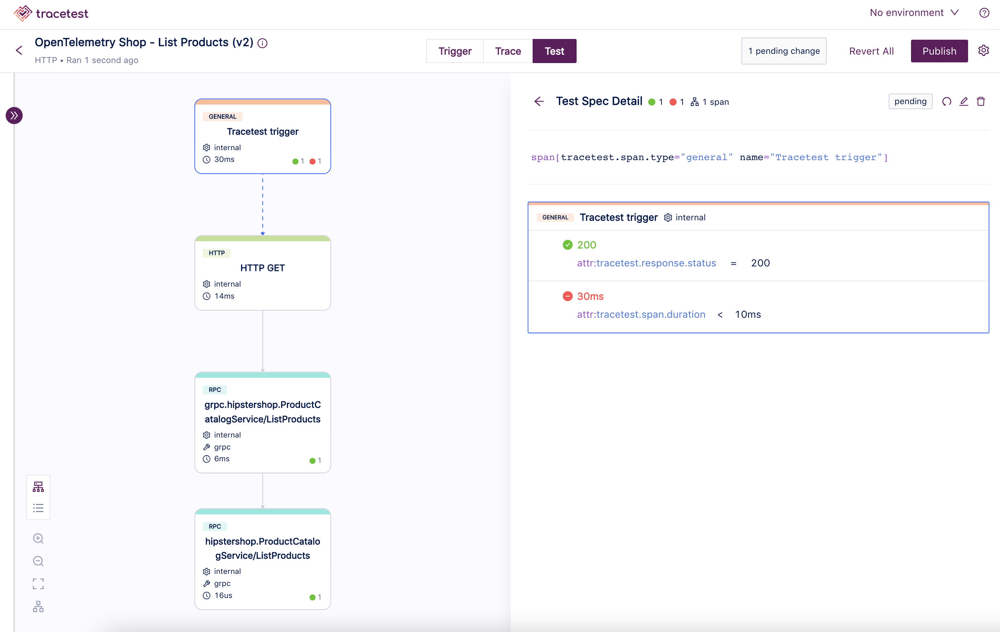
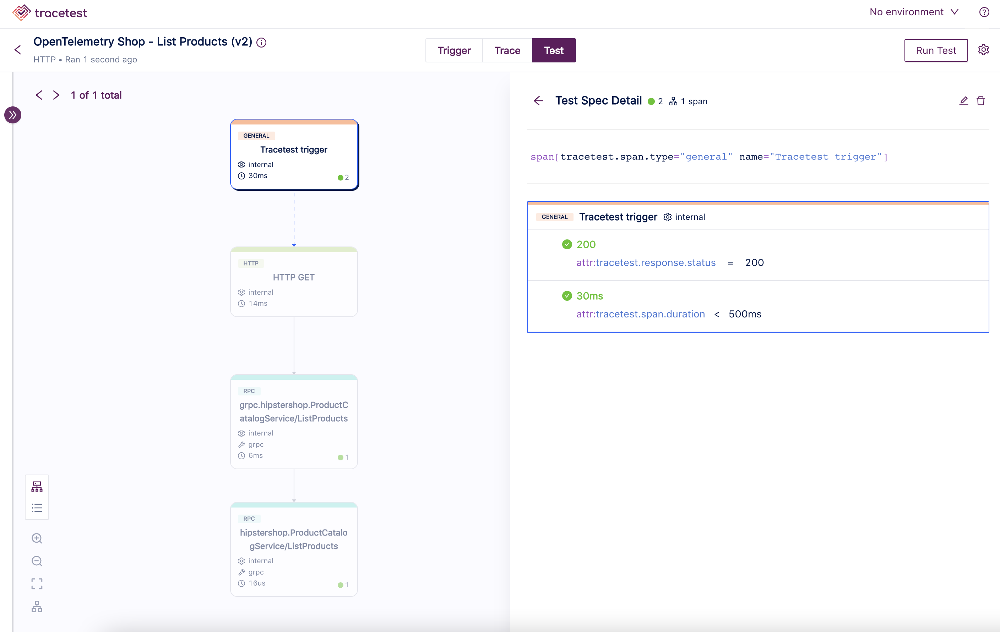
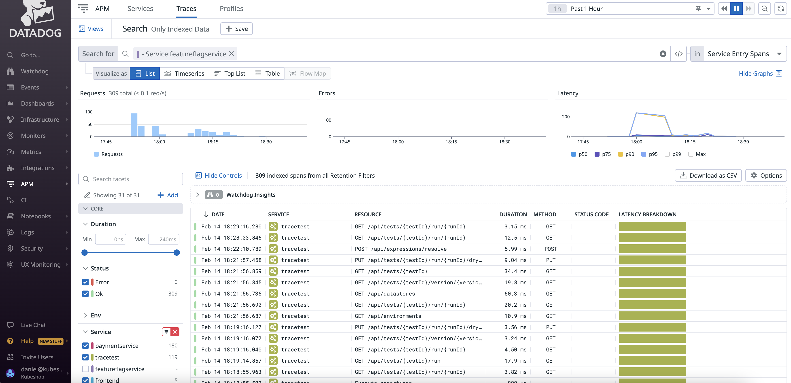
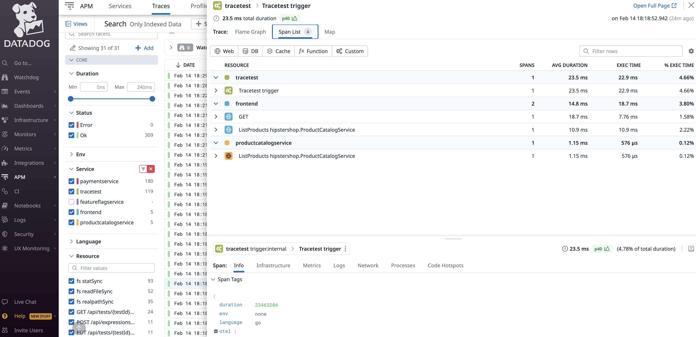

# Running Tracetest With Datadog

:::note
[Check out the source code on GitHub here.](https://github.com/kubeshop/tracetest/tree/main/examples/tracetest-datadog)
:::

[Tracetest](https://tracetest.io/) is a testing tool based on [OpenTelemetry](https://opentelemetry.io/) that allows you to test your distributed application. It allows you to use your telemetry data generated by the OpenTelemetry tools to check and assert if your application has the desired behavior defined by your test definitions.

[Datadog](https://www.datadoghq.com/) is an observability solution for cloud-scale applications, providing solutions to monitor databases, servers, tools and services. It provides integrated distributed tracing, logs and metrics solution and supports OpenTelemetry standards.

## OpenTelemetry Demo `v1.3.0` with Datadog, OpenTelemetry and Tracetest

This is a simple sample app on how to configure the [OpenTelemetry Demo `v1.3.0`](https://github.com/open-telemetry/opentelemetry-demo) to use [Tracetest](https://tracetest.io/) for enhancing your E2E and integration tests with trace-based testing and [Datadog](https://www.datadoghq.com/) as a trace data store.

## Prerequisites

You will need [Docker](https://docs.docker.com/get-docker/) and [Docker Compose](https://docs.docker.com/compose/install/) installed on your machine to run this sample app! Additionally, you will need a Datadog account and an API. Sign up to Datadog on their [homepage](https://www.datadoghq.com/) by clicking on `Get Started Free`.

## Project Structure

The project is built with Docker Compose. It contains two distinct `docker-compose.yaml` files.

### 1. OpenTelemetry Demo

The `docker-compose.yaml` file and `.env` file in the root directory are for the OpenTelemetry Demo.

### 2. Tracetest

The `docker-compose.yaml` file, `collector.config.yaml`, `tracetest-provision.yaml`, and `tracetest-config.yaml` in the `tracetest` directory are for setting up Tracetest and the OpenTelemetry Collector.

The `tracetest` directory is self-contained and will run all the prerequisites for enabling OpenTelemetry traces and trace-based testing with Tracetest, as well as routing all traces the OpenTelemetry Demo generates to Lightstep.

### Docker Compose Network

All `services` in the `docker-compose.yaml` are on the same network, defined by the `networks` section on each file, and will be reachable by hostname from within other services. E.g. `tracetest:4317` in the `collector.config.yaml` will map to the `tracetest` service, where port `4317` is the port where Tracetest accepts traces.

## OpenTelemetry Demo

The [OpenDelemetry Demo](https://github.com/open-telemetry/opentelemetry-demo) is a sample microservice-based app with the purpose to demo how to correctly set up OpenTelemetry distributed tracing.

Read more about the OpenTelemetry Demo [here](https://opentelemetry.io/blog/2022/announcing-opentelemetry-demo-release/).

The `docker-compose.yaml` contains 14 services.

To start the OpenTelemetry Demo by itself, run this command:

```bash
docker compose up
```

This will start the OpenTelemetry Demo. Open up `http://localhost:8084` to make sure it's working. But, you're not sending the traces anywhere.

Let's fix this by configuring Tracetest and OpenTelemetry Collector to forward trace data to both Lightstep and Tracetest.

## Tracetest

The `docker-compose.yaml` in the `tracetest` directory is configured with three services.

- **Postgres** - Postgres is a prerequisite for Tracetest to work. It stores trace data when running trace-based tests.
- [**OpenTelemetry Collector**](https://opentelemetry.io/docs/collector/) - A vendor-agnostic implementation of how to receive, process and export telemetry data. To support sending traces to Datadog, we are using the [`contrib` version](https://github.com/open-telemetry/opentelemetry-collector-contrib), which contains vendor-related code.
- [**Tracetest**](https://tracetest.io/) - Trace-based testing that generates end-to-end tests automatically from traces.

```yaml
version: "3.9"

networks:
  default:
    name: opentelemetry-demo
    driver: bridge

services:
  tracetest:
    restart: unless-stopped
    image: kubeshop/tracetest:${TAG:-latest}
    container_name: tracetest
    platform: linux/amd64
    ports:
      - 11633:11633
    extra_hosts:
      - "host.docker.internal:host-gateway"
    volumes:
      - type: bind
        source: ./tracetest-config.yaml
        target: /app/tracetest.yaml
      - type: bind
        source: ./tracetest-provision.yaml
        target: /app/provisioning.yaml
    command: --provisioning-file /app/provisioning.yaml
    healthcheck:
      test: ["CMD", "wget", "--spider", "localhost:11633"]
      interval: 1s
      timeout: 3s
      retries: 60
    depends_on:
      tt-postgres:
        condition: service_healthy
      otel-collector:
        condition: service_started
    environment:
      TRACETEST_DEV: ${TRACETEST_DEV}

  tt-postgres:
    image: postgres:14
    container_name: tt-postgres
    environment:
      POSTGRES_PASSWORD: postgres
      POSTGRES_USER: postgres
    healthcheck:
      test: pg_isready -U "$$POSTGRES_USER" -d "$$POSTGRES_DB"
      interval: 1s
      timeout: 5s
      retries: 60

  otel-collector:
    image: otel/opentelemetry-collector-contrib:0.68.0
    container_name: otel-collector
    restart: unless-stopped
    command:
      - "--config"
      - "/otel-local-config.yaml"
    volumes:
      - ./tracetest/collector.config.yaml:/otel-local-config.yaml

```

Tracetest depends on both Postgres and the OpenTelemetry Collector. Both Tracetest and the OpenTelemetry Collector require config files to be loaded via a volume. The volumes are mapped from the root directory into the `tracetest` directory and the respective config files.

**Why?** To start both the OpenTelemetry Demo and Tracetest we will run this command:

```bash
docker-compose -f docker-compose.yaml -f tracetest/docker-compose.yaml up
```

The `tracetest-config.yaml` file contains the basic setup of connecting Tracetest to the Postgres instance and telemetry exporter. The exporter is set to the OpenTelemetry Collector.

```yaml
# tracetest-config.yaml

---
postgres:
  host: postgres
  user: postgres
  password: postgres
  port: 5432
  dbname: postgres
  params: sslmode=disable

telemetry:
  exporters:
    collector:
      serviceName: tracetest
      sampling: 100
      exporter:
        type: collector
        collector:
          endpoint: otel-collector:4317

server:
  telemetry:
    exporter: collector
    applicationExporter: collector
```

The `tracetest-provision.yaml` file contains the setup of the demo APIs that Tracetest can use as an example for tests, the polling profiles that say how Tracetest should fetch traces from the data store, and the configuration for the data store, in our case, Datadog.

```yaml
---
type: Demo
spec:
  name: "OpenTelemetry Shop"
  enabled: true
  type: otelstore
  opentelemetryStore:
    frontendEndpoint: http://frontend:8084
    productCatalogEndpoint: productcatalogservice:3550
    cartEndpoint: cartservice:7070
    checkoutEndpoint: checkoutservice:5050

---
type: PollingProfile
spec:
  name: Default
  strategy: periodic
  default: true
  periodic:
    retryDelay: 5s
    timeout: 180s

---
type: DataStore
spec:
  name: datadog
  type: datadog

```

**How to Send Traces to Tracetest and Datadog?**

The `collector.config.yaml` explains that. It receives traces via either `grpc` or `http`. Then, exports them to Tracetest's OTLP endpoint `tracetest:4317` in one pipeline, and to Datadog in another.

Make sure to add your Datadog API Key on `datadog` exporter.

```yaml
receivers:
  otlp:
    protocols:
      http:
      grpc:

processors:
  batch: # this configuration is needed to guarantee that the data is sent correctly to Datadog
    send_batch_max_size: 100
    send_batch_size: 10
    timeout: 10s

exporters:
  # OTLP for Tracetest
  otlp/tt:
    endpoint: tracetest:4317
    # Send traces to Tracetest.
    # Read more in docs here: https://docs.tracetest.io/configuration/connecting-to-data-stores/opentelemetry-collector
    tls:
      insecure: true
  # Datadog exporter
  datadog:
    api:
      site: datadoghq.com
      key: ${DATADOG_API_KEY} # Add here you API key for Datadog
    # One example on how to set up a collector configuration for Datadog can be seen here:
    # https://docs.datadoghq.com/opentelemetry/otel_collector_datadog_exporter/?tab=onahost

service:
  pipelines:
    traces/tt:
      receivers: [otlp]
      processors: [batch]
      exporters: [otlp/tt]
    traces/dd:
      receivers: [otlp]
      processors: [batch]
      exporters: [datadog]
```

## Run Both the OpenTelemetry Demo App and Tracetest

To start both the OpenTelemetry and Tracetest, we will run this command:

```bash
docker-compose -f docker-compose.yaml -f tracetest/docker-compose.yaml up
```

This will start your Tracetest instance on `http://localhost:11633/`. Go ahead and open it up.

[Start creating tests in the Web UI](https://docs.tracetest.io/web-ui/creating-tests)! Make sure to use the endpoints within your Docker network like `http://frontend:8084/` when creating tests.

This is because your OpenTelemetry Demo and Tracetest are in the same network.

> Note: View the `demo` section in the `tracetest.config.yaml` to see which endpoints from the OpenTelemetry Demo are available for running tests.

Here's a sample of a failed test run, which happens if you add this assertion:

```css
attr:tracetest.span.duration  < 10ms
```



Increasing the duration to a more reasonable `500ms` will make the test pass.



## Run Tracetest Tests with the Tracetest CLI

First, [install the CLI](https://docs.tracetest.io/getting-started/installation#install-the-tracetest-cli).
Then, configure the CLI:

```bash
tracetest configure --endpoint http://localhost:11633 --analytics
```

Once configured, you can run a test against the Tracetest instance via the terminal.

Check out the `http-test.yaml` file.

```yaml
# http-test.yaml

type: Test
spec:
  id: JBYAfKJ4R
  name: OpenTelemetry Shop - List Products
  description: List Products available on OTel shop
  trigger:
    type: http
    httpRequest:
      url: http://frontend:8084/api/products
      method: GET
      headers:
      - key: Content-Type
        value: application/json
  specs:
  - selector: span[tracetest.span.type="general" name="Tracetest trigger"]
    assertions:
    - attr:tracetest.response.status   =   200
    - attr:tracetest.span.duration  <  10ms
  - selector: span[tracetest.span.type="rpc" name="grpc.hipstershop.ProductCatalogService/ListProducts"]
    assertions:
    - attr:rpc.grpc.status_code = 0
  - selector: span[tracetest.span.type="rpc" name="hipstershop.ProductCatalogService/ListProducts"
      rpc.system="grpc" rpc.method="ListProducts" rpc.service="hipstershop.ProductCatalogService"]
    assertions:
    - attr:rpc.grpc.status_code = 0
```

This file defines a test the same way you would through the Web UI.

To run the test, run this command in the terminal:

```bash
tracetest test run -d ./http-test.yaml -w
```

This test will fail just like the sample above due to the `attr:tracetest.span.duration  <  10ms` assertion.

```bash
✘ OpenTelemetry Shop - List Products (http://localhost:11633/test/JBYAfKJ4R/run/3/test)
        ✘ span[tracetest.span.type="general" name="Tracetest trigger"]
                ✘ #2d1b0dcbd75b3a42
                        ✔ attr:tracetest.response.status   =   200 (200)
                        ✘ attr:tracetest.span.duration  <  10ms (24ms) (http://localhost:11633/test/JBYAfKJ4R/run/3/test?selectedAssertion=0&selectedSpan=2d1b0dcbd75b3a42)
        ✔ span[tracetest.span.type="rpc" name="grpc.hipstershop.ProductCatalogService/ListProducts"]
                ✔ #90aeab1e9db4617b
                        ✔ attr:rpc.grpc.status_code = 0 (http://localhost:11633/test/JBYAfKJ4R/run/3/test?selectedAssertion=1)
        ✔ span[tracetest.span.type="rpc" name="hipstershop.ProductCatalogService/ListProducts" rpc.system="grpc" rpc.method="ListProducts" rpc.service="hipstershop.ProductCatalogService"]
                ✔ #44b836b092b4d708
                        ✔ attr:rpc.grpc.status_code = 0 (http://localhost:11633/test/JBYAfKJ4R/run/3/test?selectedAssertion=2)
```

If you edit the duration as in the Web UI example above, the test will pass!

## View Trace Spans Over Time in Datadog

To access a historical overview of all the trace spans the OpenTelemetry Demo generates, jump over to your Datadog account on `APM > Traces` area.



You can also drill down into a particular trace as well.



With Datadog and Tracetest, you get the best of both worlds. You can run trace-based tests and automate running E2E and integration tests against real trace data. And, use Datadog to get a historical overview of all traces your distributed application generates.

## Learn more

Feel free to check out our [examples in GitHub](https://github.com/kubeshop/tracetest/tree/main/examples), and join our [Discord Community](https://discord.gg/8MtcMrQNbX) for more info!
